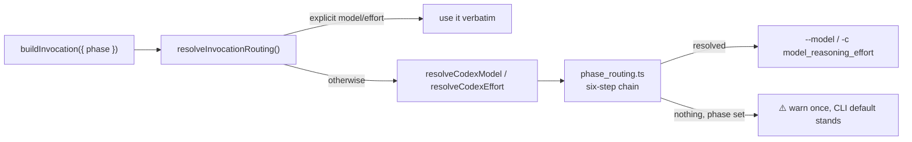

# Codex per-phase model and reasoning-effort defaults

## Summary

`CODEX_PROVIDER.buildInvocation()` forwarded only an **explicit** model/effort,
and `buildCodexArgs()` emits `--model` / `-c model_reasoning_effort="…"` only
when one is set. Because the worker relies on phase defaults, neither was
normally set: every Codex phase — the cheapest `summarise` and the most
expensive `planning` alike — ran on whatever the CLI happened to be configured
with, discarding the cost design `docs/MODEL-AND-CACHING.md` describes for
Claude. Codex has both levers, so both are now wired. Closes #363.

- **`CODEX_PHASE_MODEL_DEFAULTS` / `CODEX_PHASE_EFFORT_DEFAULTS`**
  (`config_defaults.ts`) cover the same phase keys as the Claude tables: the
  eight planning-shaped phases on `gpt-5-codex` at `high`, `issue` on `gpt-5` at
  `high`, the reactive fixes on `gpt-5` at `medium`, and the trivial trio
  (`spelling_fix`, `summarise`, `health`) on `gpt-5-mini` at `low`. Codex accepts
  four effort levels (`minimal`/`low`/`medium`/`high`), so there is no equivalent
  of Claude's `xhigh`/`max`. The model ids are an implementation choice
  documented in the code; configuration always overrides them.
- **The six-step precedence chain is stated once**, in the new
  `phase_routing.ts`: `PREFIX_<PHASE>` env var → per-repo phase override →
  per-repo base → global config phase override → phase default → base env var.
  Claude's two resolvers and Codex's two new ones (`resolveCodexModel`,
  `resolveCodexEffort`) supply their own names, tables and override state to it,
  so Codex reuses the Claude chain rather than copying it. Claude's resolved
  values are unchanged — the seam tests from #362 still assert byte-identical
  Claude argv.
- **New config keys**: global `codex_phase_model_overrides` /
  `codex_phase_effort_overrides`, and per-repo `codex_model`,
  `codex_phase_model_overrides`, `codex_phase_effort_overrides`. Per-repo
  overrides are replaced — never merged — on a repo switch, so a premium repo's
  Codex tier cannot leak into a filler repo.
- **Fail loud (Issue #3234 standard)**: a non-empty phase resolving to no model
  (or no effort) emits one `console.warn` naming the phase and the table missing
  the entry, then leaves the CLI default in place rather than throwing. A
  phase-less invocation is deliberate and stays quiet.

An explicit `request.model` / `request.effort` still beats all six steps.

## Evidence

Backend/CLI change — no web interface to screenshot. The evidence is the argv
the descriptor builds, asserted by the tests below.

Targeted run (`deno test --allow-all tests/codex_phase_routing_test.ts
tests/agent_provider_routing_seam_test.ts
tests/agent_provider_per_invocation_test.ts`): **38 passed, 0 failed**.

`./quality.sh` is green on every check except `deno tests`, which reports **10
pre-existing environment-dependent failures** in `fleet_health_test.ts`,
`host_workdir_guard_test.ts`, `optional_feature_env_test.ts` and
`setup_workdir_reminder_test.ts` (work-dir path and env-var assumptions about the
host). They were confirmed to fail identically on an untouched worktree of the
base branch `milestone/357-audit-model-selection-for-codex-gemini-documen`, so
they are not caused by this change. No test touched by this PR fails.

## Test Plan

New — `worker/deno/tests/codex_phase_routing_test.ts` (16 tests):

- `planning` with no explicit model/effort produces argv carrying
  `--model gpt-5-codex` and `-c model_reasoning_effort="high"`.
- Every phase key reaches argv with its designed model **and** effort.
- The Codex tables cover the same phase keys as the Claude tables, and every
  Codex effort value is one Codex accepts.
- A cheap phase (`spelling_fix`, `summarise`, `health`) resolves to a cheaper
  model and lower effort than `planning`.
- Explicit `model`/`effort` beats the phase default.
- Each precedence step beats the one below it: phase env var → per-repo phase
  override → per-repo base → global config override → phase default → base env
  var.
- Per-repo overrides are replaced, never merged, on a repo switch.
- An unknown phase warns once per lever, names the phase, and adds no flags.
- A phase-less invocation resolves nothing and stays quiet.
- The documented routing table matches `CODEX_PHASE_*_DEFAULTS`.

Modified — three tests from the #362 seam deliberately pinned the pre-#363
pass-through (`"must add no Codex routing flags yet (Issue #363)"`). They now
assert the landed behaviour:

- `agent_provider_routing_seam_test.ts`: "Codex and Gemini resolve nothing" is
  split — Gemini still resolves nothing (pending #364), Codex resolves each
  phase through its tables; "a provider that resolves nothing keeps the explicit
  values" now uses Gemini; the Codex golden argv carries the phase defaults.
- `agent_provider_per_invocation_test.ts`: a phase now routes per provider —
  Claude keeps `--model`/`--effort`, Codex gets a Codex model id plus its `-c`
  effort syntax (never a Claude tier), Gemini still gets nothing.

No test was removed or commented out.

## Security self-check

- No new external input surface: the resolvers read operator-controlled config
  and env vars only, and every resolved value lands in an argv array passed to
  `Deno.Command` — no shell string interpolation.
- No secrets, credentials or hidden files staged.
- No new dependency.
