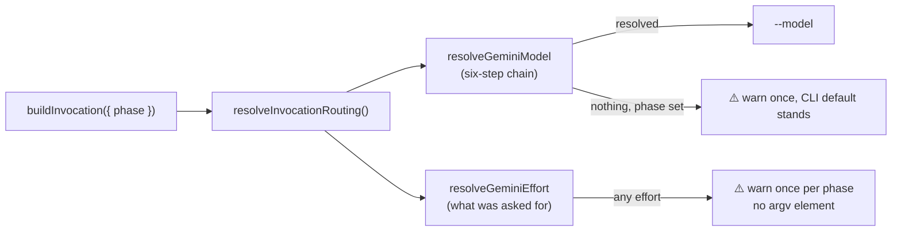

# Gemini per-phase model defaults, and a loud warning for an effort it cannot honour

## Summary

`GEMINI_PROVIDER.buildInvocation()` had two gaps: `request.phase` was discarded
entirely, so every Gemini phase — the cheapest `summarise` and the most
expensive `planning` alike — ran on whatever the CLI happened to be configured
with; and `request.effort` was dropped without a word, so an operator who pinned
an effort (or simply relied on `PHASE_EFFORT_DEFAULTS`) got no signal that the
lever does nothing under Gemini. Closes #364.

- **`GEMINI_PHASE_MODEL_DEFAULTS`** (`config_defaults.ts`) covers the same phase
  keys as the Claude table: the eight planning-shaped phases on
  `gemini-2.5-pro`, `issue` and the reactive fixes on `gemini-2.5-flash`, and
  the trivial trio (`spelling_fix`, `summarise`, `health`) on
  `gemini-2.5-flash-lite`. The model ids are an implementation choice documented
  in the code; configuration always overrides them.
- **The six-step precedence chain is reused, not copied** — `resolveGeminiModel`
  supplies Gemini's names, tables and override state to the existing
  `phase_routing.ts`: `GEMINI_MODEL_<PHASE>` env var → per-repo
  `gemini_phase_model_overrides` → per-repo `gemini_model` base tier → global
  `gemini_phase_model_overrides` → the table above → `GEMINI_MODEL` env var. An
  explicit `request.model` still beats all six, and per-repo overrides are
  replaced — never merged — on a repo switch.
- **Fail loud on the missing effort lever (Issue #3234).** When an effort is
  resolved for a Gemini invocation — explicitly on the request, or from the
  worker's phase effort design — `buildGeminiArgs` emits **one**
  `console.warn` naming the provider, the phase and the requested effort, and
  adds **no** argv element. The warning is de-duplicated **once per phase per
  worker process** (stated in the code comment on `_effortWarnedPhases`), so a
  multi-phase run states the gap for each phase it routes and a retried phase
  states it once. No flag the CLI does not have is invented and the run is not
  failed: the warning is the fix.
- **No dead configuration.** There is deliberately no
  `GEMINI_PHASE_EFFORT_DEFAULTS` and no `gemini_phase_effort_overrides` key —
  effort configuration the CLI could never apply would be surface that lies.

New config keys: global `gemini_phase_model_overrides`, and per-repo
`gemini_model` / `gemini_phase_model_overrides`, documented in
`docs/CONFIGURATION.md` and `docs/MODEL-AND-CACHING.md`.

## Evidence

Backend/CLI change — no web interface to screenshot. The evidence is the argv
the descriptor builds and the warning it emits, asserted by the tests below.

Targeted run (`deno test --allow-all tests/gemini_phase_routing_test.ts
tests/agent_provider_gemini_test.ts tests/agent_provider_routing_seam_test.ts
tests/agent_provider_per_invocation_test.ts tests/codex_phase_routing_test.ts`):
**79 passed, 0 failed**.

`./quality.sh` is green on every check except `deno tests`, which reports the
same **10 pre-existing environment-dependent failures** recorded in
`pr-summary-363.md` — `fleet_health_test.ts`, `host_workdir_guard_test.ts`,
`optional_feature_env_test.ts` and `setup_workdir_reminder_test.ts` (work-dir
path and env-var assumptions about the host). Full suite: **15912 passed, 10
failed**. No test touched by this PR fails.

## Test Plan

New — `worker/deno/tests/gemini_phase_routing_test.ts` (16 tests):

- `planning` with no explicit model produces argv carrying
  `--model gemini-2.5-pro`; every phase key reaches argv with its designed
  model.
- The Gemini table covers the same phase keys as the Claude table, and a cheap
  phase resolves to a cheaper model than `planning`.
- An explicit `model` beats the phase default; a phase-less invocation resolves
  nothing and stays quiet.
- Each precedence step beats the one below it: phase env var → per-repo phase
  override → per-repo base → global config override → phase default → base env
  var; per-repo overrides are replaced, never merged, on a repo switch.
- A phase that resolves to no model warns once, names the phase, and adds no
  flag.
- **Effort:** an explicit effort produces exactly one warning naming the
  provider, phase and effort, and argv byte-identical to the same invocation
  without it; a phase with an effort default warns without an explicit effort;
  the warning is once per phase, not once per invocation; no effort anywhere
  produces no warning; the invocation still builds and carries no invented
  effort flag.
- The documented routing table matches `GEMINI_PHASE_MODEL_DEFAULTS`.

Modified — two tests from the #362 seam deliberately pinned the pre-#364
pass-through:

- `agent_provider_routing_seam_test.ts`: "Gemini resolves nothing" now asserts
  Gemini resolves each phase through its table (and reports the requested
  effort); "a provider that resolves nothing keeps the explicit values" becomes
  "an explicit value beats a provider's own phase routing"; the Gemini golden
  argv carries the phase defaults.
- `agent_provider_per_invocation_test.ts`: a phase now routes to a Gemini model
  id (never a Claude tier) while still carrying no effort argument.

No test was removed or commented out.

## Security self-check

- No new external input surface: the resolvers read operator-controlled config
  and env vars only, and every resolved value lands in an argv array passed to
  `Deno.Command` — no shell string interpolation.
- The new warning names the phase and effort from operator configuration only;
  no secret or credential is logged.
- No secrets, credentials or hidden files staged. No new dependency.
