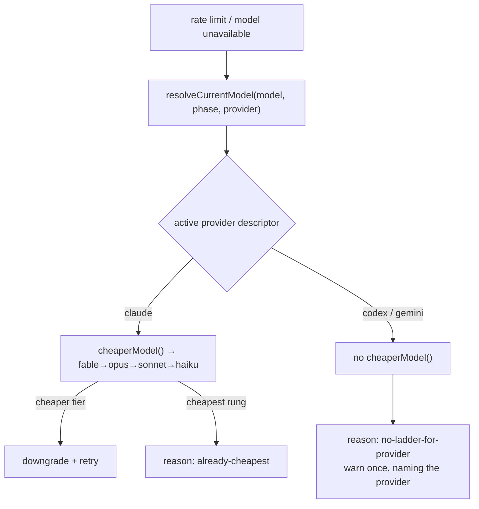

# Rate-limit model fallback is provider-aware (Issue #365)

## Summary

The rate-limit / credit-exhaustion downgrade documented in
`docs/MODEL-AND-CACHING.md` § "Model Fallback on Rate Limit" was Claude-only end
to end. `resolveCurrentModel()` resolved through `buildClaudeModelArgs(phase)`
whatever provider was running, so under Codex or Gemini it returned a Claude
model id the run was not using; `attemptModelFallback()` then looked that id up
in the Claude tier ladder and returned `already-cheapest` — indistinguishable
from a genuine "already on the cheapest tier". The documented fallback either
no-opped in silence or reasoned about the wrong model.

Both now go through the provider seam:

- The ladder is a descriptor capability. `AgentProviderDescriptor` gains an
  optional `cheaperModel(model)`; Claude implements it by delegating to
  `getCheaperModel()` (`config_defaults.ts`), Codex and Gemini omit it. Giving
  either a ladder later is one method on its descriptor, no change here.
- `resolveCurrentModel(model, phase, provider?)` resolves through
  `selectAgentProvider(provider).resolveModel(phase)` — the active provider's
  own chain — so it can no longer return a Claude id under a non-Claude run.
- `attemptModelFallback(currentModel, enabled, provider?)` returns the new,
  distinct `{ ok: false, reason: "no-ladder-for-provider", provider }` when the
  active provider has no ladder. `disabled` and `already-cheapest` are
  unchanged.
- `warnNoModelLadder()` states the outcome loudly and **once per provider**
  (mirroring the `clearGeminiEffortWarnings` pattern in `gemini_executor.ts`),
  naming the provider and the model. `claude_runner.ts` calls it at both
  give-up sites — the model-unavailable branch and the rate-limit-exhausted
  branch — and the rate-limit give-up message now carries the reason.

Under Claude, behaviour and reasons are byte-for-byte what they were: the
Claude descriptor's `resolveModel` is `resolveClaudeModel`, which is exactly
what `buildClaudeModelArgs` wraps.

Closes #365.

## Evidence

Backend/CLI change — no web interface to screenshot. Verified by unit tests
(below) and the repository quality gate.



Targeted run:

```
deno test --allow-all tests/model_fallback_test.ts \
  tests/model_fallback_retry_test.ts tests/phase_model_escalation_test.ts
ok | 70 passed | 0 failed
```

`./quality.sh` passes every gate except `deno tests`, which reports **10
pre-existing failures unrelated to this change** (`fleet_health_test.ts`,
`host_workdir_guard_test.ts`, `optional_feature_env_test.ts`,
`setup_workdir_reminder_test.ts` — all host work-dir path assertions). Confirmed
pre-existing: the identical 10 fail on the stashed, unmodified tree.

## Test Plan

Added to `worker/deno/tests/model_fallback_test.ts` (all call the real
functions and assert on returned values / captured output):

- `resolveCurrentModel uses the Codex chain under Codex` and `… the Gemini
  chain under Gemini` — the resolved id equals `resolveCodexModel()` /
  `resolveGeminiModel()` and differs from what the Claude chain returns for the
  same phase (the bug).
- `resolveCurrentModel follows the active provider from the environment` —
  `VIBE_AGENT_PROVIDER=codex` with no explicit selector.
- `an explicit model still wins under any provider`.
- `Codex reports no-ladder-for-provider, not already-cheapest` and the Gemini
  equivalent — the regression the issue names, asserted on the whole result
  object including `provider`.
- `disabled still beats the missing ladder`.
- `Claude reasons are unchanged by the provider seam` — regression guard for
  `opus → sonnet`, `haiku → already-cheapest`, and an unknown id under Claude.
- `the missing ladder is warned about once, naming the provider` — captures
  `console.warn`, calls the warning twice, asserts exactly one message naming
  `codex` and the model.
- `warnNoModelLadder is silent for every other outcome` and `the warning goes
  to the run logger when one is supplied`.

Existing `model_fallback_retry_test.ts` and `model_fallback_test.ts` cases were
left untouched and still pass — they call the two functions with no provider
argument, which resolves to Claude.

## Documentation

`docs/MODEL-AND-CACHING.md` § "Model Fallback on Rate Limit" gains a bullet
stating that the ladder belongs to the active provider, that Codex/Gemini
return `no-ladder-for-provider` with a once-only warning, and how to give a
provider a ladder.
