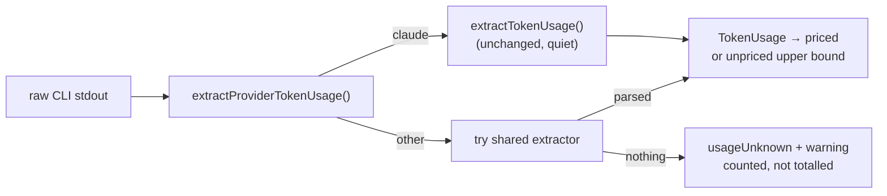

# Token usage and cost are recorded UNKNOWN, never a silent zero, for Codex/Gemini runs

## Summary

`extractTokenUsage()` reads the Claude CLI `stream-json` shape (`type:"result"`
plus `usage.input_tokens`). Codex emits its own JSONL under `--json` and Gemini
its own `--output-format stream-json` events, so neither parsed, `claude_runner`
turned the resulting `null` into "no usage", and the credit log recorded **zero
tokens and zero cost** for the run — silently. Cost dashboards, the daily budget
log and the context-window monitor all under-reported and nothing said so.

This makes the gap loud (fail-loud standard, Issue #3234) without guessing at
either CLI's event shape:

- **New `worker/deno/lib/provider_token_usage.ts`** — one entry point that
  dispatches on the active provider descriptor. Claude delegates to the
  unchanged extractor and stays quiet even when a run reports no usage line; any
  other provider is offered the shared extractor first (a CLI whose output
  happens to be Claude-compatible is parsed normally) and, when nothing is
  parseable, returns `usageUnknown: true` with one warning naming the provider,
  repo, phase and model.
- **`claude_runner.ts`** — calls the new seam, logs the warning via
  `logger.warn` (whether or not credit logging is configured, since the run
  stats under-report just the same), and passes `usageUnknown` to
  `logInvocation`.
- **`credit_tracker.ts`** — `InvocationEntry.usageUnknown` is persisted; the
  daily summary gains `unknownUsageInvocations` / `unknownUsageProviders`, and
  `formatSummary` ends with `WARNING: N invocation(s) reported no parseable
  token usage (provider(s): codex, gemini) — their tokens and cost are UNKNOWN,
  not zero, and are NOT counted in the totals above.`
- **Unpriced non-Claude ids** — `MODEL_PRICING` is Claude-only, so a Codex or
  Gemini model id with real tokens already falls through
  `estimateCostWithUpperBound()` to the conservative upper bound and is named in
  `unpricedModels`. That path is now covered by tests and stated explicitly in
  the docs, so the outcome is a visible unpriced record rather than a `$0` one.

Claude extraction and pricing are untouched: `token_usage.ts` is byte-for-byte
unchanged, and the only Claude-path behaviour change is none — verified by the
existing regression tests plus a new assertion that the Claude result equals
`extractTokenUsage()` exactly and produces no warning.

**Not implemented, deliberately:** real Codex/Gemini token parsing. Neither CLI
is installed in this container and their JSONL shapes are version-specific, so a
guessed parser would re-introduce the same undercount behind something that
looks authoritative. `docs/MODEL-AND-CACHING.md` now records this as known
Claude-only behaviour, and adding an extractor is one new branch in
`extractProviderTokenUsage()` plus a pricing row.

Closes #366.

## Evidence

Backend/CLI change — no web interface to screenshot. Evidence is the test suite.



Targeted run of the affected suites:

```text
$ deno test --allow-all tests/provider_token_usage_test.ts \
    tests/token_usage_test.ts tests/credit_tracker_test.ts
ok | 80 passed | 0 failed (430ms)
```

`./quality.sh` passes lint, type check, fmt, mermaid, markdownlint and the full
Deno suite apart from **10 pre-existing environment failures** unrelated to this
change (`fleet_health_test.ts`, `host_workdir_guard_test.ts`,
`optional_feature_env_test.ts`, `setup_workdir_reminder_test.ts` — they assert
against the host work-dir layout). Confirmed pre-existing by stashing this
branch's changes and re-running those four files on the clean tree: the same 10
fail.

## Test Plan

New — `worker/deno/tests/provider_token_usage_test.ts`:

- Claude usage equals `extractTokenUsage()` exactly, `usageUnknown: false`, no
  warning (regression guard).
- A Claude run with no usage line produces no warning.
- A Codex JSONL run and a Gemini stream-json run each yield no usage,
  `usageUnknown: true`, and a warning naming the provider, repo, phase and model
  and the words "not zero".
- Empty non-Claude output is unknown, and the message contains no `undefined`
  when context is missing.
- Non-Claude output in a Claude-compatible shape is extracted and stays quiet.

Added to `worker/deno/tests/credit_tracker_test.ts`:

- `logInvocation` persists `usageUnknown` with no token fields at all.
- `getDailySummary` counts unknown-usage invocations and their providers, and
  `formatSummary` warns loudly.
- A Claude-only day reports zero unknown-usage invocations and no warning.
- A Codex model id with real tokens lands in `unpricedModels` with a non-zero
  upper-bound cost.

Added to `worker/deno/tests/token_usage_test.ts`:

- `lookupModelPricing()` returns `null` for `gpt-5-codex` / `gemini-2.5-pro`.
- Both are charged at the unpriced upper bound (`priced: false`, cost `> 0`).
