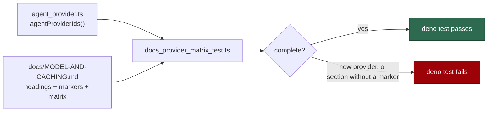

# Document per-behaviour provider applicability in `docs/MODEL-AND-CACHING.md`

## Summary

`docs/MODEL-AND-CACHING.md` reads as the model/session/caching reference for
the whole worker, but most of it describes Claude. A reader running
`agent_provider: codex` had no way to tell which documented behaviour they
still get. This change makes the applicability explicit and machine-checked.
Closes #367.

- **New `## Provider Applicability` section** below the Table of Contents: a
  legend (✅ applies · ⚠️ partial · ❌ not for this provider · ➖ not wired for
  anyone) and a matrix whose rows cover every `##`/`###` section of the
  document, with a "what Codex/Gemini do instead" column on every non-✅ row.
- **A one-line `> **Applies to:** …` marker under every `##`/`###` heading**
  (47 in total, including the `#### Session ID — a UUID` behaviour the issue
  calls out), so a reader landing mid-document via an anchor is not misled.
- **Cross-links, no duplication**: the section points at the README
  coding-agent section, `docs/CONFIGURATION.md` and `docs/CONTAINER.md` for
  *how to select* a provider; this page stays the *behaviour* reference. The
  README's coding-agent list gains one bullet pointing back at the matrix.
- **Fix-issue status is stated**: #363, #364, #365 and #366 have landed, so
  those rows describe post-fix behaviour. One open gap is recorded and linked.

Every claim was checked against the code, not carried over from the issue
body — several of the issue's scoping findings were already out of date on the
milestone branch:

| Claim | Verified in |
| --- | --- |
| Codex and Gemini now route phases through their own tables | `codex_executor.ts`, `gemini_executor.ts`, `phase_routing.ts` |
| Only Claude has a cheaper-model ladder; others report `no-ladder-for-provider` | `model_fallback.ts`, `agent_provider.ts` (`cheaperModel?`) |
| Session persistence/allowlist/compaction cover `.claude/` only | `session_manager.ts`, `session_file_policy.ts`, `session_compaction.ts` |
| Resume mechanisms differ (`--session-id`/`--resume`, `codex exec resume --last`, `--resume latest`) | `session_resume.ts`, `codex_executor.ts`, `gemini_executor.ts` |
| Layer 2 caching is Anthropic-only — the others fold the system prompt in | `agent_provider.ts` (`--system-prompt`), `agent_prompt.ts` (`composeAgentPrompt`) |
| Served-model observation (degraded verdict) reads Claude `stream-json` | `run_stats.ts` (`extractServedModels`) |
| Non-Claude model ids have no context-window row → 200,000-token default | `context_budget.ts` (`MODEL_CONTEXT_WINDOWS`) |

**Gap found while verifying, filed rather than fixed here (out of scope for a
documentation issue):** the pre-flight Fable reroute in `claude_runner.ts` is
not provider-gated, so in a mixed deployment a cached `unavailable` verdict can
force `--model opus --effort max` onto a Codex/Gemini Quorum invocation
(`quorum`/`quorum_judge` are Fable-preferring phases and pass no explicit
model). Raised as stSoftwareAU/VibeCoder#398 and linked from the matrix row,
which is labelled as describing current, pre-fix behaviour.

## Evidence

Documentation-only change with no web interface to screenshot; the evidence is
the new failure-detection test.

`worker/deno/tests/docs_provider_matrix_test.ts` reads the document and
asserts, against `agentProviderIds()` rather than hand-written prose:



```text
running 9 tests from ./tests/docs_provider_matrix_test.ts
MODEL-AND-CACHING - carries a provider applicability matrix ... ok
MODEL-AND-CACHING - the matrix has a column for every registered provider ... ok
MODEL-AND-CACHING - every registered provider id appears in the document ... ok
MODEL-AND-CACHING - every documented heading carries an applicability marker ... ok
MODEL-AND-CACHING - every marker gives a verdict for every registered provider ... ok
MODEL-AND-CACHING - no provider is described by omission ... ok
MODEL-AND-CACHING - the matrix covers every documented heading ... ok
MODEL-AND-CACHING - every matrix row links a heading that exists ... ok
MODEL-AND-CACHING - the matrix legend defines every verdict symbol it uses ... ok
ok | 9 passed | 0 failed
```

Both regressions the issue asks the test to catch were reproduced against a
mutated copy of the document before the copy was restored:

- marker deleted →
  `"Session Persistence Allowlist" (line 1244) must be followed by a marker line starting "> **Applies to:**"`
- section added without a matrix row →
  `the Provider Applicability matrix must carry a row linking "Brand New Behaviour" as (#brand-new-behaviour)`

## Test Plan

- Added `worker/deno/tests/docs_provider_matrix_test.ts` (9 tests):
  - the matrix section exists and has a column per registered provider id;
  - every registered provider id appears in the document;
  - every `##`/`###` heading (outside fenced code blocks, excluding the index
    and the matrix section itself) carries an `> **Applies to:**` marker;
  - every marker gives each registered provider one of ✅ ⚠️ ❌ ➖;
  - a marker reporting ⚠️/❌/➖ must say what happens instead — no provider
    described by omission;
  - the matrix covers every such heading, and every matrix anchor resolves to a
    real heading;
  - the legend defines every verdict symbol used.
- `./quality.sh` run clean over the whole repo.
