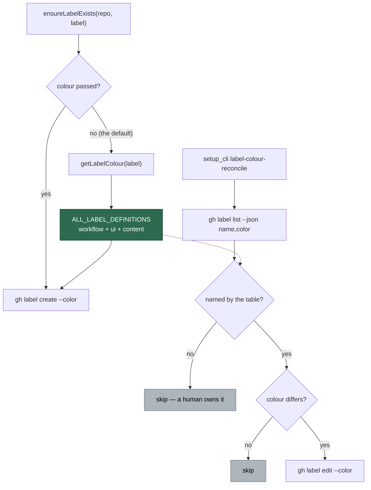

# Fleet label colours: one canonical table, and a pass that repairs the drift

## Summary

`ensureLabelExists` took the colour as a parameter with a red default, so a
label's colour was decided by whichever call site happened to create it first in
that repo — and nine call sites each hard-coded their own literal. The measured
result: `severity:critical` grey in VibeCoder, red in GRQ; the whole
`severity:*` / `confidence:*` / `security` family flat grey in one repo and a
deliberate ramp in the next.

This change adds the canonical table, points every call site at it, and adds the
reconcile pass that repairs repos which already drifted. Closes #368.

**1. One canonical table.** The repo already had a colour table —
`LABEL_DEFINITIONS` in `worker/deno/setup/label_definitions.ts`, documented as
"single source of truth for label names, colours, and descriptions" — but it
only covered the workflow/UI labels seeded at onboarding. Rather than start a
second table in `config_defaults.ts` (which is the drift this issue is about),
the content labels join the existing one:

- `worker/deno/setup/content_label_definitions.ts` — the new
  `CONTENT_LABEL_DEFINITIONS`, grouped so the families read as families: the
  `severity:*` ramp, the `confidence:*` ramp, the security family, the per-scan
  category labels, the outcome labels, and the `lang:*` buckets. All colours
  lower-case hex, so comparing them is never a string-normalisation problem.
- `label_definitions.ts` gains the `content` category, the union
  `ALL_LABEL_DEFINITIONS`, and the lookups `getLabelColour` /
  `getLabelDescription` (case-insensitive, as GitHub label names are).

The split is by *role*, not by authority: `LABEL_DEFINITIONS` is what onboarding
**seeds** onto every repo; content labels appear only when a scan files a
finding, so seeding them would put 30 unused labels in every repo.
`getApplicableLabels` is unchanged and a test pins that content labels never
leak into onboarding.

**2. `ensureLabelExists` looks the colour up.** `colour` and `description` are
now optional; omitted, they resolve from the canonical table instead of
defaulting to red. All nine literals are gone, plus a tenth found on the way
(`needs_human_escalation.ts`'s `DEFAULT_LABEL_COLOUR = "fbca04"`):

| File | Was |
| --- | --- |
| `lib/audit_failure_notifier.ts` | `const LABEL_COLOUR = "d73a4a"` |
| `lib/claim_issue.ts` | `"d73a4a"` |
| `lib/label_failure.ts` | `"d73a4a"` |
| `lib/label_question_failure.ts` | `"d73a4a"` |
| `lib/pr_merge_conflict_scan.ts` | `MERGE_CONFLICT_LABEL_COLOUR = "b60205"` |
| `lib/security_tree_sweep.ts` | `label === SWEEP_LABEL ? "5319e7" : "d73a4a"` |
| `lib/work_on_content_integrity.ts` | `colour ?? "d73a4a"` |
| `lib/work_on_content_integrity.ts` | `ensureLabelColour: "d73a4a"` |
| `commands/label_manager.ts` | `args["colour"] ?? "d73a4a"` |
| `lib/needs_human_escalation.ts` | `DEFAULT_LABEL_COLOUR = "fbca04"` |

`grep '"d73a4a"' lib/ commands/ setup/` now returns only the table itself.

**3. The reconcile pass** — `worker/deno/setup/label_colour_reconcile.ts`, wired
as `setup_cli.ts label-colour-reconcile` (with `--dry-run`). Per monitored repo
it reads `gh label list --json name,color`, and for each label the table
**names** whose colour differs, issues `gh label edit <name> --color <hex>`,
reporting every `from → to`. Two boundaries hold:

- It only touches labels the table names — a label a human created is left
  exactly as they set it.
- It never *creates* a label. Seeding is `label-sync`'s job.

It fails loud: an unreadable or unparseable label list returns `ok: false` with
the cause, never a clean "0 drifted"; a failed edit is counted and reported, not
swallowed; and one failing repo does not stop the sweep.

## Evidence

Backend/CLI change — no web interface to screenshot. The drift in the issue was
reproduced against the live fleet before the change (`gh label list`):

| Label | VibeCoder | GRQ | NEAT-AI | Canonical now |
| --- | --- | --- | --- | --- |
| `severity:critical` | `ededed` | `B60205` | `b60205` | `b60205` |
| `severity:high` | `ededed` | `D93F0B` | `d93f0b` | `d93f0b` |
| `severity:medium` | `d4a72c` | `FBCA04` | `fbca04` | `fbca04` |
| `severity:low` | `ededed` | `0E8A16` | `0e8a16` | `0e8a16` |
| `confidence:high` | `ededed` | `5319E7` | `0e8a16` | `0e8a16` |
| `confidence:low` | `cfd3d7` | `5319E7` | `c2e0c6` | `c2e0c6` |
| `security` | `ededed` | `B60205` | `ee0701` | `b60205` |

And the reconcile pass was run against the live fleet in `--dry-run` (read-only
— it issued no edits), reproducing exactly the drift the issue reported:

```text
stSoftwareAU/VibeCoder: ok=true inspected=28 drifted=9
   confidence:high: ededed -> 0e8a16
   security: ededed -> b60205
   severity:critical: ededed -> b60205
   severity:high: ededed -> d93f0b
   severity:low: ededed -> 0e8a16
   confidence:medium: ededed -> fbca04
   severity:medium: d4a72c -> fbca04
   confidence:low: cfd3d7 -> c2e0c6
   security-scan-overflow: ededed -> fbca04
stSoftwareAU/GRQ: ok=true inspected=42 drifted=4
   confidence:high: 5319e7 -> 0e8a16
   confidence:medium: 5319e7 -> fbca04
   confidence:low: 5319e7 -> c2e0c6
   security-scan-overflow: ededed -> fbca04
stSoftwareAU/NEAT-AI: ok=true inspected=46 drifted=3
   negative-result: 808080 -> c5def5
   security: ee0701 -> b60205
   lang:general: ededed -> c2e0c6
```

Note what it did **not** report: GRQ's `scenario-count-low`, `new-feed` and
`new-observation`, and NEAT-AI's `Project` and `performance`, are human-created
labels the table does not name — 42 and 46 fleet labels inspected out of 52 and
51 present. They are left exactly as their owners set them.

Where the colour resolution now goes:



`./quality.sh`: every stage passes except `deno tests`, which reports 10
failures in `fleet_health_test.ts`, `host_workdir_guard_test.ts`,
`optional_feature_env_test.ts` and `setup_workdir_reminder_test.ts`. These are
pre-existing and host-path dependent — the same 10 fail at `HEAD~1` with this
change stashed, and none of the four files touches label code. All 32 tests
added here pass inside the full-suite run.

## Test Plan

Added (all call real functions and assert on returned values / issued commands
— no source-text inspection):

- `worker/deno/tests/setup_content_label_definitions_test.ts` (14 tests) — the
  table's shape (lower-case 6-char hex, non-empty descriptions, no duplicate
  names across the two halves), the severity ramp's four distinct colours in
  order, the confidence ramp being a ramp rather than one flat colour, `security`
  no longer grey, every `lang:` bucket named, case-insensitive lookup, the
  unmanaged-label fallback, and a regression guard that content labels never
  reach `getApplicableLabels` (onboarding).
- `worker/deno/tests/setup_label_colour_reconcile_test.ts` (13 tests) — repaint
  of a drifted label with the correct target colour, the reported `from → to`,
  no edit when already canonical, casing alone not counting as drift
  (`B60205` == `b60205`), labels the table does not name never touched, never
  creating an absent label, dry-run reporting without editing, fail-loud on an
  unreadable list and on unparseable output, a failed edit counted rather than
  swallowed, and a fleet sweep where one failing repo does not stop the rest.
- `worker/deno/tests/label_colour_lookup_test.ts` (5 tests) — `ensureLabelExists`
  resolving a content label's colour, a workflow label's colour *and*
  description, two different labels no longer sharing one hard-coded red, the
  default for an unmanaged label, and an explicit colour still winning.

No existing test was modified or removed: `getApplicableLabels`, `getLabelCount`
and `getAllLabels` keep their previous semantics and counts.

## Documentation

- `README.md` — new "Content Labels and Fleet Colours" section under Supported
  Labels, with the ramp table and the reconcile commands.
- `docs/workflows/label-flows.md` — content/finding labels added to the full
  label map with their canonical colours.
- `docs/SETUP.md` — `label-colour-reconcile` added to the subcommand table.
