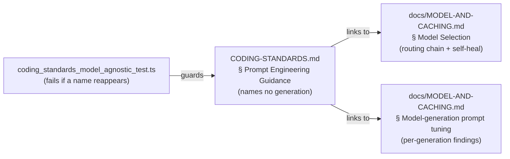

# PR Summary — Issue #371

## Summary

`CODING-STANDARDS.md` § "Prompt Engineering Guidance" declared itself
model-generation-agnostic and then hard-coded the current routing chain anyway,
naming model generations in three places (the routing sentence, the
"unavailable" self-heal, and the verification-scaffolding bullet). That
duplicated `docs/MODEL-AND-CACHING.md`, the single source of truth for which
model runs which phase, and went stale on every routing change.

The section preamble and the "Match verification scaffolding" bullet are
rewritten to name no generation: the preamble links to
[Model Selection](docs/MODEL-AND-CACHING.md#model-selection) for the per-phase
routing chain and the unavailability self-heal, and the bullet states the
general rule — add a self-verification checkpoint only for a generation that
does not self-verify, omit it for one that does — deferring the concrete tuning
result to
[Model-generation prompt tuning](docs/MODEL-AND-CACHING.md#model-generation-prompt-tuning),
where it was already recorded (`docs/MODEL-AND-CACHING.md:1583-1595`). The other
seven bullets were already agnostic and are untouched. Docs-only change plus its
guard; no worker behaviour changes.

A guard stops the standard drifting back:
`worker/deno/lib/model_generation_name_check.ts` scans the model-agnostic
documents for the `opus|fable|sonnet|haiku` family and `claude-<digit>` model
ids, and `worker/deno/tests/coding_standards_model_agnostic_test.ts` fails the
Deno test suite — and so `./quality.sh` — when one reappears.

Reviewer note: the guard is enforced by this repository's own Deno test rather
than by a shared quality-gate check, because the gate runs against every
monitored repository and another repo's `CODING-STANDARDS.md` may legitimately
name a model. Repository isolation means this standard is enforced where it
lives.

Closes #371.

## Evidence

Docs-and-tests change with no web interface, so there is no screenshot to
capture. Evidence is the acceptance grep and the test run.

Acceptance grep returns no hits:

```console
$ grep -inE 'opus|fable|sonnet|haiku|claude-[0-9]' CODING-STANDARDS.md
$ echo $?
1
```

Guard tests pass:

```console
$ deno test --allow-read --allow-write --allow-env \
    tests/coding_standards_model_agnostic_test.ts \
    tests/opus5_prompt_tuning_docs_test.ts
...
ok | 18 passed | 0 failed (46ms)
```

Where each fact now lives:



## Test Plan

- Added `worker/deno/tests/coding_standards_model_agnostic_test.ts` — 13 tests
  covering: clean prose passes; each of `Opus`/`Fable`/`Sonnet`/`Haiku` is
  flagged; `claude-<digit>` ids are flagged; bare "Claude" is not; matching is
  case-insensitive; line number and trimmed context are reported; a word that
  merely contains a name (`opusculum`, `sonneteering`) is not flagged; empty
  content yields no hits; the check reports `PASSED`, `FAILED` (with the
  offending line and a pointer to `docs/MODEL-AND-CACHING.md`) and `SKIPPED`
  (document absent); the live `CODING-STANDARDS.md` names no generation
  (regression guard); and the rewritten section links to both owning sections.
- Updated `worker/deno/tests/opus5_prompt_tuning_docs_test.ts` — the test that
  required `CODING-STANDARDS.md` to *name* the current fallback generation now
  requires it to *link* to the section that owns the chain. The original
  assertion is superseded, not deleted: its intent (the two documents must not
  drift) is unchanged, and the reason for the change is recorded in a comment
  above the test.
- `./quality.sh` passes, including markdownlint and the `docs prompt versions`
  check.
