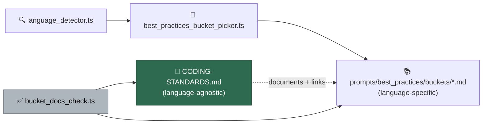

# PR Summary — Issue #372

## Summary

The per-language best-practice buckets were undocumented in the standard that is
supposed to be the entry point: `grep -in 'bucket|best_practices|best practices'
CODING-STANDARDS.md` returned zero hits, so the Rust rule "prefer `?` over
`unwrap()` / `expect()`" — which lives in
`prompts/best_practices/buckets/rust.md` — was unfindable from
`CODING-STANDARDS.md`. This answers the parent issue's question (#358, *"Where
does the Rust rule 'never unwrap' exist?"*): the per-language standards already
exist and are already selected per repository; only their discoverability was
missing.

`CODING-STANDARDS.md` gains one short section, § "Language-Agnostic Standards vs
Per-Language Buckets", placed after § "Prompt Template Versioning". It:

- States the split — this document plus the injected `prompts/coding_guidelines/`
  template carry the language-agnostic rules (fail-loud, security, commit
  safety, TDD, quality gates); language-specific rules live in the buckets and
  are injected only when the repository uses that language.
- Lists all eight buckets (`rust`, `typescript`, `java`, `react`, `html`,
  `terraform`, `aws-cloudformation`, `general`) in a table, each linking to its
  guide under `prompts/best_practices/buckets/`.
- Names `worker/deno/lib/best_practices_bucket_picker.ts` as the selector and
  `worker/deno/lib/language_detector.ts` as its input, so a reader can see *when*
  a bucket is injected.
- Uses the Rust `unwrap()` rule as the worked example, so searching the standard
  for "unwrap" or "Rust" routes to `buckets/rust.md` in one hop.

It deliberately does not restate bucket contents — the buckets remain the single
source of truth for their own rules.

Docs-only change plus its guard; no worker behaviour changes. Closes #372.

## Evidence

A guard stops the section drifting out of date.
`worker/deno/lib/bucket_docs_check.ts` reads every entry under
`prompts/best_practices/buckets/`, fails when a bucket has no
`prompts/best_practices/buckets/<name>.md` link in `CODING-STANDARDS.md`, and
fails when a bucket link in the standard does not resolve on disk. Adding a
ninth bucket without documenting it therefore reddens CI — the actual regression
the section is meant to prevent.



Reviewer note: the guard is enforced by this repository's own Deno test rather
than by a shared quality-gate check. The gate runs against every monitored
repository, and only this repository owns the bucket guides — repository
isolation means the standard is enforced where it lives. This mirrors the guard
added for Issue #371.

Docs-and-tests change with no web interface, so there is no screenshot to
capture. The evidence is the test run below.

```text
deno test --allow-read --allow-write tests/bucket_docs_test.ts
ok | 17 passed | 0 failed (17ms)
```

## Test Plan

Added `worker/deno/tests/bucket_docs_test.ts` (17 tests), which calls the real
functions in `worker/deno/lib/bucket_docs_check.ts` with fixtures and against the
live repository tree:

- `bucketNamesFromEntries` — extension stripping and sorting, non-Markdown
  entries ignored, empty directory.
- `findUndocumentedBuckets` — a linked bucket passes; a bare language mention
  without the path does not; only the missing buckets are reported; no buckets
  means nothing to document.
- `findBucketLinkTargets` — collects targets, drops duplicates, strips anchors,
  ignores non-bucket links.
- `runBucketDocsCheck` against temporary fixture trees — `PASSED` when every
  bucket is linked and resolves; `FAILED` for an undocumented ninth bucket (the
  regression guard); `FAILED` for a link to a removed bucket; `SKIPPED` when the
  buckets directory or the standard is absent.
- Live-tree regression guards — every bucket on disk is documented in
  `CODING-STANDARDS.md` with a resolving link, and the standard mentions
  `unwrap()`, `prompts/best_practices/buckets/rust.md`, and
  `worker/deno/lib/best_practices_bucket_picker.ts`.

### Quality gate

`./quality.sh < /dev/null` passes every stage except `deno tests`, which reports
**15950 passed / 10 failed**. All ten failures are pre-existing and unrelated to
this change — they are environment-sensitive tests that read the real host work
directory (`/home/vibe/auto-issue-work`):

- `tests/fleet_health_test.ts` — 1
- `tests/host_workdir_guard_test.ts` — 1
- `tests/optional_feature_env_test.ts` — 1
- `tests/setup_workdir_reminder_test.ts` — 7

Verified pre-existing by checking out the untouched base branch
(`milestone/358-coding-standards-should-be-model-agnostic` at `e96a999`) in a
separate worktree and running those four files there: the same **10 failed**.
This branch touches only `CODING-STANDARDS.md`, the new
`worker/deno/lib/bucket_docs_check.ts`, and its test, none of which those tests
import. `deno lint`, `deno check`, `deno fmt --check`, markdownlint, mermaid and
`docs prompt versions` all pass.
