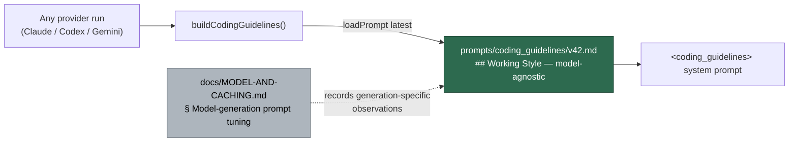

# coding_guidelines v42 — model-agnostic Working Style section

## Summary

`buildCodingGuidelines()` (`worker/deno/lib/prompt_builder.ts:90`) loads the
**latest** `coding_guidelines` version for every run, with no provider
awareness. v34–v41 opened with a section headed `## Opus 5 Working Style` whose
premise — "You self-verify as you work, delegate readily, and tend to write at
length" — asserted one model generation's traits to every run, the Codex and
Gemini providers included.

New `prompts/coding_guidelines/v42.md` (templates are immutable once committed,
so this is a new version, not an edit to v41) copies v41 and rewrites **only**
that section:

- Heading retitled `## Working Style`.
- The generation-specific premise replaced with a neutral lead.
- All four directives kept. The fourth is restated as the rule —
  **Trust the quality gate** ("a green quality gate is the signal to stop") —
  instead of "You already check your work as you go".

The generation-specific observations that justified the original framing were
not deleted: they are prior tuning results and stay in
`docs/MODEL-AND-CACHING.md` § "Model-generation prompt tuning", which gains a
`Where the framing lives (v42 onward)` subsection recording the move.

Out of scope, per the issue: the per-model overlay mechanism, and
`CODING-STANDARDS.md` (#371, #372).

Closes #373.

## Evidence

Backend/prompt-template change only — no web interface to screenshot.

Acceptance greps and the version diff:

```console
$ diff prompts/coding_guidelines/v41.md prompts/coding_guidelines/v42.md
23c23
< ## Opus 5 Working Style
---
> ## Working Style
25,26c25
< You self-verify as you work, delegate readily, and tend to write at length. Play
< to the strengths and rein in the tendencies:
---
> Four standing directives govern how much work a task gets:
41,43c40,42
< - **Trust your own verification.** You already check your work as you go, so do
<   not add ritual "double-check everything again" passes once the quality gate is
<   green. A clean gate is the signal to stop, not to re-verify.
---
> - **Trust the quality gate.** A green quality gate is the signal to stop, not to
>   start another pass. Do not add ritual "double-check everything again" rounds
>   once it passes cleanly.

$ grep -inE 'opus|fable|sonnet|haiku' prompts/coding_guidelines/v42.md
$ echo $?
1
```

`v41.md` is untouched — the `prompt immutability` quality check passes, and
`coding_guidelines v42 - differs from v41 only in the working-style section`
asserts the byte-identical prefix and suffix around the rewritten section.

How the guidelines reach a run, and where the model-generation detail now
lives:



### Quality gate

`./quality.sh` result: `prompt immutability`, `markdownlint`, `mermaid`,
`docs prompt versions`, `deno lint`, `deno type check` and `deno fmt` all
**PASSED**.

`deno tests` reports pre-existing failures in `tests/fleet_health_test.ts`,
`tests/host_workdir_guard_test.ts`, `tests/optional_feature_env_test.ts` and
`tests/setup_workdir_reminder_test.ts` — all work-dir/environment assertions
unrelated to this change — plus one flaky concurrency test
(`tests/audit_journal_test.ts`) that failed on only one of two runs. Confirmed
pre-existing: `git stash -u` then re-running those files on the clean tree
reproduces the same failures. The 12 new tests pass.

## Test Plan

New `worker/deno/tests/coding_guidelines_v42_test.ts` (12 tests), written
before the template and confirmed failing against v41 (10 failed / 2 passed),
then passing after. It asserts against the **latest** version — not v42 alone —
so a future copy-forward that re-introduces a model name or drops a directive
fails in CI:

- `coding_guidelines v42 - loads via loadPrompt` / `is the latest version` /
  `satisfies the placeholder contract`.
- `latest coding_guidelines - names no Claude model generation` — reuses
  `findModelGenerationNames()` from
  `worker/deno/lib/model_generation_name_check.ts` (the `opus|fable|sonnet|haiku`
  + `claude-<digit>` matcher already used for `CODING-STANDARDS.md`), so the two
  checks cannot drift.
- `latest coding_guidelines - names no foreign model generation` — `gpt|gemini`.
- `latest coding_guidelines - working-style heading is model-agnostic`.
- `latest coding_guidelines - keeps all four working-style directives` — asserts
  each of **Stay in scope**, **Cap delegation**, **Keep deliverables tight**,
  **Trust the quality gate** by keyword, and that
  "You already check your work as you go" is gone.
- `latest coding_guidelines - drops the model-generation premise`.
- `coding_guidelines v42 - differs from v41 only in the working-style section`
  and `carries v41 sections forward` — every other `##`/`###` heading survives.
- `coding_guidelines v41 - stays immutable`.
- `MODEL-AND-CACHING.md records the working-style framing move`.

No existing tests were modified. `coding_guidelines_v36_test.ts`,
`docs_owed_by_code_change_test.ts` and `opus5_prompt_retune_test.ts` assert
`## Opus 5 Working Style` against pinned versions (v34–v36), which stay
immutable and unaffected.
