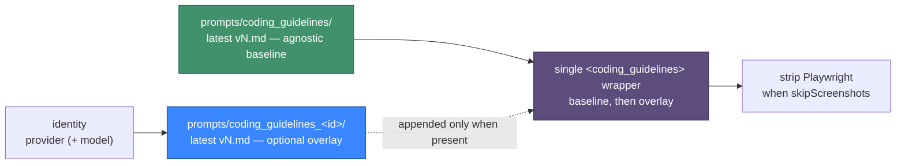

## Summary

`buildCodingGuidelines()` took no model or provider identity, so every run got
the identical guidelines block whatever agent executed it. The v42 baseline
(Issue #373) is model-agnostic by design, which left genuine per-model tuning
with nowhere to live.

This adds an **optional** agent identity to `buildCodingGuidelines()` and
appends a per-model working-style overlay behind the agnostic baseline, inside
the one `<coding_guidelines>` wrapper. With no identity — or no overlay
authored for it — the output is byte-identical to today, which stays the common
path. Closes #374.

- `worker/deno/lib/coding_guidelines_overlay.ts` (new) resolves the overlay:
  `AgentIdentity { provider?, model? }` maps to
  `prompts/coding_guidelines_<provider>_<model>/` then
  `prompts/coding_guidelines_<provider>/`, most specific first, each an
  ordinary immutable `vN.md` prompt directory.
- Identity segments are slugged to `[a-z0-9-]` before they touch a path, so a
  malformed provider id from `.config.json` or the environment cannot traverse
  out of `prompts/`.
- **Fails loud, not silently:** an overlay directory that exists but carries no
  `vN.md` was authored deliberately, so it returns an error rather than passing
  for "no overlay". An *absent* directory is the ordinary no-overlay case.
- `stripPlaywrightSection` runs after the overlay is appended, so
  `skipScreenshots: true` strips Playwright guidance from the overlay too.
- Identity is threaded through the nine `buildCodingGuidelines()` call sites in
  `lib/prompt_builder.ts` (as an optional `agentIdentity` on each options
  interface), plus `commands/prompt_builder.ts` (new `--provider`/`--model`,
  else the configured active provider) and `lib/grill_me_processor.ts` (which
  previously called it with no arguments at all).
- Worked example shipped: `prompts/coding_guidelines_claude/v1.md`, which
  restates the standing directives' premise for Claude runs only.

The overlay is keyed off the provider id `lib/agent_provider.ts` already
resolves (`CLAUDE_PROVIDER_ID` / `CODEX_PROVIDER_ID` / `GEMINI_PROVIDER_ID`) —
no second notion of "current model" is invented.

**Reviewer note — why the cached issue-prompt path passes no identity.**
`computeStaticPromptHash()` in `lib/prompt_builder_cache.ts` keys the cached
system prompt on the repo and the static templates only. Threading an identity
into that path without folding it into the hash would serve one provider's
cached system prompt to another's run — the exact leak this issue exists to
prevent. `buildCachedIssuePrompt()` is therefore left passing nothing (it gets
the baseline), and the constraint is now documented in EXTENDING.md so a future
change cannot walk into it.

## Evidence

Backend/CLI change with no web interface to screenshot — the evidence is the
test suite below.



```text
deno test tests/coding_guidelines_overlay_test.ts tests/prompt_builder_test.ts \
  tests/grill_me_prompt_v12_test.ts
ok | 98 passed | 0 failed
```

## Test Plan

`worker/deno/tests/prompt_builder_test.ts` (new cases):

- No identity — and an empty identity object — produce output byte-identical to
  the wrapped baseline template.
- With an overlay authored for `claude`, the block contains the baseline then
  the overlay in one wrapper; the same call for `codex` and `gemini` contains
  neither the overlay text nor a second wrapper. **This is the regression the
  issue exists to prevent, and it now fails `deno test` in CI.**
- An unknown identity resolves to the exact baseline — no throw, no empty
  overlay heading.
- `skipScreenshots: true` strips the Playwright section from the overlay as
  well as the baseline, wrapper intact.

`worker/deno/tests/coding_guidelines_overlay_test.ts` (new file):

- `codingGuidelinesOverlayNames()`: no identity → no candidates; provider alone
  → one candidate; provider + model → model-specific first; a bare model with
  no provider → nothing; a hostile provider/model id is slugged to a single
  safe path segment.
- `loadCodingGuidelinesOverlay()`: absent overlay → `undefined` not an error;
  unknown identity → `undefined` not a throw; highest `vN.md` wins; a model
  overlay beats the provider overlay and an unmatched model falls back to it;
  one provider's overlay never resolves for another; a version-less overlay
  directory returns an error naming the directory.
- The shipped `prompts/coding_guidelines_claude/` worked example loads and
  contains no Playwright reference.

## Docs

- `docs/EXTENDING.md` § **Per-model coding-guidelines overlays** — naming,
  precedence, immutability, the `skip_screenshot_check` interaction, and the
  prompt-cache constraint above.
- `docs/MODEL-AND-CACHING.md` § *Model-generation prompt tuning* — now points
  at the overlay prompts as where a tuning derived from an observed behaviour
  is applied.
- `docs/PROMPTS.md` — the new prompt type listed in the template table.
