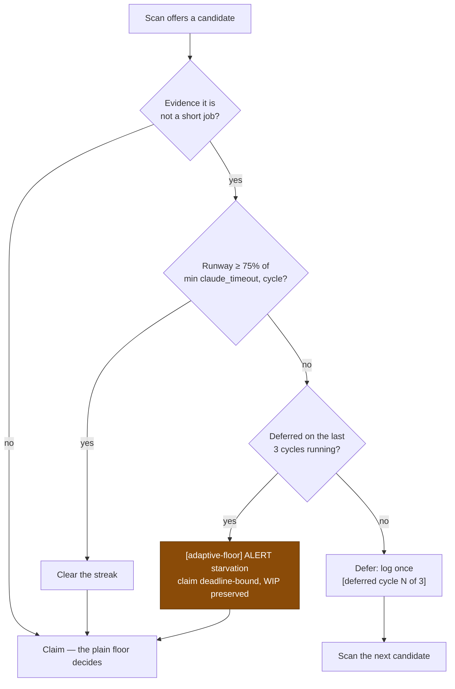

# Bound the adaptive claim floor so it cannot strand an issue for ever

## Summary

The idle-decision census and the claim scan disagreed about
`stSoftwareAU/VibeCoder` for cycle after cycle. The census was right; the claim
scan was wrong, and the culprit was the **adaptive claim floor** (Issue #245).

`decideAdaptiveClaim` refuses an issue with evidence of being a long job —
preserved WIP, a prior `execute` timeout, a long-job size label — unless the
cycle still has `0.75 × min(claude_timeout, cycleSeconds)` of runway. Its own
module doc names the invariant that makes that safe: *the requirement must stay
satisfiable*. On this host it is not. The cycle is 3600 s and `claude_timeout`
is 3600 s, so the requirement is 2700 s of **remaining** runway — but a claim
gate is only reached after startup, the maintenance passes and the scan have
run, about twenty minutes into the cycle. The best runway ever offered to a
claim gate was 2430 s.

`stSoftwareAU/VibeCoder#355` was therefore refused on every cycle, for ever,
under wording that reads as transient:

```text
06:03  VibeCoder#355 … 2360s of runway left, below the 2700s adaptive floor — leaving it for the next cycle
07:05  VibeCoder#355 … below the 2700s adaptive floor — leaving it for the next cycle
08:05  VibeCoder#355 … below the 2700s adaptive floor — leaving it for the next cycle
09:09  VibeCoder#355 … 1631s of runway left, below the 2700s adaptive floor — leaving it for the next cycle
10:06  VibeCoder#355 … 2360s of runway left, below the 2700s adaptive floor — leaving it for the next cycle
```

Meanwhile `[idle-census] ALERT inversion repos=…,stSoftwareAU/VibeCoder,…` fired
on every one of those cycles and Issue #321 escalated it — this issue. The same
line shows `stSoftwareAU/GRQ#4375` and `#4371`/`#4372` starved identically,
which is why the alert named three repos, not one.

This is the failure shape Issue #319 described: **a permanent condition worded
as a passing one**.

The fix gives the deferral a memory. The worker counts the consecutive *cycles*
(not scans — a slot re-scans every 30 s) that the floor deferred one issue. On
the third it yields: the issue is claimed on whatever runway is left, the
execute is deadline-bound, and WIP preservation carries the progress into the
next cycle — exactly the regime Issue #47 already documents for a host whose
cycle can never fit its budget. The override is loud and greppable, and the
streak resets the moment the floor accepts the issue, so an issue that genuinely
fits a later cycle is still never claimed on a doomed slice.

Closes #375.

## Evidence

Backend/CLI change — no web interface to screenshot. Verified by the tests
listed below plus the production log evidence quoted above (`~/logs`,
`[idle-census] ALERT inversion`, and the per-cycle "below the 2700s adaptive
floor" lines for `VibeCoder#355` and `GRQ#4375`).



The override line, as it will appear in `worker.log`:

```text
[adaptive-floor] ALERT starvation issue=stSoftwareAU/VibeCoder#355 deferred_cycles=3 limit=3 runway=2360s required=2700s — the floor can never be met on this host, so the claim proceeds deadline-bound and WIP preservation carries the progress (Issue #375).
```

Quality gate: `./quality.sh` reports the same ten pre-existing failures on this
container as it does on an unmodified `main` (`fleet_health`,
`host_workdir_guard`, `optional_feature_env`, `setup_workdir_reminder` — all
host work-dir path expectations, none touched by this change). Verified by
stashing the change and re-running those four files: `10 failed` either way.
Every other check passes, and the full suite is `15859 passed | 10 failed`.

## Test Plan

New — `worker/deno/tests/adaptive_floor_starvation_test.ts` (10 tests) drives the
real state module against a temporary work directory:

- consecutive cycles increment the streak; repeat scans within one cycle do not
- streaks are tracked per issue, and clearing one resets it to zero
- a missing or corrupt state file reads as empty (restarts the count — the
  conservative direction)
- malformed and expired (>7 day) entries are dropped on load
- a failed persist is reported through the log sink, never silent
- the `ALERT starvation` line names the issue, the streak, the limit, the runway
  and the shortfall

New in `worker/deno/tests/run_core_adaptive_claim_test.ts` (5 tests) drive the
scan-loop wiring through `runCoreLoop`:

- an issue already deferred on the two previous cycles is **claimed** on 933 s of
  runway, and the starvation alert is logged — the regression test for this
  issue: it fails against the unfixed code, which defers again
- below the limit the issue is still deferred, with `[deferred cycle 1 of 3]`
  named in the line
- the limit is configurable and honoured
- an issue the floor accepts has its streak cleared
- with no streak tracking wired the floor defers exactly as before #375

The five existing Issue #245 tests are unchanged and still pass, so the floor's
original behaviour inside the limit is intact.

Docs: `docs/CONFIGURATION.md` § Adaptive claim floor gains the bounded-deferral
subsection and the updated flowchart.
