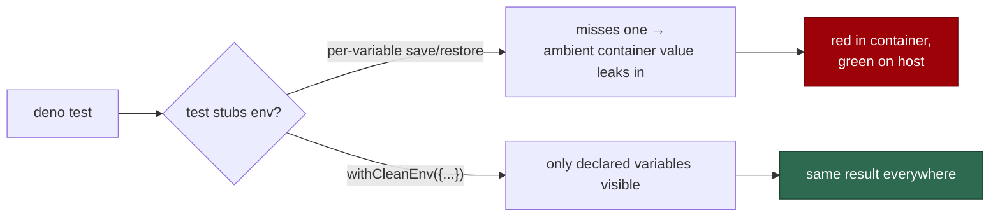

# Ten Deno tests read the ambient worker environment

## Summary

Ten tests across four files stubbed *some* of the environment their code path
reads and inherited the rest from whichever machine ran the suite. Inside the
worker container `WORK_DIR`, `VIBE_IMAGE_AGENT_PROVIDERS`, `FLEET_HEALTH_REPO`
and `UPDATE_GH_USER_STATUS` are all exported, so `./quality.sh` reported
`deno tests FAILED` on every in-container run and the gate could not tell a
genuine regression from the noise.

The fix is a shared stubbing helper — `worker/deno/tests/support/env.ts` —
that snapshots, replaces and restores an environment as a whole rather than
one variable at a time, plus the subprocess equivalent (`clearEnv: true`) for
the tests that shell out. No production code changed. Closes #378.

- `withEnv(values, body)` — replace the named variables, restore them
  afterwards (including deleting one that was previously unset), even on throw.
- `withCleanEnv(values, body)` — the same, and *every other* variable the
  process carries is hidden for the duration. A code path can only see what the
  test declared, so the result no longer depends on the host.
  `RUNTIME_ENV_KEEP` / `RUNTIME_ENV_KEEP_PREFIXES` keep `PATH`, `HOME`,
  `TMPDIR`, `DENO_*` and friends so subprocess- and tempdir-based tests still
  work; none of them configure the worker.

The seven `remind_obsolete_host_work_dirs` cases failed for the subprocess
variant of the same bug: `Deno.Command`'s `env` option **merges** into the
parent environment, so the child inherited the real `WORK_DIR` and probed the
host's actual work dir instead of its temp fixture. `clearEnv: true` gives the
child exactly the listed variables.

Three further test files (`default_branch_cache_test.ts`, `run_mode_test.ts`,
`worker_cache_dir_test.ts`) each carried their own private copy of a `withEnv`
helper; they now import the shared one. Behaviour is unchanged — this is the
DRY half of "a shared helper rather than per-variable save/restore".



## Evidence

Backend/CLI change with no web interface, so the evidence is test output
captured in the failing environment — this worker container, where all four
ambient variables are set:

```text
WORK_DIR=/home/vibe/auto-issue-work
VIBE_IMAGE_AGENT_PROVIDERS=claude
FLEET_HEALTH_REPO=git@github.com:stSoftwareAU/GRQ-health.git
UPDATE_GH_USER_STATUS=true
```

**Before** — `origin/main` checked out into a clean worktree in the same
container, reproducing exactly the ten failures the issue lists:

```text
FAILURES

buildFleetHealthConfig - container mode clones under the work-dir mount => ./tests/fleet_health_test.ts:914:6
host workdir guard - buildFleetHealthConfig only builds strings, never directories => ./tests/host_workdir_guard_test.ts:288:6
applyOptionalFeatureEnv - reads the file and sets what is missing; an unreadable file sets nothing => ./tests/optional_feature_env_test.ts:57:6
remind_obsolete_host_work_dirs - names a leftover work dir and how to reclaim it => ./tests/setup_workdir_reminder_test.ts:74:6
remind_obsolete_host_work_dirs - covers the approval-state sibling too => ./tests/setup_workdir_reminder_test.ts:97:6
remind_obsolete_host_work_dirs - removes an empty leftover work dir and says so (Issue #134) => ./tests/setup_workdir_reminder_test.ts:116:6
remind_obsolete_host_work_dirs - removes a work dir holding only setup's own .vibe-cache (Issue #134) => ./tests/setup_workdir_reminder_test.ts:137:6
remind_obsolete_host_work_dirs - removes an empty approval-state sibling too (Issue #134) => ./tests/setup_workdir_reminder_test.ts:167:6
remind_obsolete_host_work_dirs - an absent work dir produces no output and no probe path => ./tests/setup_workdir_reminder_test.ts:239:6
remind_obsolete_host_work_dirs - a checkout beside the cache is still reported => ./tests/setup_workdir_reminder_test.ts:276:6

FAILED | 63 passed | 10 failed (2s)
```

**After** — the same container, this branch, the four affected files plus the
three de-duplicated ones and the new helper's own suite:

```text
ok | 127 passed | 0 failed (1s)
```

**Full gate** — `./quality.sh < /dev/null`:

```text
  deno tests                     PASSED
  deno lint                      PASSED
  deno type check                PASSED
  deno fmt                       PASSED

Result: PASSED (with skipped checks)
```

## Test Plan

New — `worker/deno/tests/env_stub_test.ts` (6 cases) covers the helper itself:

- `withEnv` sets, deletes and restores the named variables — happy path plus
  the "was unset, must go back to unset" edge case.
- `withEnv` returns the body's value, sync and async.
- `withEnv` restores the environment when the body throws.
- `withCleanEnv` hides an ambient variable the caller did not name — the
  regression case for this issue.
- `withCleanEnv` keeps the runtime variables (`HOME`, non-empty `PATH`) the
  test process itself needs.
- `withCleanEnv` restores the *entire* environment it cleared, even after a
  throw (asserted against a full `Deno.env.toObject()` snapshot).

Modified — the ten failing cases, which now assert the same behaviour under a
declared environment. Two of them were strengthened rather than merely made to
pass: `fleet_health_test.ts` and `optional_feature_env_test.ts` wrap the
`withCleanEnv` call in an outer `withEnv` that pins a *hostile* ambient
`FLEET_HEALTH_REPO` / `UPDATE_GH_USER_STATUS`, so the assertion fails if the
hiding ever regresses instead of quietly passing on a bare developer host.
No test was removed, skipped, or had its assertions weakened.

Docs — `docs/EXTENDING.md` gains a "Stubbing the environment" section under the
testing guidance: use `tests/support/env.ts`, never hand-roll a per-variable
save/restore, and pass `clearEnv: true` to `Deno.Command`.
