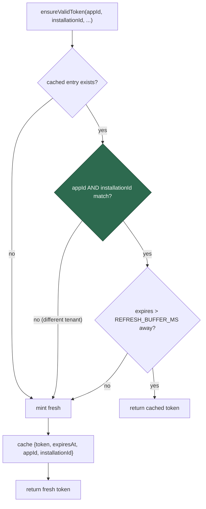

# PR Summary — Issue #38

## Summary

`worker/deno/lib/github_app_auth.ts` cached the GitHub App installation token
in a module-level singleton holding only `{token, expiresAt}`. The cache-hit
path in `ensureValidToken` never checked which `appId`/`installationId` the
token had been minted for, so a call for installation B made while a live token
for installation A was cached silently returned **A's token** — a cross-tenant
credential leak that fails silently rather than loudly.

The fix keys the cache by the identity the token was minted for:

- `CachedToken` now carries `appId` and `installationId` alongside
  `token`/`expiresAt`.
- The hit path returns the cached token only when **both** identity fields
  match the current arguments; a mismatch falls through to the normal mint
  path, which overwrites the entry with the new identity.
- Expiry and `REFRESH_BUFFER_MS` semantics are untouched.
- `resetTokenCache()` still assigns `null` to the whole entry, so token,
  expiry and identity are discarded together — no stale identity can survive a
  reset.

A single-entry identity-checked cache was chosen over a keyed map: it is the
smaller change and matches today's single-installation usage, while closing the
hazard before any multi-installation code path exists.

**Original trigger closed, no trivial bypass.** The only way to reach
`return cachedToken.token` is through a guard that requires
`cachedToken.appId === appId && cachedToken.installationId === installationId`;
the identity is written into the entry at the same statement that writes the
token, from the same `ensureValidToken` arguments used for the mint, so no
entry can exist whose identity fields disagree with the token it holds. Every
other path falls through to a fresh JWT + installation-token exchange for the
requested identity. There is no alternative return of a cached token and no
setter that mutates identity independently of the token, so the
wrong-installation return is unreachable rather than merely harder to hit.

Closes #38.

## Evidence

Backend/library change with no web interface — no screenshot applies. The
evidence is the Deno unit suite.

Cache decision after the fix:



Targeted suite, after the fix:

```text
$ deno test --allow-read --allow-write --allow-env --allow-net --allow-run \
    tests/github_app_auth_test.ts < /dev/null
ok | 33 passed | 0 failed (28ms)
```

Regression linkage — the two cross-identity tests were written first and fail
against the unfixed code, exactly as the flaw predicts (stale token returned):

```text
github_app_auth - ensureValidToken mints fresh for a different installationId
  AssertionError: Values are not equal.
  -   ghs_token_1   (actual: installation A's cached token)
  +   ghs_token_2   (expected: fresh mint for installation B)
github_app_auth - ensureValidToken mints fresh for a different appId
  AssertionError: Values are not equal.
  -   ghs_token_1
  +   ghs_token_2
FAILED | 18 passed | 2 failed
```

Both pass after the fix. Existing cache-hit and near-expiry refresh tests were
not modified and still pass.

Full gate: `./quality.sh` reports every check PASSED except `deno tests`, which
fails on 7 tests unrelated to this change —
`tests/fleet_health_test.ts` (1), `tests/optional_feature_env_test.ts` (1) and
`tests/setup_workdir_reminder_test.ts` (5). Verified pre-existing: stashing this
branch's changes and re-running those three files on the base commit
(`aeb9ddc`) reproduces the identical 7 failures.

### Security self-check

- **Input validation** — no new external input; the two new comparisons are
  exact string equality on values the caller already supplies.
- **Secrets** — no credentials staged; the test key is the existing
  test-only PEM already in the suite.
- **Injection surface** — none added.
- **Error handling** — unchanged; no new failure paths, and the identity
  mismatch fails safe by minting rather than by returning a wrong credential.
- **Dependencies** — none added.

## Test Plan

Added to `worker/deno/tests/github_app_auth_test.ts`:

- `worker/deno/tests/github_app_auth_test.ts::github_app_auth - ensureValidToken mints fresh for a different installationId`
  — reproduces the flaw (fails against the unfixed code, passes after the fix):
  asserts a second fetch occurs and the returned token is not installation A's.
- `worker/deno/tests/github_app_auth_test.ts::github_app_auth - ensureValidToken mints fresh for a different appId`
  — same shape across a differing `appId`; also fails against the unfixed code.
- `worker/deno/tests/github_app_auth_test.ts::github_app_auth - resetTokenCache clears the cached identity too`
  — after a reset, the same identity mints fresh, so no stale identity survives.

Unchanged and still passing: the same-identity cache-hit test and the
near-expiry refresh test.
