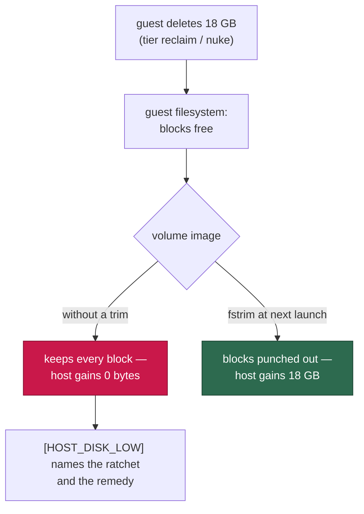
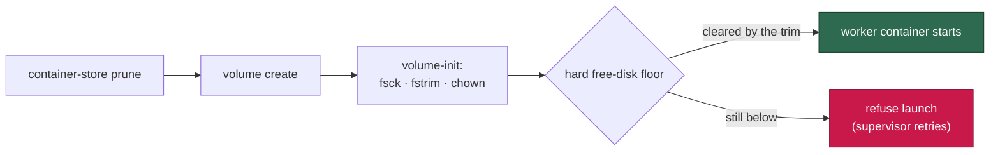

# Return the work volume's freed blocks to the host (Issue #384)

## Summary

The `vibe-work` named volume is a thin-provisioned disk image: blocks are
allocated to it when the guest writes and are **never** returned when the guest
deletes. Every guest-side reclaim therefore handed the host exactly zero bytes,
while the host-free estimate credited those deletions anyway — so host `GRQ-23`
sat below the disk floor for days, claimed nothing, and logged
`reclaimed 0 bytes` every few minutes. This change makes the floor reachable
again. Closes #384.

Four parts, one root cause:

1. **The blocks come back.** `container/volume-init.sh` already runs as root
   with the volumes mounted, so it now runs `fstrim -v` on each block-device
   volume, punching the freed blocks out of the image. This is the supported
   compaction path asked for in the issue: it runs on every launch, needs no
   `container volume delete` incantation, and a runtime that cannot discard (or
   an image without `fstrim`) says so loudly while the launch proceeds.
2. **The trim gets its chance.** Both launchers create the volumes and run the
   init **before** the hard free-disk floor gate. Gating first made the floor
   unreachable by construction: a host below it refused the launch, so the
   volume was never trimmed, so the host never got its blocks back.
3. **Guest bytes are no longer counted as host bytes.** `estimateHostFree` now
   takes the volume's **high-water mark** rather than its current usage, and
   `HostDiskMonitor` tracks that peak. Previously an 18 GB guest-side sweep
   raised the host estimate by 18 GB the host never received and reported
   `healed: true` while host `df` had not moved.
4. **The alarm teaches.** A new `work_volume_ratchet.ts` classifies the gap
   between the peak and current use and produces the operator-facing sentences.
   The host-disk status names the ratchet, and the `[HOST_DISK_LOW]` reclaim
   line states plainly that the bytes it freed were freed *inside the guest*,
   that the host got none of them, and what returns them.

Before / after, on the GRQ-23 numbers:

```text
before: [HOST_DISK_LOW] reclaimed 0 bytes of disposable work-volume space —
        monitored 2.9 GB in 9 repos; side/data 10.8 GB in 1 dirs; removed 0
        (0.0 GB, disk-low) — host disk now low: host 6.5 GB free (1.4%) …

after:  [HOST_DISK_LOW] reclaimed 11811160064 bytes of disposable space INSIDE
        the work volume — … removed 1 (11.0 GB, disk-low) — 11.0 GB freed
        inside the guest, 0 bytes returned to the host: the vibe-work volume
        image only grows — 23.5 GB of the image is now space the guest has
        already freed. The launch-time volume trim (fstrim in volume-init)
        hands those blocks back on the next launch; where the runtime cannot
        discard, stop the container and `volume delete vibe-work` — the clones
        re-clone and the approval snapshots re-baseline (Issue #384)
```

**Not in scope.** The issue's side note — `side/data` growing 0.7 GB → 10.8 GB
in one afternoon on an idle host — is a separate leak and is filed as
stSoftwareAU/VibeCoder#387.

## Evidence

Backend/launcher change with no web interface, so no screenshot applies; the
evidence is the test suite below plus the launcher run recorded by the harness.

Where the host's space actually goes, and what gets it back:



The launch order that makes the floor reachable:



Test run (the suites this change touches):

```text
deno test tests/work_volume_ratchet_test.ts tests/host_disk_test.ts \
  tests/volume_init_script_test.ts tests/run_sh_launcher_test.ts \
  tests/launcher_parity_test.ts tests/run_core_slot_pool_test.ts
ok | 114 passed | 0 failed
```

`./quality.sh` passes every check except `deno tests`, which reports 10
failures that are **pre-existing and environment-dependent** — verified by
running `tests/fleet_health_test.ts`, `tests/host_workdir_guard_test.ts`,
`tests/optional_feature_env_test.ts` and `tests/setup_workdir_reminder_test.ts`
on a stashed (clean) tree: the same 10 fail there. They assert on the test
host's real `~/auto-issue-work` layout and touch none of the code in this
change.

## Test Plan

New — `worker/deno/tests/work_volume_ratchet_test.ts` (10 tests):

- the peak the guest reached is what the host lost (the GRQ-23 numbers);
- a volume that has not shrunk, and a gap under the 1 GiB floor, are not
  ratchets;
- an unknown reading never becomes a ratchet claim, and a peak below the
  current reading cannot go negative;
- `describeWorkVolumeRatchet` names the dead space and the volume, or says
  nothing;
- `describeGuestReclaimToHost` always states `0 bytes returned to the host`,
  names `fstrim` and `volume delete vibe-work`, and never claims a sweep freed
  bytes it did not;
- the volume name in the remedy is pinned to `WORK_VOLUME_NAME`, so the command
  an operator is told to run cannot drift from the volume the launcher mounts.

Added to `worker/deno/tests/host_disk_test.ts` (4 tests) — the regression the
issue reports:

- a guest-side delete after a 20 GB growth does **not** raise the host estimate
  (the fix; fails against the unfixed `estimateHostFree`);
- the low alarm's detail names the volume image as where the space went;
- a volume that has not shrunk says nothing about a ratchet;
- native mode reads `df` directly, so freed space is genuinely free and there is
  no ratchet to claim.

Added to `worker/deno/tests/volume_init_script_test.ts` (5 tests), driving the
real script with stubbed `fstrim`:

- a block-device volume is trimmed, after the check remounted it;
- a bind-mounted target is not trimmed (no image to punch holes in);
- a runtime that cannot discard is loud and the launch still proceeds (exit 0);
- an image without `fstrim` says so rather than failing silently;
- an unrepairable device is never trimmed.

Added to `worker/deno/tests/run_sh_launcher_test.ts` (1 test) — runs the real
`run.sh` against the recording stub with an unclearable floor and asserts the
volume init already ran before the refusal, and that no worker container
started.
