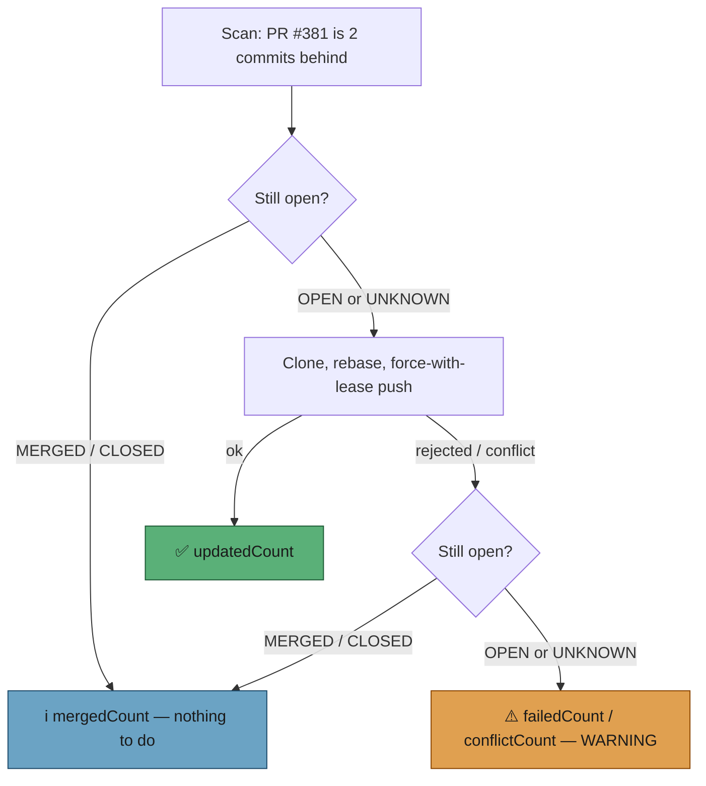

# A PR that merges mid-cycle is a no-op, not a failed branch update

## Summary

The PR-branch-update pass scans, then executes up to a minute later. On host
GRQ-23, PR #381 was read as two commits behind at 21:48:37Z, merged at
21:49:12Z, and the push went out at 21:49:37Z — `--force-with-lease` refused it
with `(stale info)`, which is the lease doing exactly its job. The run still
reported `failedCount=1` and a WARNING, so a genuine push failure (protected
branch, permissions, a real lease violation over someone else's commits) read
identically to "the PR merged while we were working".

The execute step now re-checks the PR's live state at the point of action — the
same lesson the claim path learnt in #344 / #352, one step further along the
pipeline:

- **Before the clone and the push** — `gh pr view --json state`. A `MERGED` or
  `CLOSED` PR is counted as `mergedCount`, logged at INFO, and costs no
  repository clone and no push.
- **After a failed update, only on failure** — the same lookup. Merged/closed →
  `mergedCount` at INFO; still open → `failedCount` / `conflictCount` and the
  WARNING, unchanged. A clean pass costs no extra API call.
- **Lookup unavailable or failing** — `UNKNOWN`. The update proceeds and every
  failure stays loud; the lookup error is warned about, never swallowed.

`mergedCount` is reported in its own clause (`, N merged mid-update`) and is
never folded into `failedCount`. A mid-cycle merge records no failure against
the Issue #335 streak, so a routine merge cannot escalate a branch that was
never broken. `conflictCount` had the same defect the issue asked us to check
and is classified by the same re-check.

Closes #386.

## Evidence

Backend/CLI change with no web interface, so there is nothing to screenshot;
the evidence is the test suite below plus the quality gate.



Test run for the five PR-branch-update suites:

```text
$ deno test --allow-all tests/pr_branch_update*_test.ts
ok | 96 passed | 0 failed (1s)
```

## Test Plan

New file `worker/deno/tests/pr_branch_update_merged_midflight_test.ts` (13
tests), all driving the real `executePrBranchUpdates` with injected deps:

- `classifyPrLiveState` maps `OPEN` / `MERGED` / `CLOSED` (case- and
  whitespace-insensitive) and falls back to `UNKNOWN` for anything else.
- `makeGhPrStateFetcher` asks `gh` for the PR's state with the PR number and
  repo it was given.
- A PR merged between scan and push is `mergedCount`, at INFO, with **no**
  push and **no** repository clone.
- A PR closed between scan and push is the same no-op.
- The distributed lock is released when the PR merged mid-cycle.
- **Regression for the reported bug:** a `(stale info)` rejection on a
  since-merged PR is `mergedCount=1`, `failedCount=0`, no WARNING, and the git
  rejection is kept in the detail for traceability. Against the unfixed code
  this asserted `failedCount=1`.
- The same rejection on a **still-open** PR stays `failedCount=1` with the
  WARNING.
- With no `getPrState` wired, a rejection is still counted as a failure.
- A state lookup that throws warns and leaves the failure loud — `UNKNOWN`
  never excuses anything.
- A conflict reported for a since-merged PR is `mergedCount`, not
  `conflictCount`; a conflict on a still-open PR still reaches the
  merge-conflict pass.
- A mid-cycle merge files no escalation issue and records no Issue #335 failure
  streak.

Existing suites re-run unchanged: `pr_branch_update_test.ts`,
`pr_branch_update_integration_test.ts`,
`pr_branch_update_failure_streak_test.ts`,
`pr_branch_update_streak_wiring_test.ts`.

## Docs

`docs/workflows/pr-feedback.md` gains a section covering the re-check, the
counter split, and the `UNKNOWN` fail-loud rule, with a flowchart.
