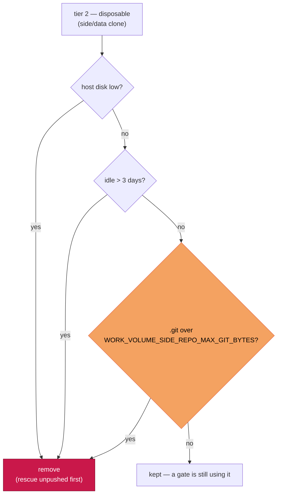

# Cap a warm side/data clone's git object store

## Summary

Found what fills `side/data` on an idle host and bounded it. Closes #387.

**The writer.** Caught live on a fleet host, mid-cycle:

```console
$ ps -ef | grep git
vibe 13600  /bin/bash ./quality.sh                       (cwd: …/GRQ)
vibe 13606   \_ bash worker/repos.sh --require-sentiment
vibe 13636       \_ /bin/bash ./model_fetch.sh GRQ-shareprices2026Q2 --skip-validate
vibe 16842           \_ git reset --hard origin/Develop  (cwd: …/GRQ-shareprices2026Q2)
vibe 16843               \_ git … fetch origin --filter=blob:none --stdin
```

**Legitimate or leak — both.** The refresh is legitimate: a data repo a gate
genuinely re-reads each run. What it *leaves behind* is the leak. In a
blobless partial clone (#243) the hard reset lazily backfills a whole tree of
blobs into a new `.promisor` pack, and git never prunes those — `git repack`
deliberately skips promisor packs. Evidence from the same host, one pack per
refresh:

```console
$ ls -la .git/objects/pack/            # GRQ-shareprices2026Q2, .git = 1.5 GB
-r--r--r-- 871235781 Aug 24 03:50 pack-b7414c…pack   + .promisor
-r--r--r-- 650843489 Aug 25 22:35 pack-a3124b…pack   + .promisor
$ tail -3 .git/logs/HEAD
… reset: moving to origin/Develop          # 24 Aug
… reset: moving to origin/Develop          # 25 Aug
```

Two refreshes, two full-tree backfills, nothing reclaimed — on a working tree
that is only 6.5 GB. Reproduced from scratch (git 2.47.3, promisor remote,
3 × 3 MB blobs rewritten per commit):

```text
clone + checkout .git:  8992 KB, promisor packs: 2
after refresh 1:       17820 KB, promisor packs: 4
after refresh 2:       26632 KB, promisor packs: 6
after gc --prune=now:  26584 KB, promisor packs: 1   ← reclaims nothing
```

**The bound.** Such a clone is refreshed every cycle, so it is never idle: the
age sweep never reaches it and the disk-low reclaim only fires once the host
is already below the floor. The age sweep now also removes a **tier-2** clone
whose `.git` exceeds `WORK_VOLUME_SIDE_REPO_MAX_GIT_BYTES` (default 2 GiB,
`0` disables) — the same shape as `deno-cache-guard` bounding the Deno cache.
Re-cloning costs one blobless backfill, about what a single refresh already
cost, so disk is bounded without multiplying the download. Every existing
protection is untouched: nothing goes while a slot is mid-execute, unpushed
commits are rescued first, and tier 1 is never a candidate.

## Evidence

Backend/CLI change — no web interface to screenshot. Verified by the tests
below plus the live host forensics and the reproduction above.

Where the new cap sits in the tier decision (the `.git over the cap?` branch
is new):



Removal says why, so an operator meeting it learns the cause:

```text
work volume: removed disposable GRQ-shareprices2026Q2 (7.9 GB, 0.0 days idle,
age, .git 1.5 GB over the 2.0 GB cap — blobless re-fetch ratchet (Issue #387))
work volume: monitored 2.9 GB in 9 repos; side/data 10.8 GB in 1 dirs;
removed 1 (7.9 GB, age); git-ratchet: GRQ-shareprices2026Q2
```

`./quality.sh` passes (deno tests, lint, type check, fmt, markdownlint,
mermaid).

## Test Plan

Added to `worker/deno/tests/work_volume_tiers_test.ts`:

- `scanWorkRootTiers - measures the git object store separately` — `.git` is
  measured on its own and is 0 when there is none.
- `selectRatchetedGitDirs - disposable clones whose object store is over the
  cap` — over/at/under the cap, `0` and a negative cap disable it, monitored
  and `.git`-less dirs are never selected.
- `reclaimWorkVolumeTiers - age mode removes a warm side repo whose object
  store has ratcheted` — a 0-day-idle clone with a 3 GB `.git` goes under a
  2 GB cap, a warm clone under the cap stays, and the log and summary name
  the ratchet.
- `reclaimWorkVolumeTiers - the git cap honours every existing protection` —
  a live slot holds it back; a failed push rescue keeps it.
- `reclaimWorkVolumeTiers - the git cap never reaches tier 1`.

Added to `worker/deno/tests/work_volume_tiers_command_test.ts`:

- `work-volume-tiers - a warm side clone over the git cap goes` — end to end
  through the command with a real `du`, generous cap keeps / tight cap
  removes.
- `--max-git-bytes -1` is rejected like the other knobs.

Added to `worker/deno/tests/run_housekeeping_test.ts`:

- the `work-volume-tiers` step carries `max-git-bytes` at its default, and
  `WORK_VOLUME_SIDE_REPO_MAX_GIT_BYTES=0` is honoured as a deliberate opt-out.
