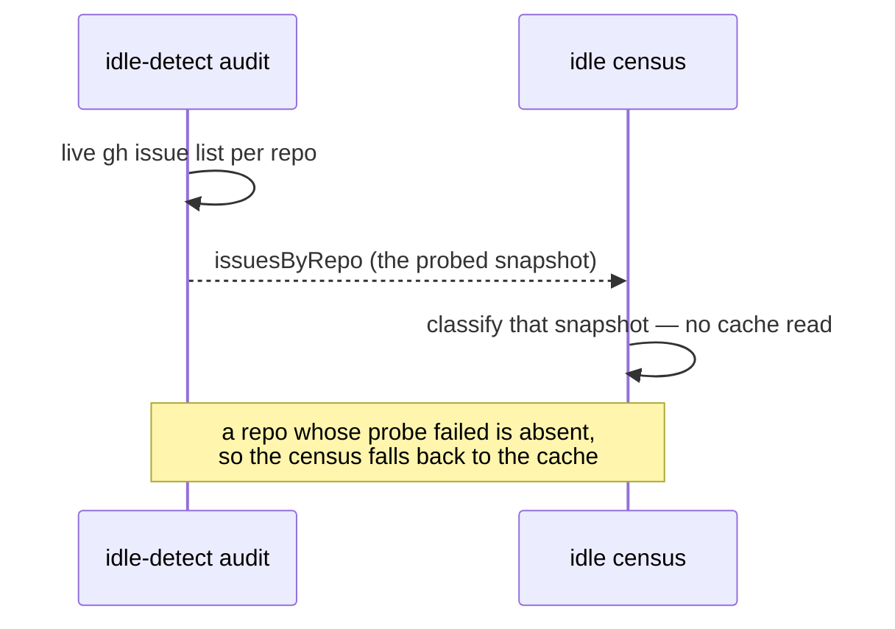

# Give the idle census and the idle-detect audit one snapshot

## Summary

The idle-decision census and the idle-detect audit model the same gates but
read **different snapshots**, so they contradicted each other on timing alone —
and that contradiction is indistinguishable, in the log, from a real gate bug.
The audit probes each repo live; the census read the shared `issues_all` cache,
whose TTL is 600 s and which a *sibling host's* claim never invalidates.

The audit now hands the census the issue list it just probed at the same gate,
and the census classifies that list.

Fixes the residual half of `stSoftwareAU/NEAT-AI#3897`, which the census's
merged-PR gate (#429 / PR #435) did not close.

## Evidence

Backend/CLI change with no web interface, so no screenshot applies. The evidence
is the worker log and the tests below.

On 2026-08-26, hours *after* PR #435 merged, `stSoftwareAU/NEAT-AI` still held
`inversion_signal=true` and still triggered `ALERT mis_classification`:

```text
20:31:05Z  NEAT-AI#3871 assigned to stservice   (gh timeline)
20:31:08Z  [idle-detect] repo=stSoftwareAU/NEAT-AI total_open=4 claimable=1 reason=has_claimable
20:32:32Z  [idle-census] repo=stSoftwareAU/NEAT-AI … work_on=3 pr_blocked=0 stream_occupied=0 merged_pr_blocked=1 inversion_signal=true
20:32:32Z  [idle-detect] ALERT mis_classification claimable_total=16 repos=…,stSoftwareAU/NEAT-AI
```

Four open issues, one snapshot apart. The audit saw #3871's assignment three
seconds after it landed and excluded its two milestone siblings as
`stream_occupied`, leaving `claimable=1`. The census, running 87 seconds later
still on a pre-claim cache entry, reported `stream_occupied=0 work_on=3` — an
inversion against a scan that was right. Under Issue #321 that streak escalates
into a filed issue, which is exactly how NEAT-AI#3897 came to exist.



No extra API call: the audit already fetched the list, and the census's own read
was a cache hit in the common case. A repo the audit could not probe carries
**no** entry — never an empty one — so a failed probe falls back to the cache
rather than reporting the repo as having nothing to do.

## Test Plan

Four tests fail against the unfixed tree (two on the absent `issues` field, two
on the absent `issuesByRepo` plumbing) and pass after it; two more pin the
fallback so a missing snapshot can never read as an empty repo.

- `tests/idle_detect_diagnostics_test.ts`
  - `auditClaimableState - publishes the live snapshot it classified (Issue #3897)`
  - `auditClaimableState - a failed probe publishes no snapshot (Issue #3897)`
- `tests/run_core_idle_census_test.ts`
  - `run_core - the audit's live issue snapshot reaches the census (Issue #3897)`
  - `run_core - an audit with no snapshot leaves the census on its own read (Issue #3897)`
- `tests/idle_decision_census_test.ts`
  - `resolveCensusIssues - the audit's live snapshot wins over the cache (Issue #3897)`
  - `resolveCensusIssues - a repo the audit could not probe falls back to the cache (Issue #3897)`

Suites re-run green together: `idle_decision_census_test.ts`,
`idle_detect_diagnostics_test.ts`, `run_core_idle_census_test.ts`,
`run_core_idle_detect_audit_test.ts`, `run_core_idle_hooks_visibility_test.ts`
→ 88 passed, 0 failed.
