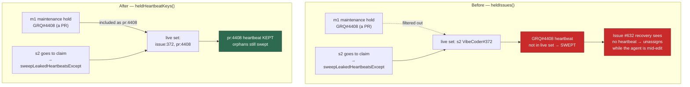

# Keep a live merge-conflict resolution's heartbeat out of the sweep

## Summary

The slot-aware leaked-heartbeat sweep (Issue #4178) was handed
`pool.registry.heldIssues()` as the live set it must not touch. That view
deliberately excludes maintenance-lane holds (Issue #213) because their number
is a **PR**, not a claimed issue — right for a finder's exclusion set, wrong for
the sweep, which asks a different question: *is anything on this host still
using this heartbeat?* The maintenance lane takes a real heartbeat, so every
merge-conflict / CI / PR-feedback / spelling pass had its **live** heartbeat
swept by the next issue slot going to claim. With the heartbeat gone, the
assigned-without-heartbeat recovery (Issue #632) could unassign the work and
hand it to another worker mid-edit — the exact double-work the heartbeat exists
to prevent.

Two changes fix it:

1. **A sibling view for the sweep.** `InFlightRepoRegistry.heldHeartbeatKeys()`
   returns *every* hold that owns a heartbeat, maintenance included, tagged with
   its kind. `heldIssues()` is unchanged, so the finder's exclusion set and the
   shutdown drain's claim release keep the Issue #213 behaviour.
   `run_core.ts` now passes `heldHeartbeatKeys()` to
   `sweepLeakedHeartbeatsExcept`.
2. **Heartbeats keyed by kind as well as number.** The registry key is now
   `owner_repo_issue:4408` / `owner_repo_pr:4408` rather than
   `owner_repo_4408`, so a PR's heartbeat and an issue's heartbeat of the same
   number cannot alias — neither can satisfy the other's idempotent start, and
   neither can be cleared by the other's stop. `kind` is optional and defaults
   to `"issue"`, so every pre-existing caller keeps its meaning; the four
   PR-servicing processors (merge-conflict, CI, feedback, spelling) now pass
   `kind: "pr"`.

The Issue #4178 behaviour is not weakened — a genuinely orphaned heartbeat is
still swept. Only who counts as live is corrected.

Closes #391.

## Evidence

Backend/worker change with no web interface, so there is nothing to screenshot;
the evidence is the regression tests and the quality gate.

**The sweep's live set, before and after:**



**The new slot-pool regression test fails against the unfixed call site.**
Reverting `run_core.ts` to `pool.registry.heldIssues()` and re-running it:

```
slot pool - the live set handed to the sweep names a live maintenance hold, so its
heartbeat is never swept (Issue #391) => ./tests/run_core_slot_pool_test.ts:422:6
error: AssertionError: every sweep must protect the maintenance hold:
  [["o/a#1:issue","o/b#2:issue"],["o/a#1:issue","o/b#2:issue"]]
FAILED | 0 passed | 1 failed | 33 filtered out
```

With the fix in place the whole suite is green:

```
running 5 tests from ./tests/heartbeat_maintenance_sweep_test.ts
...
ok | 43 passed | 0 failed (3s)          # heartbeat + registry + maintenance lane
ok | 34 passed | 0 failed (1s)          # tests/run_core_slot_pool_test.ts
```

`./quality.sh` passes (deno tests, lint, type check, fmt, markdownlint, mermaid
and the chokepoint checks all PASSED; three environment-dependent checks
SKIPPED).

## Test Plan

New — `worker/deno/tests/heartbeat_maintenance_sweep_test.ts`:

- `heldHeartbeatKeys` includes the maintenance lane while `heldIssues` still
  excludes it (the Issue #213 view must not change).
- A live merge-conflict resolution survives an issue slot's sweep — the
  reported defect.
- A genuinely orphaned heartbeat is still swept beside a live maintenance hold
  — Issue #4178 not weakened.
- `issue:N` and `pr:N` are distinct heartbeats: distinct handle ids, and a live
  set naming only the PR does not keep the issue's heartbeat alive.
- A live-set entry with no `kind` still means the issue namespace (backwards
  compatibility for every pre-#391 caller).

Modified:

- `worker/deno/tests/run_core_slot_pool_test.ts` — asserts the live set the
  pool hands the sweep names the live maintenance hold as `pr:<n>`. Verified to
  fail against the pre-fix call site (output above).
- `worker/deno/tests/heartbeat_test.ts` — the hand-built fake handle in the
  "safe to call when not started" case carries the new `kind` field. No test
  was removed or disabled.
