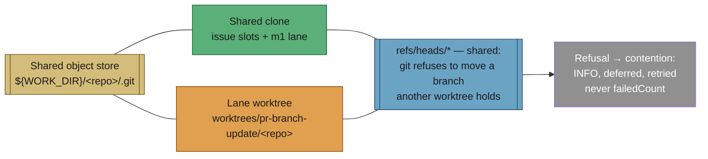

## Summary

Every lane on a host worked in one clone per repo, so lanes moved each other's
`HEAD`, index and working tree. Two failures 15 seconds apart proved it: PR #392
was OPEN with its branch on origin and the pass reported
`pathspec … did not match any file(s) known to git`, and PR #390 could not be
updated at all because an issue slot had left two unpushed commits on its branch
in the shared clone. Both were counted as `failedCount` and fed the Issue #335
escalation streak, so a healthy PR could have an issue filed against it.

The Priority-1.6 branch-update pass now works in **its own linked worktree** off
the shared clone, and clone contention is named as contention instead of being
reported as a PR fault. Closes #394.

What changed:

- **`worker/deno/lib/lane_worktree.ts`** (new) — per-lane worktrees at
  `${WORK_DIR}/worktrees/<lane>/<repo>`, added **detached** so the lane claims no
  branch, sharing the clone's object store (no re-clone, no extra objects).
  Reused across cycles, repairs a legacy single-branch clone's fetch refspec
  (Issue #211), and fails loud rather than falling back to the shared clone.
  `detachLaneWorktreeHead()` frees the branch after each PR.
- **`worker/deno/lib/clone_contention.ts`** (new) — classifies the git wordings
  that describe the *clone*: a vanished ref, a branch another worktree holds, a
  held index/ref lock, and the Issue #211 unpushed-work refusal (now a named
  error). `describeCloneContention()` produces the operator line — what the
  clone did, that the PR is not at fault, and that it is retried.
- **`worker/deno/lib/pr_branch_update.ts`** — new `contended` outcome and
  `contendedCount`. Contention is logged at INFO, counted apart from
  `failedCount`, kept out of the Issue #335 failure streak, and releases the
  distributed lock. Genuine push failures and real merge conflicts are unchanged.
- **`worker/deno/lib/git_pull.ts`** — `updatePrBranch` positions the branch with
  the hardened `checkoutPrBranchAtRemoteHead` (explicit tracking-ref fetch +
  `checkout -B`, one mutating command) instead of a bare `git checkout <branch>`
  followed by a fast-forward. That removes both the read-then-checkout window and
  the "pathspec did not match" class. It also judges and rebases against the
  **published** base ref (`origin/<base>` where it exists), because a local base
  ref another worktree holds cannot be fast-forwarded.
- **Wiring** (`run_core_production_deps.ts`, `pr_maintenance.ts`) — the pass uses
  `ensureRepoClone` + a lane worktree instead of the destructive `setupRepo`
  (`reset --hard` + `clean -fd` + `checkout <default>`) on the shared clone, and
  leaves its worktree detached afterwards. Summaries report
  `N deferred (clone held by another lane)`.
- **`worker/deno/lib/stale_workdir.ts`** — `worktrees` is a reserved work-root
  name so the housekeeping sweeps do not delete a live lane checkout.
- **Docs** — `docs/workflows/README.md` (new "Per-lane worktrees" section with a
  Mermaid diagram) and `docs/USAGE.md`.

## Evidence

Backend/CLI change — no web interface to screenshot. The evidence is real-git
tests plus the full quality gate.

`./quality.sh` — `Result: PASSED (with skipped checks)`; deno tests, lint, type
check and fmt all PASSED.

Regression tests reproduce both reported failures against real git repositories:

- `git_pull_lane_isolation_test.ts::updatePrBranch - a PR branch that exists only
  on origin is updated, not reported as a missing pathspec` fails before the
  change with git's `pathspec … did not match any file(s) known to git` (failure
  1 in the issue) and passes after it, with the rebase verified as published.
- `git_pull_lane_isolation_test.ts::… runs in a lane worktree while the shared
  clone holds the base branch` proves the lane updates a PR while the shared
  clone sits on `main` with an uncommitted edit — and that the edit survives.
- `git_pull_lane_isolation_test.ts::… unpushed commits another lane left are
  refused as contention` pins failure 2: nothing is pushed, the unpushed commit
  survives, and the error classifies as `unpushed-local-work`.

## Test Plan

New:

- `worker/deno/tests/lane_worktree_test.ts` — 8 tests: path derivation, unsafe
  segment refusal, detached creation sharing the object store, reuse, the
  shared clone's `HEAD`/branch/tree untouched while the lane commits, branch
  release on detach, loud failure on a non-repository, and the reserved
  work-root name.
- `worker/deno/tests/clone_contention_test.ts` — 7 tests over the exact logged
  messages, including that a protected-branch push rejection and a real merge
  conflict are **not** reclassified as contention.
- `worker/deno/tests/pr_branch_update_contention_test.ts` — 7 tests: vanished
  branch, unpushed work and a lost setup race are `contended` at INFO with no
  WARNING; four contended cycles escalate nothing; genuine failures and
  conflicts still count; the lock is released.
- `worker/deno/tests/git_pull_lane_isolation_test.ts` — 3 real-git regression
  tests (above).

Modified — both changes are business-logic consequences of this issue and are
documented in the test files themselves:

- `git_pull_checkout_error_test.ts` — `updatePrBranch` no longer runs a bare
  `git checkout`, so a branch that is nowhere is now diagnosed as
  `does not exist on origin` rather than as git's `pathspec` wording. Issue
  #335's requirement (say *why*, not just which branch) is still asserted.
- `pr_branch_update_streak_wiring_test.ts` — its sample "permanently failing
  branch" was the pathspec message, which is now retried contention; it is a
  protected-branch push rejection instead. The Issue #335 escalate-once-then-skip
  behaviour under test is unchanged.
