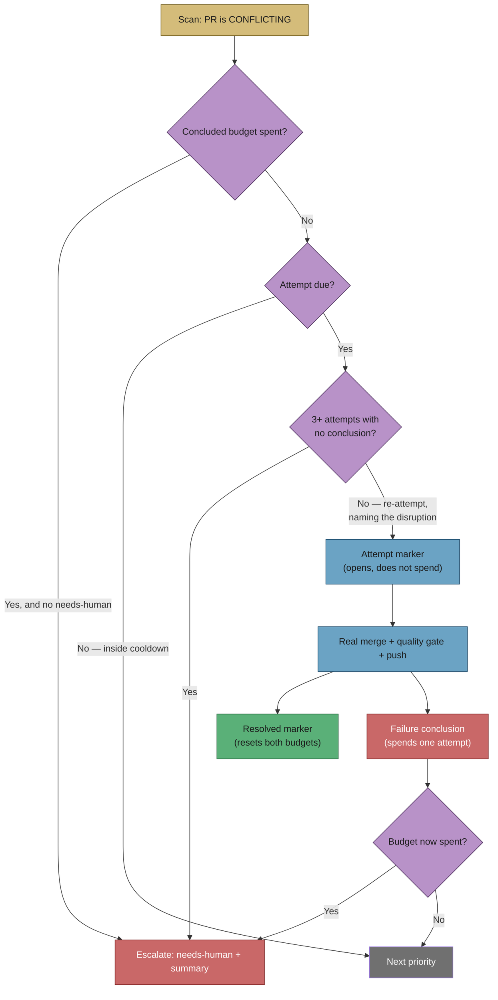

# Merge conflicts are resolved, not just complained about (Issue #395)

## Summary

The Priority 1.61 merge-conflict pass spent its attempt **before** the merge
ran, so a run cut short by worker infrastructure left an "attempt 1 of 2"
comment with no conclusion — and the next scan counted that dead attempt
against the 2-attempt budget. GRQ#4408 and GRQ#4409 stalled exactly there:
labelled `merge-conflict`, out of budget, owned by nobody, silent.

This change makes every attempt end visibly and stops disruption from spending
the budget.

- **An attempt opens, a conclusion spends it.** The attempt marker still goes
  up before the merge (it is what makes a disruption detectable), but the
  budget is now spent only by a conclusion: the resolved marker, or a new
  `merge-conflict-failed` comment naming the conflicted files and the failure.
- **A disrupted attempt is re-attempted, and said out loud.** An attempt marker
  with no conclusion after it is counted as disrupted, not spent; the next
  attempt comment names how many were disrupted and that they do not spend the
  budget. Disruption gets its own bound — **3** on one PR — after which the
  scan escalates with `needs-human`, pointing at the worker rather than the
  conflict. That escalation runs from the *scan*, because the resolution pass
  is exactly what may be unable to finish.
- **Nothing stalls unowned.** The final concluded failure escalates from the
  resolution pass — but if that escalation never landed, the PR was skipped in
  silence for ever. The scan now backstops it: a spent budget with no
  `needs-human` is escalated (reusing the resolution pass's dedup key, so a
  landed escalation is not duplicated — only its missing label re-applied).
- **One disruption source closed outright.** The cross-host PR lock is now
  refreshed while the attempt runs. Its TTL is 5 minutes and a resolution runs
  for as long as the agent takes, so a second host cleaned the lock as stale
  mid-attempt and started a competing attempt on the same branch — racing the
  first one's push and leaving it looking disrupted.

The GRQ#4373 policy is untouched: a real merge in which both sides' changes
survive, never a side-pick or a force-rebase.

Closes #395.

## Evidence

Backend/CLI change — no web interface to screenshot. The evidence is the test
suite below plus the state machine the change implements.



Targeted suite:

```text
deno test --allow-all tests/pr_merge_conflict_scan_test.ts \
                      tests/pr_merge_conflict_processor_test.ts
ok | 39 passed | 0 failed (300ms)
```

Full gate: `./quality.sh < /dev/null` → `Result: PASSED (with skipped checks)`
— the three skips (config integration, pages-liquid, mermaid built output)
are the pre-existing environment skips.

## Test Plan

`worker/deno/tests/pr_merge_conflict_scan_test.ts`

- `parseConflictAttempts - counts concluded attempts and tracks the latest` —
  attempt + conclusion pairs spend the budget (updated: the fixtures now carry
  the conclusion the processor posts, because an opening marker alone no
  longer counts).
- `parseConflictAttempts - an attempt with no conclusion is disrupted, not
  spent` — the GRQ#4408/#4409 shape.
- `parseConflictAttempts - a new attempt marks an unconcluded one disrupted`.
- `parseConflictAttempts - a resolved marker resets both budgets` (updated for
  the same reason).
- `countDisruptedAttempts - an open attempt counts as disrupted`.
- `hasExhaustedDisruptedAttempts - binds disrupted retries separately`.
- `findConflictingPr - a disrupted attempt is re-attempted, not counted as
  spent` — the regression test: two marker-only attempts, PR handed back with
  `attemptCount: 0`, `disruptedCount: 2`, no `needs-human`.
- `findConflictingPr - repeated disruption escalates loudly instead of
  stalling`, and `- the disruption bound is configurable`.
- `findConflictingPr - a spent budget with no needs-human is escalated, not
  stalled` — the new backstop.
- `findConflictingPr - refuses a PR that has spent its attempt budget`
  (updated: the fixture now carries the `needs-human` the final attempt
  applies, since a spent budget is a quiet skip only once the PR is a
  human's, and asserts no duplicate escalation comment).

`worker/deno/tests/pr_merge_conflict_processor_test.ts`

- `processMergeConflict - a failed attempt posts an explicit conclusion`.
- `processMergeConflict - the escalating attempt also posts its conclusion`.
- `processMergeConflict - a disrupted earlier attempt is surfaced on the PR`.
- `processMergeConflict - a clean history says nothing about disruption`.
- `processMergeConflict - the PR lock is refreshed while the agent works` —
  drives the real renewal helper against a fake `gh`, asserting the lock
  comment is refreshed during the attempt and not after it ends.

No existing test was removed or commented out.
