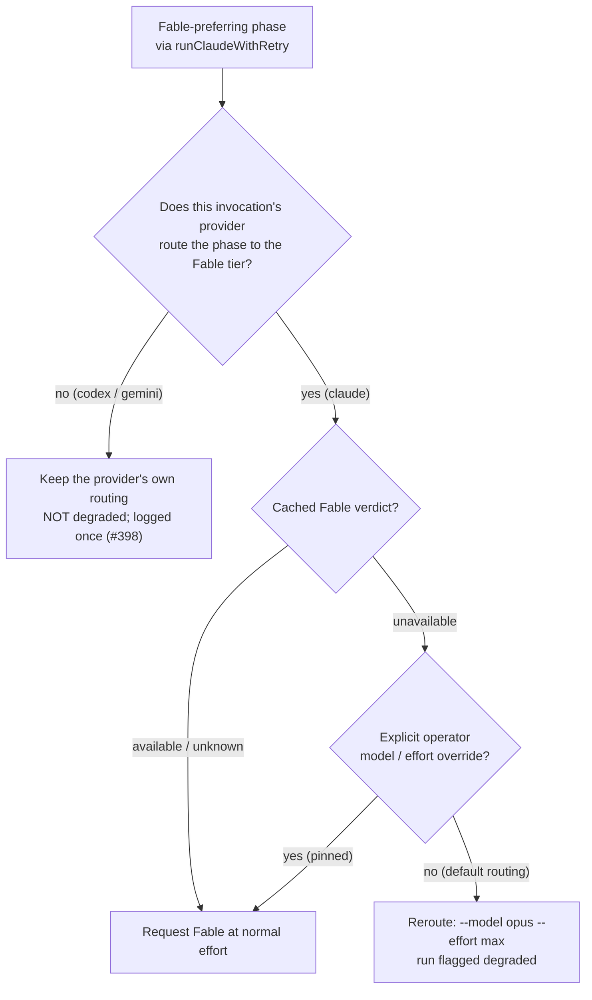

# Provider-gate the pre-flight Fable reroute

## Summary

The pre-flight Fable reroute fired at the `runClaudeWithRetry` chokepoint
**before** the provider seam picked the agent, and decided entirely through
Claude's routing chain. So in a mixed deployment
(`agent_providers: ["claude", "codex", "gemini"]`), a cached `unavailable`
Fable verdict forced `--model opus --effort max` onto a Quorum draft naming
`agentProvider: "codex"` — an Anthropic tier alias that CLI cannot resolve —
and flagged the run `preflightDegraded` for a tier it never requested.

The reroute is now gated on the **invocation's** provider:

- `resolveFablePreflightRouting` / `applyFablePreflightRouting` take the
  provider and reroute only when it routes that phase to the Fable tier. The
  gate tests the **resolved tier** (`providerRoutesToFableTier`), not the
  provider id, so a fourth provider carrying a Fable tier needs no edit here.
- A provider without that tier keeps its own routing and is never flagged
  degraded — and says so: `warnProviderHasNoFableTier` logs the skipped reroute
  once per provider per worker process, so the gap is visible rather than
  silent (fail-loud, Issue #3234).
- `claude_runner.ts` resolves the invocation's effective model through the
  provider seam (`provider.resolveModel(phase)`) instead of
  `buildClaudeModelArgs(phase)`, so the override detection is no longer
  Claude-only either.

Claude's behaviour is unchanged: the same phases still reroute to Opus @ `max`
and still record `preflightDegraded`.

Closes #398.

## Evidence

Backend/CLI change — no web interface to screenshot. The behaviour is verified
by tests that drive `runClaudeWithRetry` end to end against stub `codex` and
`claude` binaries on PATH, asserting on the argv each CLI actually received.



Full local gate green:

```
  deno tests                     PASSED
  deno lint                      PASSED
  deno type check                PASSED
  deno fmt                       PASSED
  markdownlint / mermaid         PASSED
Result: PASSED (with skipped checks)
```

## Test Plan

New — `worker/deno/tests/fable_preflight_provider_gate_test.ts` (the
regression test the issue asked for; both fail against the unfixed code):

- `gate: unavailable Fable ⇒ a Codex quorum invocation keeps its own routing,
  no --model opus, not degraded` — cached `unavailable` verdict, `phase:
  "quorum"`, `agentProvider: "codex"`: the recorded argv carries no `opus` and
  no `max`, `--model` carries Codex's own top-tier model, the result has no
  `preflightDegraded`/`preflightDegradedReason`, and a `[fable-routing]`
  warning naming `codex` was emitted.
- `gate: unavailable Fable ⇒ the Claude quorum invocation is still rerouted` —
  the same phase under `agentProvider: "claude"` still gets
  `--model opus --effort max` and `preflightDegraded: true`, proving the gate
  narrowed the behaviour rather than removing it.

Modified — `worker/deno/tests/fable_routing_test.ts` (existing cases kept, all
updated for the new required `provider` argument, which now carries a stubbed
Claude-shaped descriptor):

- `providerRoutesToFableTier` — true for a Fable-tier provider, false for a
  Codex-shaped one and for a provider that resolves no model.
- `resolveFablePreflightRouting - a provider with no Fable tier is never
  rerouted` — the full phase × verdict × override matrix stays a no-op.
- `applyFablePreflightRouting - a Codex quorum invocation keeps its own
  routing`.
- `warnProviderHasNoFableTier - warns once per provider, and only when the
  outage rerouted nothing`.

Unchanged and still passing —
`worker/deno/tests/fable_preflight_reroute_wiring_test.ts` (all five Claude
wiring cases).

Docs updated in the same change: `docs/MODEL-AND-CACHING.md` (provider
applicability matrix row, the gaps paragraph, the "Pre-flight Fable reroute"
marker, a new provider-gate bullet, the flow diagram and the implementation
list) and `docs/QUORUM.md` (degraded-model reporting under a non-Claude
member).
