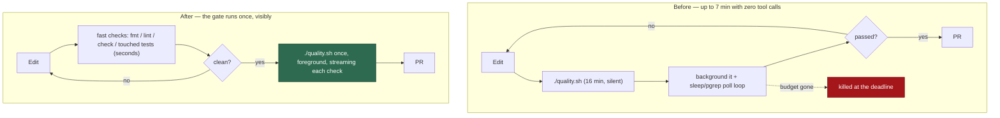

# Stop agents blocking on the full quality gate

## Summary

Agents were spending most of their execute budget waiting on `./quality.sh`
rather than working: one sat frozen at 38 tool calls for over seven minutes
inside a `for i in $(seq 1 55); do pgrep -f quality.sh … sleep 10; done` poll
loop, the PR-feedback lane hit its 1800 s cap with its last tool call eight
minutes before the kill, and issue slots were truncated at the cycle deadline.
Three root causes are fixed here. Closes #399.

1. **The guidance made the gate the inner loop.** `buildQualityInstructions`
   told every agent to "keep running `./quality.sh` until it passes cleanly" —
   a 16-minute gate re-run after every edit, inside a ~15-minute window. It now
   points the inner loop at the repo's fast checks (formatter, linter, type
   check, only the touched test files) and asks for **one foreground gate run**
   at the end, explicitly forbidding a backgrounded gate and a `sleep`/`pgrep`
   poll loop. This is the issue's point 3 — the cheapest and largest win.
2. **The gate was silent until it finished.** `runQualityGate` accumulated all
   output and printed it only at the end, so a slow run and a hung run looked
   identical — which is *why* the poll loops existed. Each check now emits one
   `✓ deno tests: PASSED (12.3s)` line the moment it settles, in both
   sequential and parallel modes. It goes to **stdout**, ahead of the detail
   dump, deliberately: the worker captures a failing run as `stdout + stderr`
   and quotes the *tail* into the remediation prompt and the failure comment,
   so a progress block on stderr would have crowded out the failing detail
   those tails exist to carry.
3. **The launcher tests leaked process trees.** `loop_supervisor_test.ts`
   SIGKILLed `loop.sh` alone; its background control-plane probe and its
   `run.sh` were re-parented to PID 1 and looped on `sleep 120` for ever
   (about twenty had accumulated on one host, the oldest over two days old).
   The new `killProcessTree` fixture stops the root first so it cannot fork a
   replacement, terminates the tree bottom-up, then kills the root.

### Deliberate non-changes

- **`nice` (issue point 2).** `quality.sh` already runs at `nice -n 10`, not
  `nice -n 19`, and forces `--sequential` inside the container. Both are
  documented findings (#4258, #4267): removing them put agent sessions back in
  the path of in-container SIGKILLs. With the gate no longer the agent's inner
  loop, the priority is no longer what costs the budget.
- **Gate wall time (issue point 1).** The content-addressed check cache (#86)
  already collapses an agent's repeat runs; the fix for a 16-minute gate inside
  a 15-minute window is not to run it repeatedly, which is what point 3 does.



## Evidence

Backend/CLI change — no web interface to screenshot. Evidence is the test suite
and the gate's own output.

**The leak reproduces and is fixed.** A root that forks a grandchild, killed
the old way:

```text
grandchild 23832 alive after plain SIGKILL of the root: true
```

`killProcessTree` leaves no survivor — `process_tree_test.ts` asserts the
grandchild's pid is gone, and `loop.sh #399` asserts the same for a live
`loop.sh` tree (probe + `run.sh` + `sleep`). After the suite ran,
`pgrep -af vibe_loop_test` matched nothing.

**The gate now streams.** Captured from a live `./quality.sh` run while the
suite was still going — previously this file stayed empty until the very end:

```text
=== Running Quality Checks ===
  ✓ prompt immutability: PASSED
  ✓ benchmark audit: PASSED
  ✓ hardcoded branch names: PASSED
  ...
  ✓ markdownlint: PASSED (2.5s)
  ✓ docs prompt versions: PASSED (0.0s)
```

**Full gate:** `./quality.sh < /dev/null` passes — run once, in the foreground,
as the new guidance prescribes.

## Test Plan

Added:

- `worker/deno/tests/repo_config_test.ts` — three tests over
  `buildQualityInstructions`: the inner loop names the fast checks and no
  longer says "keep running"; the gate is run once in the foreground and
  polling is forbidden; a repo-configured custom quality command carries the
  same rules.
- `worker/deno/tests/quality_gate_test.ts` — six tests: `formatCheckProgress`
  with and without a measured duration; `runChecksSequential` reports each
  check *before the next one starts*; `runChecksParallel` reports a fast check
  while a slow one is still blocked (the regression that mattered — no waiting
  for the whole set); a throwing check is still reported, never silent;
  `runQualityGate` streams its pre-checks through `onProgress`.
- `worker/deno/tests/process_tree_test.ts` — `killProcessTree` kills a
  grandchild of the killed process, and handles a childless process.
- `worker/deno/tests/loop_supervisor_test.ts` — `loop.sh #399`: snapshot the
  live supervisor's descendants, kill it, assert none survive.

Modified: `loop_supervisor_test.ts`'s `killTree` and its five inline
kill-and-wait cleanups now go through `killProcessTree`. No test was removed or
disabled.
