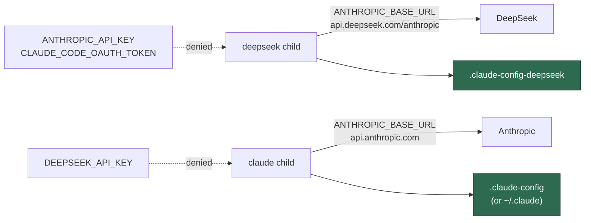

# PR Summary — Issue #412

## Summary

DeepSeek is carried on the **Claude Code CLI** pointed at DeepSeek's
Anthropic-compatible endpoint (parent #396), so the default child environment is
exactly the wrong one: the binary reads Anthropic's variables, but the host on
the other end belongs to a third party. This adds
`worker/deno/lib/deepseek_env.ts` — DeepSeek's own three lists on the shared
`agent_env.ts` filter — and closes the isolation in both directions.
Closes #412.

- **Anthropic's credentials never reach DeepSeek's endpoint.**
  `DEEPSEEK_ENV_DENYLIST` names `ANTHROPIC_API_KEY` and
  `CLAUDE_CODE_OAUTH_TOKEN` alongside the OpenAI and Google keys and the
  worker-only secrets. Denied by name, not by the secret-shape rule, so a future
  allowlist edit cannot let them through.
- **The endpoint and the credential are pinned.** `buildDeepSeekChildEnv()` sets
  `ANTHROPIC_BASE_URL` to `DEEPSEEK_ANTHROPIC_BASE_URL`
  (`https://api.deepseek.com/anthropic`) and surfaces `DEEPSEEK_API_KEY` as
  `ANTHROPIC_AUTH_TOKEN` — the name the CLI reads — so the provisioned
  credential needs no second variable. An operator's own non-empty value always
  wins, matching the `CLAUDE_CONFIG_DIR` pin in `claude_env.ts`.
- **No cross-provider session bleed.** `CLAUDE_CONFIG_DIR` is pinned to
  `.claude-config-deepseek` under `WORK_DIR` (or under `HOME` when the run
  driver exported none), so `--resume` cannot replay a Claude session's
  transcripts into a DeepSeek run inside a Quorum image.
- **The reverse direction.** `DEEPSEEK_API_KEY` is added to
  `CLAUDE_ENV_DENYLIST`, `CODEX_ENV_DENYLIST` and `GEMINI_ENV_DENYLIST`,
  matching how those three already name each other.

Out of scope, as the issue states: the descriptor that consumes this module,
phase routing, the container fragment, and docs.

## Evidence

Backend-only change with no web interface to screenshot — the evidence is the
test suite. `./quality.sh < /dev/null` passes (`deno tests`, `deno lint`,
`deno type check`, `deno fmt`, host work-dir guard, all PASSED; the SKIPPED
checks are the pre-existing toolchain-absent ones).

The `CLAUDE_CONFIG_DIR` pin exists because both providers run one binary:

The one-line notes on the deny arrows are the leak this PR prevents: an
Anthropic key travelling to `api.deepseek.com`, and DeepSeek's key travelling to
the other three vendors' children.

## Test Plan

New `worker/deno/tests/deepseek_env_test.ts` — every case builds a child env
from a synthetic parent holding **every** vendor credential at once and asserts
on the returned map:

- `ANTHROPIC_API_KEY` and `CLAUDE_CODE_OAUTH_TOKEN` are absent, as are the
  OpenAI/Google keys, the worker-only secrets and an unknown secret-shaped var.
- `ANTHROPIC_BASE_URL` is DeepSeek's endpoint; an operator-set value is
  preserved; an empty value is treated as unset (it would send DeepSeek's key to
  Anthropic's default host).
- `ANTHROPIC_AUTH_TOKEN` equals the parent's `DEEPSEEK_API_KEY`; an already-set
  token is left alone; no key means no invented token.
- `CLAUDE_CONFIG_DIR` differs from `buildClaudeChildEnv()`'s under the same
  `WORK_DIR`, and also on the host where the Claude child keeps the default; an
  explicit value is never overridden.
- The Claude, Codex and Gemini children all strip `DEEPSEEK_API_KEY`, and all
  three denylists name it.

Extended `worker/deno/tests/claude_env_test.ts` with a `DEEPSEEK_API_KEY`-in-
parent case asserting it is stripped while `ANTHROPIC_API_KEY` is kept.
