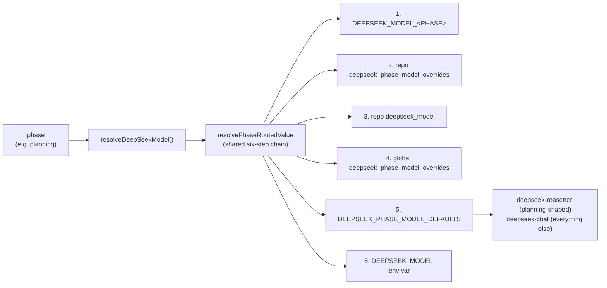

# DeepSeek per-phase model routing (Issue #413)

## Summary

DeepSeek is carried on the **Claude** CLI, so its argv shape is Claude's — and
Claude's routing resolves to *tier aliases* (`fable`, `opus`, `sonnet`,
`haiku`), not model ids. A DeepSeek provider with no routing of its own returns
`undefined` and the CLI falls back to an Anthropic model name DeepSeek's
endpoint cannot resolve, failing mid-run against a third-party endpoint. This
change settles the phase→model mapping the parent issue left open and pins every
phase to a real DeepSeek model id. Closes #413.

- **Tables** (`worker/deno/lib/config_defaults.ts`, mirroring the Gemini block):
  `DEFAULT_DEEPSEEK_MODEL_TOP_TIER = "deepseek-reasoner"`,
  `DEFAULT_DEEPSEEK_MODEL = "deepseek-chat"`, and
  `DEEPSEEK_PHASE_MODEL_DEFAULTS` covering the same phase keys as
  `PHASE_MODEL_DEFAULTS`. The eight planning-shaped phases (`planning`,
  `grill_me`, `quorum`, `quorum_judge`, `refinement`, `revision`, `question`,
  `clarification`) run on the reasoning model; the rest run on `deepseek-chat`.
  DeepSeek publishes no third, cheaper tier, so the trivial trio
  (`spelling_fix`, `summarise`, `health`) shares the base tier — stated in the
  comment as a deliberate absence rather than left to inference.
- **Resolvers** (new `worker/deno/lib/deepseek_executor.ts`):
  `resolveDeepSeekModel(phase?)` calls the shared `resolvePhaseRoutedValue`
  helper with `DEEPSEEK_`-named keys throughout, so the six-step chain is
  Claude's precedence with DeepSeek names.
  `resolveDeepSeekEffort(phase?)` follows the Gemini precedent (#364): DeepSeek's
  Anthropic-compatible endpoint does not implement Anthropic's effort control, so
  the resolver reports what the phase was *asked* to run at and
  `warnDeepSeekEffortUnsupported()` warns once per phase instead of emitting an
  `--effort` flag. There is deliberately no DeepSeek effort table and no
  `deepseek_effort` config key — either would be dead configuration (#3234).
- **No `cheaperModel` export.** `deepseek-chat` is not a cheaper rung of
  `deepseek-reasoner` in the sense `model_fallback.ts` means, so the descriptor
  can omit the optional method and get `no-ladder-for-provider` rather than a
  silent no-op (#365).
- **Config keys** `deepseek_model` / `deepseek_phase_model_overrides` registered
  beside the Codex/Gemini equivalents (`config_unknown_keys.ts`,
  `validation.ts`, `config.ts`, `types.ts`) and wired through config loading
  (`mod.ts`, `run_core_production_deps.ts`, `execute_claude_phase.ts`) so an
  operator's configuration is actually applied rather than accepted and ignored.

Out of scope, as the issue states: the provider descriptor, the container
fragment, credentials, and the provider documentation. Only the reference rows
for the two new config keys were added to `docs/CONFIGURATION.md`, so no key
ships undocumented.

## Evidence

Backend/CLI change with no web surface to screenshot. Evidence is the test suite
plus the full quality gate.



`./quality.sh` result:

```text
  deno tests                     PASSED
  deno lint                      PASSED
  deno type check                PASSED
  deno fmt                       PASSED

Result: PASSED (with skipped checks)
```

## Test Plan

New `worker/deno/tests/deepseek_executor_test.ts` (18 tests), all calling the
real resolvers and the real config loader:

- **Phase table** — the full phase→model map asserted value by value;
  `planning` → `deepseek-reasoner`, `summarise` → `deepseek-chat`.
- **Key parity** — every key of `PHASE_MODEL_DEFAULTS` is present in
  `DEEPSEEK_PHASE_MODEL_DEFAULTS`, so a future phase that is added to one table
  and forgotten in the other fails `deno test`.
- **The regression this issue exists to prevent** — iterating every key of
  `PHASE_MODEL_DEFAULTS` through `resolveDeepSeekModel` yields no Anthropic tier
  alias (`fable`, `opus`, `sonnet`, `haiku`) and every value is a DeepSeek id.
- **Precedence at each of the six steps** — phase env var beats all; repo phase
  override beats repo base; repo base beats global override; global override
  beats the table default; base env var covers a phase with no entry; a phase
  with no model anywhere warns naming `deepseek-executor` and `--model`. Also:
  per-repo overrides are replaced, never merged, on a repo switch.
- **Effort** — `resolveDeepSeekEffort` returns the phase's asked-for effort from
  `PHASE_EFFORT_DEFAULTS`; no DeepSeek effort table or effort config key exists
  (asserted against the live module namespace and `KNOWN_CONFIG_KEYS`); the
  unhonourable-effort warning fires once per phase and never mentions
  `--effort`.
- **Config keys** — `deepseek_phase_model_overrides` passes the unknown-key
  check and validates as a string map, and a `.config.json` carrying both the
  global key and per-repo `deepseek_model` /
  `deepseek_phase_model_overrides` survives `loadConfig` and drives the resolver.
