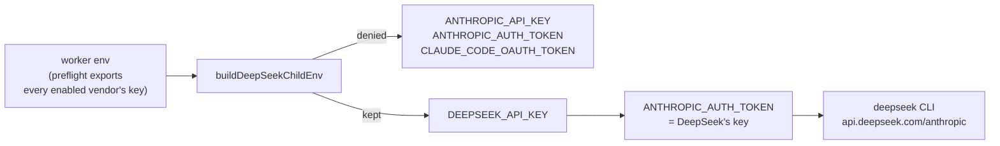

# Register the DeepSeek provider descriptor and `deepseek_auth.ts`

## Summary

Registers `deepseek` as the fourth coding-agent provider, so
`agent_provider: deepseek` (and `VIBE_AGENT_PROVIDER=deepseek`) actually
selects it and a Quorum pool can name it. Closes #414.

**New — `worker/deno/lib/deepseek_auth.ts`** (the vendor-owned auth module the
descriptor delegates to, mirroring `codex_auth.ts` / `gemini_auth.ts`):

- `DEEPSEEK_CREDENTIAL_ENV_VARS` — the single name `DEEPSEEK_API_KEY`.
- `isDeepSeekAuthError()` with **its own** pattern list. `isClaudeAuthError` is
  deliberately not re-exported: the binary is Anthropic's but the 401 body is
  DeepSeek's, and `claude_auth.ts` narrowed its patterns to phrases the
  Anthropic CLI itself prints (#45). The overlap between the two lists is fine;
  sharing the array would not be.
- `deepSeekAuthActionableMessage()` naming `DEEPSEEK_API_KEY` and
  `deepseek/provider.env` — never `claude login`, which authenticates
  Anthropic's endpoint and cannot fix a DeepSeek credential.

**`worker/deno/lib/agent_provider.ts`** — `DEEPSEEK_PROVIDER_ID`, the
descriptor and its registration:

- `binary: "deepseek"`, **not** `"claude"`. Both fragments install to
  `/usr/local/bin/<binary>`, so a shared command name in an
  `AGENT_PROVIDERS="claude,deepseek"` image means one provider silently
  overwriting the other.
- `credentials` → `deepseek/provider.env` /
  `VIBE_LAUNCHAGENT_DEEPSEEK_API_KEY`; `environment` from `deepseek_env.ts`;
  `install.fragment` → `providers/deepseek.sh`; `promptTransport: "stdin"`.
- `resolveModel` / `resolveEffort` delegate to `deepseek_executor.ts`; **no**
  `cheaperModel`, so the rate-limit fallback reports `no-ladder-for-provider`
  rather than a silent no-op (#365).
- The Claude CLI's argv construction is **factored** into a shared
  `buildClaudeCliArgs()` rather than copied — the two providers run the same
  executable, and a second verbatim copy is how they drift. DeepSeek passes the
  model alone: the endpoint implements no effort control, so a resolved effort
  is warned about once per phase (`warnDeepSeekEffortUnsupported`) and never
  becomes an argument (the Gemini treatment, #364).

**What needed no edit, asserted rather than assumed:**
`credential_preflight.ts`, `container_launch.ts`,
`resolveEnabledAgentProviderIds` and `selectAgentProvider` are all
descriptor-driven and unchanged.

### Seam defect found by registering the descriptor

`deepseek_env.ts` allowed `ANTHROPIC_AUTH_TOKEN` to be **inherited**. Once the
provider is registered, a `claude,deepseek` run is reachable — and in one, the
credential preflight exports `claude/provider.env` into the worker's own
environment, so the inherited `ANTHROPIC_AUTH_TOKEN` is *Anthropic's* token and
the DeepSeek child would have sent a live first-party credential to
`api.deepseek.com` on every request. The variable is now denied on the way in
and set **only** from `DEEPSEEK_API_KEY`, which is exactly what that module's
header already promised.



Three existing tests changed as a result, each documented in place:

- `deepseek_env_test.ts` — "an already-set `ANTHROPIC_AUTH_TOKEN` is left
  alone" now asserts an inherited Anthropic token is replaced by DeepSeek's
  key; the denylist/allowlist expectations move with it. A second case covers
  "no DeepSeek key → the inherited token is simply dropped".
- `multi_provider_credentials_test.ts` — "no vendor sees another vendor's
  secret" now asserts by **value** rather than by variable name, which is
  strictly stronger: a provider carried on another vendor's CLI legitimately
  sets that CLI's variable from its own key, but no other vendor's secret may
  appear under any name.
- `setup_credential_provisioning_test.ts` — the "one credential per vendor" run
  provisions DeepSeek too (setup.sh already supported the variable), and its
  local DeepSeek stand-in descriptor is replaced by the now-registered one.

## Evidence

Backend/CLI change with no web interface, so there is no screenshot to take.
The evidence is the test suite: `deno test` over
`worker/deno/tests/` — 16 260 passed, 0 failed, including the new
`agent_provider_deepseek_test.ts` (21 tests) and the extended
`credential_preflight_test.ts`.

Argv emitted for a DeepSeek `planning` phase, showing the routed DeepSeek model
and no `--effort`:

```text
--model deepseek-reasoner --dangerously-skip-permissions --verbose
--output-format stream-json -p <prompt>
```

## Test Plan

New — `worker/deno/tests/agent_provider_deepseek_test.ts` (modelled on
`agent_provider_gemini_test.ts`):

- `agentProviderIds()` returns `["claude", "codex", "gemini", "deepseek"]`;
  the descriptor's four facets are populated; an unsupported id names
  `deepseek` among the supported ids; `cheaperModel` is absent.
- **`DEEPSEEK_PROVIDER.binary !== CLAUDE_PROVIDER.binary`**, plus the
  registry-wide invariant that no two providers share a command name.
- `agent_provider: deepseek`, `VIBE_AGENT_PROVIDER=deepseek` and
  `agent_providers: ["claude", "deepseek"]` all select/enable it.
- `selectAgentProvider("deepseek")` throws when `VIBE_IMAGE_AGENT_PROVIDERS`
  excludes it, naming the installed set and offering no fallback.
- A Quorum trio (`claude` + `deepseek` planners, `gemini` judge) resolves per
  invocation, each on a distinct binary.
- **`buildInvocation` carries a DeepSeek model id and no `--effort` for every
  phase in `DEEPSEEK_PHASE_MODEL_DEFAULTS`**; an explicit effort is warned about
  once instead of reaching the argv.
- Claude's argv shape, stdin prompt transport, session resume.
- Auth: DeepSeek's own 401 phrasings are recognised, the message names
  `DEEPSEEK_API_KEY` and `deepseek/provider.env` and not `claude login`, and a
  missing credential classifies as `provider-auth`.
- The credential preflight reports and then accepts `deepseek/provider.env`
  with no edit to `credential_preflight.ts`.

Extended — `worker/deno/tests/credential_preflight_test.ts`: a
`deepseek`-enabled run built from `enabledAgentProviders()` asserts the
preflight reports the provider **by name** (vendor, `DEEPSEEK_API_KEY`,
`VIBE_LAUNCHAGENT_DEEPSEEK_API_KEY`), leaves Claude's status untouched, and
passes once the file is provisioned.
