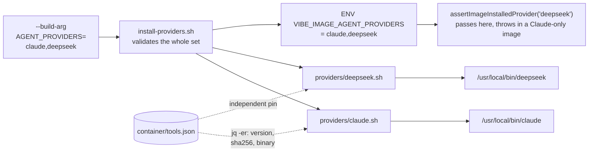

# DeepSeek install fragment: the Claude CLI under its own command and its own pin

## Summary

`AGENT_PROVIDERS="claude,deepseek"` failed the build at
`container/install-providers.sh` — *"Unsupported coding-agent provider"* —
because no `container/providers/deepseek.sh` existed. This adds that fragment
and its `container/tools.json` pin. Closes #415.

DeepSeek serves an Anthropic-compatible API, so the CLI that drives it is the
Claude Code CLI: the same upstream artefact `container/providers/claude.sh`
installs. The fragment follows `claude.sh` step for step — `jq -er` reads the
version, per-architecture `sha256` and `binary` from the manifest (an unpinned
provider stops the build), `curl -fsSL` fetches the pinned release,
`sha256sum -c -` verifies it, `install -m 0755` places it, and `--version` on
the installed command must match the pin. Nothing is piped into a shell and no
floating `latest` is resolved.

Two things are deliberately **not** copies of the `claude` entry, and the code
now defends both:

- **It installs `/usr/local/bin/deepseek`**, from the manifest's `binary`
  field. Both fragments run in one `claude,deepseek` image, so a shared command
  name would mean one provider silently overwriting the other.
  `parseContainerManifest` now rejects two `providers[]` entries sharing a
  `binary`, so a later "de-duplicating" edit that sets `"binary": "claude"`
  fails the gate instead of producing that image.
- **The version is pinned independently.** DeepSeek's endpoint is a third party
  tracking Anthropic's API surface; holding `deepseek` on a known-good CLI
  version while `claude` moves ahead is the point of the second pin. The
  `notes` field records that so the next reader does not collapse the two.

`deepseek` is pinned but stays out of `installedProviders`: a default image is
Claude-only, exactly as `codex` and `gemini` are. The fragment is enumerated in
`CONTAINER_IMAGE_INPUTS`, so changing it moves the image tag.

## Evidence

Backend/CLI change — no web interface to screenshot. The evidence is the test
suite plus the quality gate.

`./quality.sh` passes: 16165 Deno tests, lint, type check, fmt, markdownlint
and mermaid all green. `shellcheck container/providers/deepseek.sh` is clean.

The regenerated `docs/audits/dependency-inventory.md` now records the
`deepseek` provider pin — the supply-chain gate fails on a stale inventory, so
that row is part of the change rather than a follow-up.

## Test Plan

New `worker/deno/tests/container_provider_deepseek_test.ts` — the failure paths
are executed against the real fragment, not read:

- the pin exists, names `providers/deepseek.sh`, installs `deepseek`, and
  carries an exact version and both architecture checksums;
- the pin is independent of `claude` — different command, different fragment;
- the fragment is an enumerated container-image input;
- the fragment aborts (non-zero) when the manifest is missing, when only the
  `claude` entry is present, and when the pin carries no checksum;
- `install-providers.sh "claude,deepseek"` validates the set and dispatches
  both fragments — no "Unsupported coding-agent provider" — while a typo
  (`deepseekk`) is still rejected;
- `imageAgentProviderIds` reads `claude,deepseek` from the image stamp,
  `assertImageInstalledProvider("deepseek")` passes there, and a Claude-only
  stamp throws naming the installed set.

Extended `worker/deno/tests/container_manifest_test.ts`:

- `parseContainerManifest` rejects a second provider whose `binary` is already
  taken, naming the offending index;
- assertions over the real `container/tools.json`: the `deepseek` entry, its
  fragment, its two checksums, `installedProviders` still `["claude"]`, and no
  two `providers[]` entries sharing a `binary`.

Docs: `docs/CONTAINER.md` gains the `deepseek` row in the provider table and a
paragraph explaining why the duplicate artefact is deliberate.
