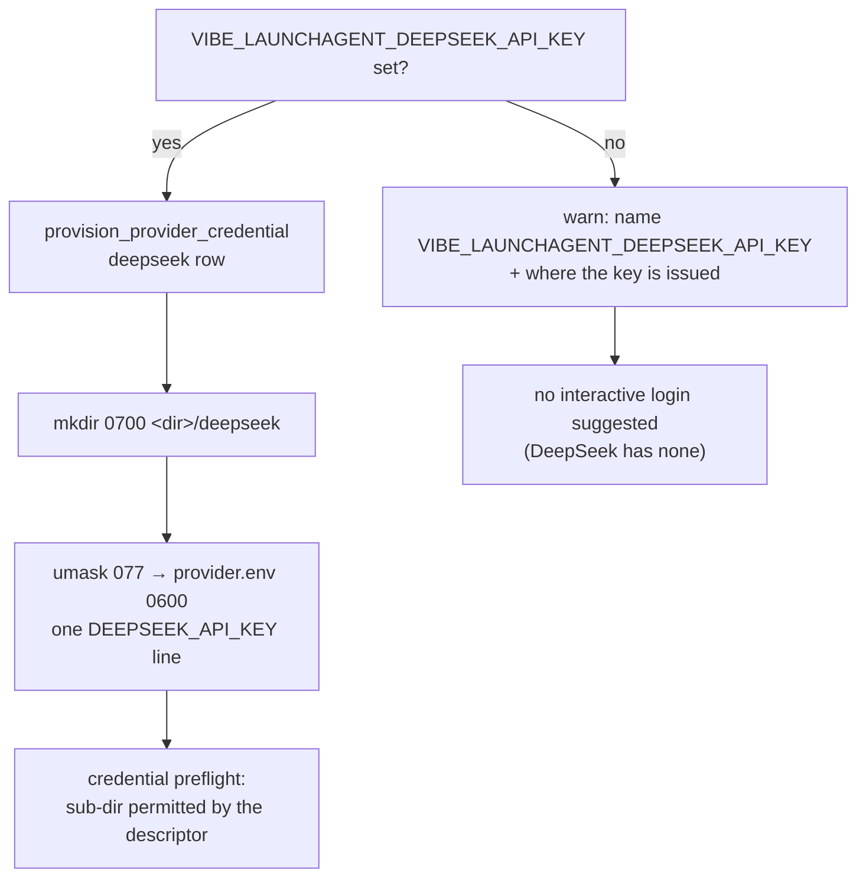

## Summary

`setup.sh` provisions coding-agent credentials from a table of
`subdir|provisioning variable|credential variables` rows. There was no
`deepseek` row, so a run with `agent_provider: deepseek` failed its credential
preflight with *provider-credentials-missing* and had no non-interactive way to
be provisioned at all.

This adds the DeepSeek row to that table — in `setup.sh` and in its Windows twin
`setup.ps1`, so neither platform is left unable to provision the vendor — and
documents `VIBE_LAUNCHAGENT_DEEPSEEK_API_KEY` in the LaunchAgent variable block
and the credential-directory layout comment. The existing provisioning loop then
writes `<credential-dir>/deepseek/provider.env` at `0600` under a `0700`
directory, with the same idempotency and the same "no credential variables set"
warning path as the other three vendors.

DeepSeek has no interactive login of its own — its credential is an API key — so
it takes the non-interactive path only. The unset-variable warning now names
`VIBE_LAUNCHAGENT_DEEPSEEK_API_KEY` and where a DeepSeek key is issued, instead
of leaving the operator with the Claude-specific `claude setup-token` fallback
that cannot help them.

The descriptor–table drift assertion was also loosened in one direction: every
**registered** descriptor must still have a row (registering a fifth provider
fails the quality gate until it is provisionable), but a row may land *before*
its descriptor is registered, which is exactly the case here — the DeepSeek
descriptor is a sibling issue. Such an early row is still checked for shape, so
a typo cannot sit in the table waiting for a descriptor to meet it, and a new
parity assertion requires `setup.ps1` to list the same vendors, in the same
order, as `setup.sh`.

No change was needed in `credential_preflight.ts`: it derives the permitted
sub-directories from the enabled descriptors, so the round trip works once the
row exists.

Closes #416.

## Evidence

Backend/CLI change — no web interface to screenshot. Evidence is the test suite
and the full quality gate, both run in the foreground:

```
$ deno test --allow-all tests/setup_credential_provisioning_test.ts tests/multi_provider_credentials_test.ts
ok | 33 passed | 0 failed (2s)

$ ./quality.sh < /dev/null
Result: PASSED (with skipped checks)
```

The provisioning path each acceptance criterion exercises:



Note the key itself is written through a subshell `umask 077` and never printed
— the tests assert the key does not appear anywhere in setup's output.

## Test Plan

`worker/deno/tests/setup_credential_provisioning_test.ts` (each case dot-sources
the real `setup.sh` and calls `provision_vibe_credentials` against a temporary
`HOME`):

- **`provisions the DeepSeek API key`** — asserts `deepseek/provider.env`
  holds a single `DEEPSEEK_API_KEY` line carrying the provisioned key, mode
  `0600` under a `0700` directory, the
  key is absent from stdout, and a second run is idempotent (same contents, same
  mode, no duplicate line).
- **`a claude+deepseek run passes the preflight unchanged`** — with only Claude
  provisioned the preflight fails naming `deepseek` and
  `VIBE_LAUNCHAGENT_DEEPSEEK_API_KEY`; once both files exist it passes with both
  providers sourced from `directory`, with no edit to `credential_preflight.ts`.
- **`no credential variables leaves nothing behind and warns`** (extended) —
  the warning names `VIBE_LAUNCHAGENT_DEEPSEEK_API_KEY` and
  `platform.deepseek.com`, and suggests no login command for any provider.

`worker/deno/tests/multi_provider_credentials_test.ts`:

- **`the provider credential table matches the registered descriptors`**
  (rewritten) — every registered descriptor's `credentials.provisionEnvVar`,
  `subdir` and `envVars` must appear in the `setup.sh` table, so registering a
  fifth provider fails here rather than at first run on a live deployment; rows
  ahead of their descriptor are still validated for shape and uniqueness.

`worker/deno/tests/setup_ps1_test.ts` (skips where no `pwsh` is installed):

- the same descriptor-coverage assertion for `setup.ps1`, plus a new assertion
  that `setup.ps1` lists the same vendors, in the same order, as `setup.sh`.
