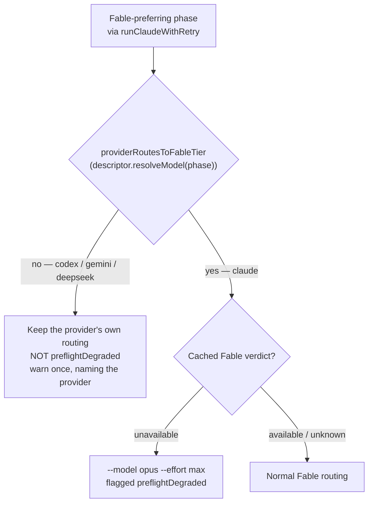

# Gate the pre-flight Fable reroute on the invocation's provider — DeepSeek coverage

## Summary

Closes #417.

Issue #398 landed first (commit `e5e4b36`, PR #438) and moved the pre-flight
Fable reroute behind a descriptor-derived gate: `providerRoutesToFableTier()` in
`worker/deno/lib/fable_routing.ts:100`, threaded the invocation's provider into
the chokepoint at `worker/deno/lib/claude_runner.ts:1923-1962`. As #417
anticipated ("if #398 lands first, this issue reduces to a DeepSeek-specific
regression test"), the production gate already satisfies every acceptance
criterion — the gate is on the resolved model *tier*, not on a provider id, so
DeepSeek is covered without an edit.

What was **not** satisfied was the issue's Failure Detection clause. #398 proved
the gate with two hand-written cases (`codex` and a `claude` control): Gemini was
untested, and a provider registered afterwards — DeepSeek, via #414 — would have
inherited no coverage at all. That matters most precisely for DeepSeek: Codex and
Gemini reject an unresolvable `--model` at their own CLI's argument layer, but
DeepSeek rides the **Anthropic CLI**, which forwards `--model opus` happily and
fails remotely mid-run.

This PR adds that coverage:

- `worker/deno/tests/fable_preflight_deepseek_gate_test.ts` — three tests, none
  of which hard-code which providers carry the Fable tier. Each expected outcome
  is derived from the descriptor's own `resolveModel()`.
- `docs/MODEL-AND-CACHING.md` — one bullet recording *why* the gate, rather than
  the CLI's argument parser, is the defence for a Claude-CLI-carried provider.

No production code changed: the gate is already correct, and the mutation
evidence below proves the new tests fail without it.

## Evidence

Backend/CLI change only — no web interface to screenshot. Evidence is the test
suite plus a mutation run.

### The gate



### Tests pass on the fixed tree

```
running 3 tests from ./tests/fable_preflight_deepseek_gate_test.ts
gate: with Fable unavailable, every registered provider is rerouted only if its own routing is Fable-tier (Issue #417) ... ok (23ms)
gate: the reroute helper itself refuses every non-Fable-tier registered provider (Issue #417) ... ok (136µs)
gate: a DeepSeek quorum invocation keeps its own model, gains no opus/max and is not degraded (Issue #417) ... ok (138µs)

ok | 3 passed | 0 failed (27ms)
```

### They fail against the pre-#398 code (mutation run)

Reverting `claude_runner.ts` to `buildClaudeModelArgs(options.phase)[1]` and
deleting the `providerRoutesToFableTier` guard from `fable_routing.ts` — i.e.
restoring exactly the state #417 describes:

```
error: AssertionError: codex argv must carry no Anthropic tier alias "opus":
  exec --json … --model opus -c model_reasoning_effort="max" … draft a plan

error: AssertionError: Values are not equal.   [DeepSeek]
-   "opus"
+   undefined

FAILED | 0 passed | 2 failed
```

Deleting **only** the `fable_routing.ts` guard (the runner's own
explicit-override detection masks it end to end) still fails the two helper-level
tests, which is why test 2 exists:

```
FAILED | 1 passed | 2 failed
```

### Quality gate

`./quality.sh < /dev/null` → `Result: PASSED (with skipped checks)` — deno tests,
lint, type check, fmt, markdownlint and mermaid all green.

## Test Plan

New file `worker/deno/tests/fable_preflight_deepseek_gate_test.ts`:

1. **`gate: with Fable unavailable, every registered provider is rerouted only if
   its own routing is Fable-tier`** — loops `agentProviderIds()` driving
   `runClaudeWithRetry` end to end against a stub CLI per descriptor `binary`,
   with a cached `unavailable` verdict and `phase: "quorum"`. Per provider it
   asserts, from the descriptor rather than a hard-coded list: a Fable-tier
   provider is rerouted to `opus` @ `max` and flagged `preflightDegraded`; a
   non-Fable provider's argv carries none of `fable`/`opus`/`sonnet`/`haiku` and
   no `max`, carries the model its own routing resolved, is not flagged
   `preflightDegraded`, has no `preflightDegradedReason`, and produced one
   `[fable-routing]` warning naming the provider. Stub binaries, credential env
   vars and the neutralised `<ID>_MODEL*` / `<ID>_EFFORT*` variables are all
   derived from the registry, so **#414 registering `deepseek` is covered with
   no edit to this file** — and a fifth provider registered without the gate
   fails `deno test` immediately.

2. **`gate: the reroute helper itself refuses every non-Fable-tier registered
   provider`** — the same loop against `applyFablePreflightRouting()` directly.
   Needed because `runClaudeWithRetry`'s own explicit-override detection is a
   second layer that would mask a gate removed from `fable_routing.ts`.

3. **`gate: a DeepSeek quorum invocation keeps its own model, gains no opus/max
   and is not degraded`** — the DeepSeek regression test. DeepSeek's descriptor
   arrives with #414, so the provider is built from the **real**
   `resolveDeepSeekModel()` routing (#413) that the descriptor will delegate to —
   not a fixture. Asserts the resolved model reads as no Anthropic tier, that
   `applyFablePreflightRouting` forces neither `model` nor `effort`, that the run
   is not degraded and carries no reason, and that
   `warnProviderHasNoFableTier()` emits exactly one warning naming both
   `deepseek` and its resolved model.

No existing test was modified or removed; the two #398 cases in
`fable_preflight_provider_gate_test.ts` still run unchanged.
