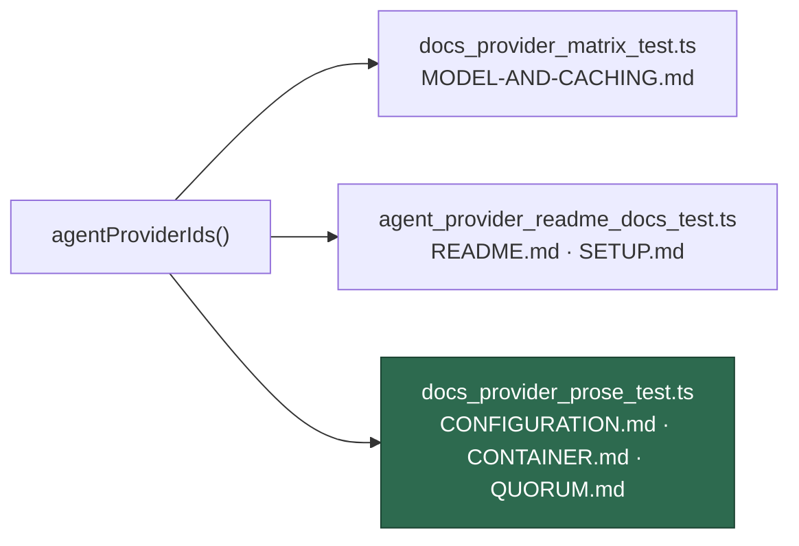

# DeepSeek in the provider documentation

## Summary

Documents `deepseek` everywhere the provider set is restated, so the two
derived documentation tests stay green once the descriptor lands (#414), and
adds a third test to cover the restatements that had no guard at all.
Closes #418.

**`docs/MODEL-AND-CACHING.md`** — the substantive part:

- The applicability matrix gains a `` `deepseek` `` column with a verdict in
  every row; the last column is now "What the non-applying providers do
  instead", reworded for a fourth entry.
- Every `> **Applies to:**` marker gains a `` `deepseek` `` verdict with its
  explanation (these were checkpointed by an earlier interrupted run and are
  carried forward here).
- A new **🐋 DeepSeek per-phase routing** section mirrors the Codex and Gemini
  ones: the `deepseek-reasoner` / `deepseek-chat` phase table, the six-step
  `DEEPSEEK_*` precedence chain, the effort-lever warning, and a Mermaid
  routing diagram.
- The section intro states the one thing a reader cannot infer: `deepseek` is
  the **Anthropic CLI pointed at a third-party endpoint**, which is why its
  credential is a DeepSeek key, why Anthropic's credentials are withheld from
  it, and why its command is `deepseek` rather than `claude`.

Three verdicts carry real information rather than copying Claude's column:

| Behaviour | `deepseek` | Why |
|-----------|:----------:|-----|
| Effort | ❌ | The CLI has `--effort`; DeepSeek's endpoint does not implement it, so the flag is never emitted (the Gemini treatment, #364) |
| Fable tier, rate-limit ladder, degraded-model reroute | ❌ | Gated **off**, not merely absent — `--model opus` is well-formed to the Anthropic CLI DeepSeek runs, so an ungated reroute would fail at the endpoint mid-run (#398, regression-tested by #417) |
| Session Resume | ⚠️ | Same CLI mechanism, but on a separate `CLAUDE_CONFIG_DIR`, so DeepSeek and Claude transcripts never cross |

**Front door and configuration** — `README.md` (intro, provider table),
`docs/SETUP.md` (provider choice, the `deepseek/provider.env` credential row and
`VIBE_LAUNCHAGENT_DEEPSEEK_API_KEY`), `docs/DEPLOYMENT.md` (the provisioning
variable table), `docs/CONFIGURATION.md` (the `agent_provider` row plus the link
to the new routing section), `docs/CONTAINER.md` (credential note, build-arg
example, build Mermaid diagram, and "Adding a fourth provider" → "a further
provider") and `docs/QUORUM.md` (a four-vendor enabled set with a
`claude` + `deepseek` planner pair judged by `gemini`, the matching build arg,
and the credential tree).

## Evidence

**No web interface to screenshot** — this change is documentation only, and no
Playwright/browser tool was present in this run's tool list (a `ToolSearch` for
`browser_navigate` / `browser_take_screenshot` returned no match), so no
headless render was possible. What was tested instead:

The two derived tests the issue names were run **with a `deepseek` descriptor
temporarily registered** (a stub clone of the Gemini descriptor with
`id: "deepseek"`), which is the only way to see them fail — they derive their
expectations from `agentProviderIds()`. Before the documentation changes,
9 assertions failed:

```text
README.md - names every registered provider id and display name           FAILED
README.md - the introduction does not present the worker as Claude-only   FAILED
docs/SETUP.md - documents provider selection in the config section        FAILED
MODEL-AND-CACHING - the matrix has a column for every registered provider FAILED
MODEL-AND-CACHING - the matrix legend defines every verdict symbol it uses FAILED
docs/CONFIGURATION.md - the agent_provider row names every provider       FAILED
docs/CONTAINER.md - an AGENT_PROVIDERS build-arg example names every …    FAILED
docs/QUORUM.md - an AGENT_PROVIDERS build-arg example names every …       FAILED
docs/QUORUM.md - the agent_providers example names every provider         FAILED
FAILED | 10 passed | 9 failed
```

After the changes, with the same stub still registered:

```text
ok | 38 passed | 0 failed
```

The stub was then reverted — `worker/deno/lib/agent_provider.ts` is unchanged by
this PR, and registering the real descriptor is #414's job.

`./quality.sh` passes, including the Mermaid gate over the new routing diagram
and the edited build diagram (`mermaid: PASSED (478 file(s), 341 block(s)
checked)`). The `pages-liquid` and `mermaid built output` checks skipped for
environmental reasons (no Ruby toolchain, no `_site` build in the container);
CI runs both.

Where the new test sits relative to the two that already existed:



## Test Plan

- **Added** `worker/deno/tests/docs_provider_prose_test.ts` — four assertions
  derived from `agentProviderIds()`:
  - the `agent_provider` row in `docs/CONFIGURATION.md` names every registered
    provider;
  - a `--build-arg AGENT_PROVIDERS` example in `docs/CONTAINER.md` names every
    registered provider;
  - the same for `docs/QUORUM.md`;
  - the `agent_providers` JSON example in `docs/QUORUM.md` names every
    registered provider.

  These are the four prose-only restatements the issue identifies — exactly how
  the documentation drifted for `gemini` before #367.
- **Run unchanged**: `worker/deno/tests/docs_provider_matrix_test.ts`,
  `worker/deno/tests/agent_provider_readme_docs_test.ts`,
  `worker/deno/tests/quorum_docs_test.ts` — all pass, both with the current
  three-provider registry and with a fourth registered.
- **Full gate**: `./quality.sh < /dev/null` → `Result: PASSED`.

## Security self-check

Documentation only — no new input handling, no injection surface, no
credentials staged (`git diff --cached --name-only` shows Markdown plus one test
file). The credential guidance added is the existing rule restated for DeepSeek:
its `provider.env` holds a DeepSeek key, and Anthropic's credentials are denied
to the DeepSeek child process.
