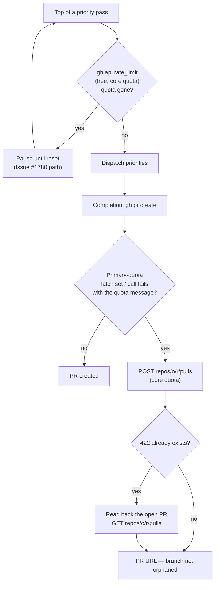

# Primary GraphQL quota exhaustion — per-pass pre-flight gate and a REST PR fallback

## Summary

Completes the remaining work on Issue #42. Closes #42.

Two of the issue's four defects landed earlier: the process-wide primary-quota
latch, the `#650` breaker mapping and the `ensureLabelExists` 422/underlying-error
fix in PR #156 (Defects 1, 2 and 4), and the REST-based claim release in PR #162
(Defect 3). This PR finishes the two items that were still open:

1. **Re-run the pre-flight quota gate at the top of every priority pass**
   (the issue's second *Expected* bullet). The gate previously ran once, at
   process start, so mid-run exhaustion — typically a sibling worker draining
   the shared token — was learnt only when one of this worker's own calls
   failed, which is precisely the doomed call the latch exists to avoid.
   `gh api rate_limit` is free and rides the core quota, so the cycle loop now
   re-reads it at the top of each pass and pauses on the existing Issue #1780
   path before any handler or health check spends a GraphQL call.

2. **Open the PR over REST when the primary GraphQL quota is gone** (the
   third bullet added in the issue's first comment). `gh pr create` is
   GraphQL-backed, so the observed run threw away 26 minutes of agent time and
   a green quality gate: branch pushed, no PR, issue still assigned, branch
   orphaned. It recurred an hour later on GRQ#4139. The REST `pulls` endpoint
   rides GitHub's separate core quota — ~4 000 calls still available at the
   time, and already exempt from the latch — so completion now falls back to
   it. Because the phase's own pre-checks are GraphQL-backed and skipped while
   latched, a 422 `already exists` resolves to the existing PR instead of
   failing. Any other create failure keeps the existing self-healing path
   untouched, and a failed fallback surfaces both errors rather than masking
   either.

The comment's other two suggestions (wait-until-reset bounded by the run
deadline, and a durable `pr_pending` marker) are deliberately not implemented:
the REST fallback lands the PR immediately on the quota that is still healthy,
so neither burning the remaining run time on a wait nor deferring the PR to a
later run is needed. In the observed run the wait would not have fitted anyway
— reset was 24 minutes out with 335 s of runway left.

## Evidence

Backend/CLI change — no web interface to screenshot. Verified by the tests
listed below plus the full local gate.

The path a `gh` call now takes once the quota is gone:

`./quality.sh`: every check passes except `deno tests`, which reports the same
10 pre-existing failures on this branch as on the base commit — verified by
running `tests/setup_workdir_reminder_test.ts`, `tests/fleet_health_test.ts`,
`tests/host_workdir_guard_test.ts` and `tests/optional_feature_env_test.ts` in
a worktree at `HEAD~2` (`FAILED | 63 passed | 10 failed`). They are host
work-dir probes unrelated to this change; the branch adds no new failures
(`14660 passed | 10 failed`).

## Test Plan

New tests, all calling the real functions:

- `worker/deno/tests/run_core_per_pass_preflight_test.ts` — an exhausted quota
  at the top of a pass pauses **before** any priority handler or health check
  runs and resumes once it clears; a healthy quota never pauses; a shutdown
  during the wait exits cleanly without dispatching.
- `worker/deno/tests/pr_create_rest_test.ts` — the REST create posts the
  expected raw fields and returns the `html_url`; every call it makes is
  `gh api <rest-path>` and never GraphQL; reviewers are requested over REST and
  a reviewer failure still returns the PR; a 422 already-exists recovers the
  open PR; other failures and a missing `html_url` fail loudly with the
  underlying message; malformed repo / empty head / empty base are rejected
  before any `gh` call.
- `worker/deno/tests/completion_phase_rest_pr_fallback_test.ts` — regression
  cover for the reported failure: a `gh pr create` that fails with the
  primary-quota message (and, separately, with the latch's own skip message)
  now completes via REST instead of returning `failure`; an ordinary create
  failure does **not** use the fallback; a failed fallback keeps the original
  reason and logs the REST error.

Docs updated in the same change: a new "Primary GraphQL quota exhaustion"
section in `docs/INTERNALS.md` (with a Mermaid diagram of the latch, the
per-pass gate and the REST-exempt paths), and a `CHANGELOG.md` entry.
