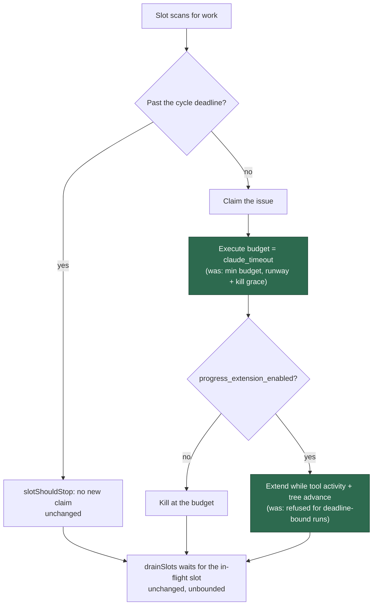

# Execute phase: an issue claim keeps its full budget

## Summary

The execute phase bounded an issue claim's Claude timeout to whatever was left
of the cycle (`resolveExecuteTimeoutSeconds`, Issue #4254) and then, via the
`deadline-bound` regime (Issue #4297), refused progress extensions to exactly
those runs. A claim taken 16 minutes before the hour therefore got a 16-minute
budget, was killed mid-task, and could not extend even while demonstrably
progressing (GRQ#4398).

The cycle deadline now stops **new** claims only. A claim already in flight
gets `config.claudeTimeout` in full, and whether it may extend is purely
`progress_extension_enabled` (plus the hard-cap runway, sibling #421). The soft
gate in the scan loop (`slotShouldStop`) and the unbounded deadline drain
(`drainSlots`) are untouched.

Closes #420.

Changes:

- `worker/deno/lib/phases/execute_phase.ts` — the execute timeout is
  `config.claudeTimeout`; `ctx.cycleDeadlineEpochMs` no longer reaches timeout
  resolution on this path (it still gates the infra-retry runway, VibeCoder#174).
  The `#4297` regime line is replaced by an `Execute budget: …` line naming the
  full budget and whether extensions are on.
- `worker/deno/lib/execute_timeout.ts` — `resolveExtensionRegime` and its types
  are gone with the regime they named. `resolveExecuteTimeoutSeconds` stays
  exported: the idle-task scan bound (Issue #186) is its remaining caller, and
  the module doc now says so, so it is not deleted later as dead code.
- `worker/deno/lib/wip_checkpoint.ts` — `buildTimedOutWipCommitMessage` loses
  its permanently-`false` `deadlineBound` option and the `" at the cycle
  deadline"` clause. The completion gate matches on the `wip:` prefix, so
  branches cut before this change are still recognised (asserted in the test).
- The timeout failure reason loses its deadline note, so no issue-work timeout
  emits `DEADLINE_BOUND_TIMEOUT_MARKER` any more. The marker and its cooldown
  exemption in `failure_diagnosis.ts` are left in place — release messaging is
  sibling issue #424's scope.
- **Out of scope, deliberately:** the idle-task route
  (`idle_task_claude_budget.ts`) and `docs/IDLE-TASK-FRAMEWORK.md` behave
  exactly as before; the doc table entry now records *why* only that route
  still applies the rule. The claim-runway floors (#4304/#47/#245) and the
  wider deadline-model docs still describe the retired truncation — those are
  sibling issues #425 and #426.



## Evidence

Backend worker change — no web interface to screenshot. The evidence is the
runner's arguments before and after the fix, driven through the real execute
phase with a mocked runner.

**Before** (new tests run against the unfixed code — a claim with 16 minutes of
runway and a 3600 s `claude_timeout`):

```
execute_phase - a claim taken with 16 minutes of cycle runway still gets the full configured budget (Issue #420) => FAILED
  Values are not equal: actual 990, expected 3600
execute_phase - a claim taken late in the cycle is still offered progress extensions (Issue #420) => FAILED
  with the truncation regime gone, the config flag is the only gate left
Execute timeout regime: deadline-bound — the cycle deadline bounds this run to 989s (configured 3600s), so progress extensions are not offered …

FAILED | 0 passed | 5 failed
```

**After**:

```
$ deno test --allow-all tests/execute_phase_full_budget_420_test.ts \
    tests/execute_timeout_test.ts tests/wip_commit_marker_test.ts \
    tests/execute_phase_killed_test.ts tests/idle_task_claude_budget_test.ts

ok | 49 passed | 0 failed (707ms)
```

The run-start log line an operator reads is now:

```
Execute budget: 3600s — the full configured claude_timeout, never truncated by the cycle deadline (Issue #420); progress extensions on.
```

Full gate: `./quality.sh < /dev/null` → `Result: PASSED (with skipped checks)`
(1951 files type-checked, deno lint/fmt/tests, mermaid and markdownlint all
green).

## Test Plan

Added / updated:

- `worker/deno/tests/execute_phase_full_budget_420_test.ts` (was
  `execute_phase_extension_regime_4297_test.ts`, updated in place rather than
  deleted) — drives the execute phase with
  `ctx.cycleDeadlineEpochMs = now + 960_000` and `claudeTimeout = 3600` and
  asserts the runner is invoked with a 3600 s timeout, that the progress
  extension option is present when the flag is on and absent when it is off,
  that the run-start line names the budget and the extension state (and no
  longer names a regime), and that the deadline published to the slot is the
  whole budget. All five failed against the unfixed code.
- `worker/deno/tests/execute_timeout_test.ts` — retained (the idle-task route
  still needs the pure-function coverage), with a new test driving
  `resolveIdleTaskBudget` under a run context: the same 16-minute runway that
  no longer truncates a claim **must** still bound a scan. A future tidy-up
  that deletes `resolveExecuteTimeoutSeconds` now breaks the build instead of
  silently unbounding scans.
- `worker/deno/tests/wip_commit_marker_test.ts` — the two builder cases drop
  the removed option; a new case asserts the pre-#420 `" at the cycle
  deadline"` subject is still recognised as WIP.
- `worker/deno/tests/execute_phase_killed_test.ts` — **business-logic change,
  documented:** the checkpoint test previously asserted the reason contained
  `"at the cycle deadline"`. A claim taken with runway left is now an ordinary
  full-budget timeout, so the assertion is inverted to require the note is
  absent; every other assertion in that test (preserved work, checkpoint
  count, failure category, no retry) is unchanged. No test was removed or
  commented out.

## Pre-PR Security Self-Check

- Input validation: no new external input — the change removes a computation
  and reads an already-validated config value.
- Credential exposure: no keys, tokens or hidden files are in the staged set
  (the masker treats a `Secrets:` label as a key/value pair and redacts
  whatever follows it, hence the wording).
- Injection surface: no new SQL, shell, filesystem or HTTP calls.
- Output encoding: only worker log lines and a git commit subject, both built
  from numbers and fixed strings.
- Authentication/authorisation: unchanged.
- Error handling: no new catch sites; the timeout path still fails loud with
  the same detailed reason minus the retired note.
- Dependencies: none added.
