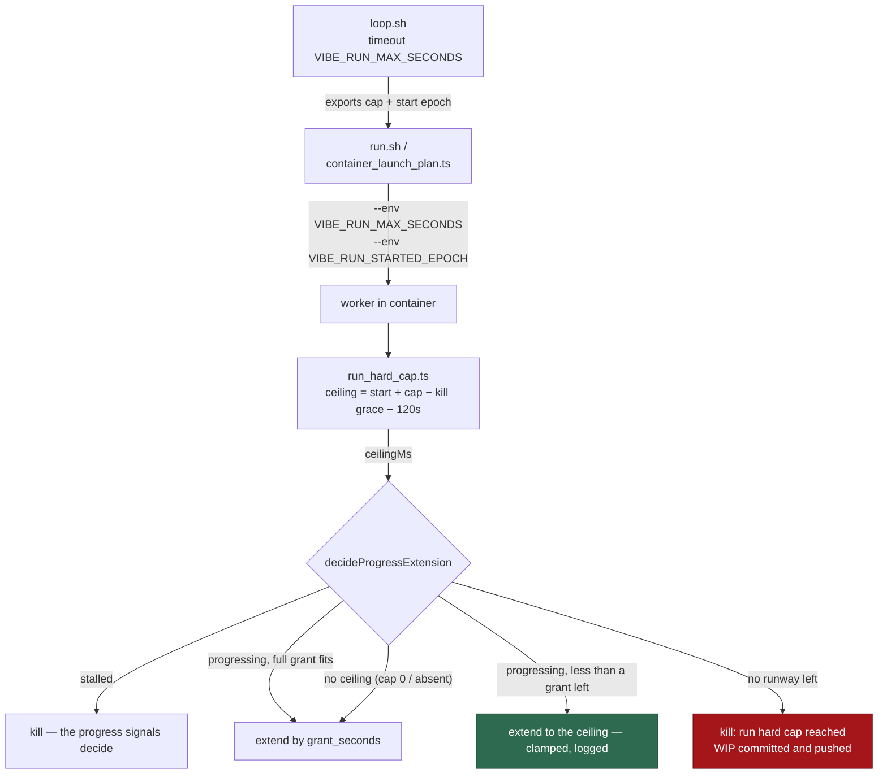

# Bound progress extensions by the supervisor hard cap

## Summary

`loop.sh` owns the run's wall-clock cap — `timeout <VIBE_RUN_MAX_SECONDS>`
around `run.sh` — but never published it, so the progress-extension policy
re-armed the deadline for as long as the agent kept progressing without knowing
when the supervisor would step in. With the deadline-bound refusal retired by
#420, a genuinely progressing run would have ended on a SIGTERM it never saw
coming: no worker-side warning, no orderly WIP commit window, and a
launcher-failure exit status recorded against the host. Closes #421.

The cap is now published and enforced worker-side:

- `loop.sh` **exports** `VIBE_RUN_MAX_SECONDS` and, per iteration immediately
  before `timeout` starts counting, `VIBE_RUN_STARTED_EPOCH`.
- `container_launch_plan.ts` reads that pair and `container_launch.ts` passes
  it into the container as two `--env` arguments; a launcher invoked outside
  `loop.sh` forwards nothing.
- `run_hard_cap.ts` (new) resolves the pair into an absolute epoch-ms
  **ceiling**, holding back `claude_kill_after` plus a 120 s WIP
  commit-and-push reserve, so the worker's own kill lands *before* the
  supervisor's SIGTERM and `wip_checkpoint.ts` has time to finish.
- `decideProgressExtension` takes the ceiling as an optional input and applies
  it last: a grant that would cross it is **clamped to the runway left** (200 s
  of runway grants 200 s, not a full 900 s and not zero), and a run with no
  runway is refused with `run hard cap reached`. The policy stays pure — no
  `Date.now()`, no env reads.
- An absent, unparseable or `0` cap means **no ceiling**, and extensions behave
  exactly as they did before. `execute_phase` logs which of the two applies
  once at run start (`Run hard cap: …`).



## Evidence

Backend/CLI change — no web interface to screenshot. Evidence is the test
suite and the operator-facing log lines.

Targeted suites (`worker/deno`):

```text
deno test --allow-all tests/run_hard_cap_test.ts \
  tests/progress_extension_hard_cap_421_test.ts \
  tests/progress_extension_runtime_test.ts \
  tests/claude_runner_progress_extension_4296_test.ts
ok | 29 passed | 0 failed (23s)

deno test --allow-all tests/loop_supervisor_test.ts \
  tests/run_sh_launcher_test.ts tests/container_launch_test.ts
ok | 82 passed | 0 failed (2m2s)
```

The two lines an operator greps (documented in `docs/TROUBLESHOOTING.md`):

```text
Run hard cap: VIBE_RUN_MAX_SECONDS=5400s from run start; progress extensions
may not push the deadline past 5250s elapsed (150s reserved for the kill grace
and the WIP commit-and-push), leaving 5100s of runway
[progress-extension] not extending after 5250s (extensions granted 5): run
hard cap reached — no runway left before the supervisor terminates this run,
so stopping now to preserve work in progress
```

Full gate: `./quality.sh < /dev/null` passes.

## Test Plan

Added:

- `worker/deno/tests/progress_extension_hard_cap_421_test.ts` — six policy
  tests: grants stop at the ceiling however long progress continues; the last
  grant is clamped to the exact runway (the issue's 200 s example) and names
  the clamp; a grant inside the ceiling is not clamped; no runway refuses and
  names the cap; an undefined ceiling reproduces today's unbounded sequence
  increment for increment; the ceiling never rescues a stalled run.
- `worker/deno/tests/run_hard_cap_test.ts` — resolution tests: a real cap
  yields the ceiling with the shutdown reserve; `0`, absent, unparseable and
  an epoch-milliseconds start each yield no ceiling with a stated reason; a cap
  smaller than the reserve leaves no runway rather than inverting; the
  passthrough reader and the run-start description line.
- `worker/deno/tests/loop_supervisor_test.ts` — two tests that spawn the real
  `loop.sh` against a recording `run.sh` stub and assert the cap and the start
  epoch reach it, both configured and at the default, so a launcher refactor
  that drops the passthrough fails `deno test`.
- `worker/deno/tests/run_sh_launcher_test.ts` — the launcher passes both
  variables into the container run, and passes none when they are absent.
- `worker/deno/tests/container_launch_test.ts` — `buildContainerLaunchPlan`
  carries the run cap.
- `worker/deno/tests/progress_extension_runtime_test.ts` — `buildProgressExtension`
  carries the ceiling through, and omits it when uncapped.
- `worker/deno/tests/claude_runner_progress_extension_4296_test.ts` — two
  end-to-end runner tests: grants are clamped and then refused at the ceiling,
  and no ceiling leaves the sequence unbounded.

No test was removed, disabled or weakened.

Docs updated: `docs/CONFIGURATION.md` (the ceiling, the clamp, the disabled
case and the extension flowchart) and `docs/TROUBLESHOOTING.md` (the two log
lines).
