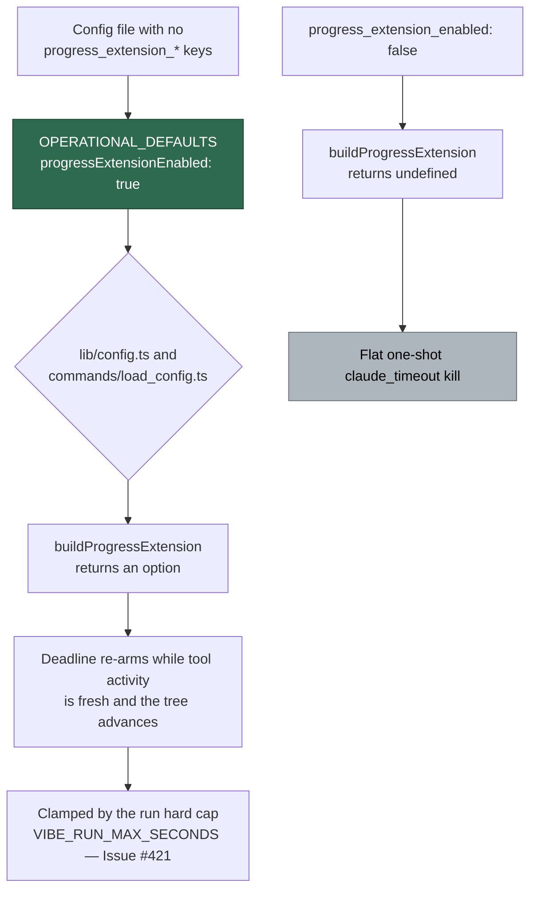

# Turn progress extensions on by default (Issue #422, parent #397)

## Summary

The re-armable issue-work deadline (#4290/#4295/#4296) shipped dark:
`progressExtensionEnabled` defaulted to `false`, so a worker with no
`progress_extension_*` keys in its config file got `buildProgressExtension() ===
undefined` and kept the flat one-shot `claude_timeout` kill. With deadline
truncation gone (#420) a legitimately long, demonstrably-progressing claim was
still killed on the clock.

This flips the default to `true` in `OPERATIONAL_DEFAULTS` — the single source
both config readers (`lib/config.ts` and `commands/load_config.ts`) resolve
through, so there is no path where the CLI and the main loop disagree. Closes
#422.

What did **not** change:

- **The switch.** `progress_extension_enabled: false` still yields `undefined`
  and today's unconditional kill.
- **The companion defaults.** `grant 900s` / `stall 300s` / `check 300s` are
  kept as the production values and still satisfy the existing validation in
  `config.ts:473-505` (all positive, stall ≥ check).
- **The bound.** Every grant is clamped to the supervisor hard cap
  (`VIBE_RUN_MAX_SECONDS`, Issue #421), which is already on this milestone
  branch (`c3272ab`), so the on-by-default chain is bounded rather than open
  ended. The no-output watchdog still kills a silent run, and only the execute
  phase reads the extendable deadline.

### Files changed

| File | Change |
| --- | --- |
| `worker/deno/lib/config_defaults.ts` | `progressExtensionEnabled: false → true`; comment now says why it is on and what bounds it |
| `docs/CONFIGURATION.md` | Reference-table default `false → true`; opt-in prose rewritten; new **Turning it off** subsection |
| `docs/TROUBLESHOOTING.md` | "Why did this run take three hours?" no longer implies the operator switched it on |
| `worker/deno/tests/progress_extension_default_422_test.ts` | New — both readers, the switch, and the doc assertion |
| `worker/deno/tests/config_test.ts`, `load_config_test.ts`, `execute_phase_full_budget_420_test.ts` | Existing default-pinning assertions updated (see Test Plan) |

## Evidence

Backend/config change — no web surface to screenshot. The evidence is the test
suite and the full quality gate.

```
$ deno test --allow-all tests/progress_extension_default_422_test.ts \
    tests/execute_phase_full_budget_420_test.ts \
    tests/config_test.ts tests/load_config_test.ts
ok | 126 passed | 0 failed (419ms)

$ ./quality.sh < /dev/null
  deno tests                     PASSED
  deno lint                      PASSED
  deno type check                PASSED
  deno fmt                       PASSED
  markdownlint                   PASSED
  config integration             PASSED
Result: PASSED (with skipped checks)
```

The decision an unconfigured worker now takes:



## Test Plan

New — `worker/deno/tests/progress_extension_default_422_test.ts`:

- an empty config resolves `progressExtensionEnabled === true` through
  `lib/config.ts`;
- the companion defaults load without tripping their own validation, and
  `stall ≥ check` holds for the defaults themselves;
- `commands/load_config.ts` exports
  `PROGRESS_EXTENSION_ENABLED="${PROGRESS_EXTENSION_ENABLED:-true}"` for the
  same empty config — the two readers cannot drift apart;
- `progress_extension_enabled: false` still resolves `false`, still makes
  `buildProgressExtension` return `undefined`, and still exports `:-false`;
- an unconfigured worker builds a real runner option carrying the default
  grant / stall / check values;
- `docs/CONFIGURATION.md` documents the `true` default, no longer says "off by
  default", shows how to switch it off, and still states the hard-cap ceiling.

Modified — business-logic change, documented as required:

- `config_test.ts` — "progress extension is off by default" now asserts `true`
  for the same unconfigured input. The old expectation *was* the bug.
- `load_config_test.ts` — the exported shell default asserted as `:-true`.
- `execute_phase_full_budget_420_test.ts` — the disabled case can no longer be
  reached via `buildDefaultWorkerConfig()`, so it now uses an explicit
  `progressExtensionEnabled: false` config (same assertion, honest input), and
  a new test asserts an unconfigured worker *does* reach the runner with a
  `progressExtension` option. No test was removed or commented out.

## Pre-PR Security Self-Check

- Input validation: unchanged — the existing `config.ts` validation still
  rejects non-positive grant/stall/check and `stall < check`.
- Credentials: nothing sensitive is staged; `git diff --cached --name-only`
  shows only the seven files above.
- Injection / output encoding / authn / error handling / dependencies: no new
  surface — this change moves one boolean literal and its documentation.
