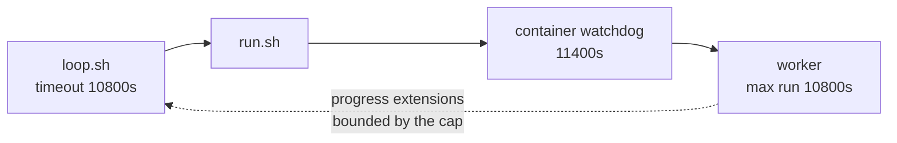

# Raise the supervisor hard cap to 10800 s and pin the watchdog relation

## Summary

Raised `loop.sh`'s default `VIBE_RUN_MAX_SECONDS` from 5400 s to **10800 s** (3 h)
and rewrote the rationale comment, which described the cap as "the 3600 s run
duration plus a wide margin". Under Issue #397 a claim is no longer truncated at
the cycle deadline, so a claim taken at minute 59 legitimately runs its full
budget with progress extensions on — with a 90-minute cap the supervisor became
the thing that killed work that was still progressing. Closes #423.

The cap now sits under the launcher's container watchdog by the documented
10-minute margin, so the host never reaps a container the supervisor would still
allow to run:

| Bound | Seconds | Source |
|-------|---------|--------|
| Supervisor hard cap | 10800 | `loop.sh` `VIBE_RUN_MAX_SECONDS` default |
| Worker's own max run duration | 10800 | `DEFAULT_MAX_RUN_SECONDS` (`worker/deno/lib/run_entrypoint.ts:34`) |
| Container watchdog deadline | 11400 | `resolveWatchdogSeconds()` = max run duration + `WATCHDOG_MARGIN_SECONDS` (600) |

That relation was already correct in code — `container_launch.ts` derives
`watchdogSeconds` from `resolveWatchdogSeconds()`, never a hand-set constant —
but nothing failed if the two drifted. A test now asserts it.

`VIBE_RUN_MAX_SECONDS=0` still means "disabled", not "cap at zero"
(Issue #322), and a run terminated at the cap is still logged as terminated by
the supervisor and recorded to the backoff recorder as a launcher failure
(Issue #4072) — neither path was touched.

### `loop.ps1` parity

`loop.ps1` has no wall-clock cap and, after review, does not gain one here: it
invokes `run.ps1` in-process, so bounding it would mean growing an untested
out-of-process supervision path, and the canonical production supervisor on
Windows is Task Scheduler, which owns the wall clock itself. The divergence is
now stated plainly in `loop.ps1` and in `docs/DEPLOYMENT.md` — what still bounds
a PowerShell host (the container watchdog in `run.ps1`, the worker's own run
limit) and what does not (a host-side `run.ps1` that never returns).



## Evidence

Backend/CLI change — no web interface to screenshot. Evidence is the test suite:

```text
running 14 tests from ./tests/loop_supervisor_test.ts
loop.sh #322 - VIBE_RUN_MAX_SECONDS=0 disables the cap rather than capping at zero ... ok (11s)
loop.sh #421 - the default cap is published too, so an unconfigured host is still bounded ... ok (5s)
loop.sh #423 - the default cap is 10800s and the container watchdog clears it by the documented margin ... ok (5s)
loop.sh #423 - an explicitly set VIBE_RUN_MAX_SECONDS still wins over the default ... ok (5s)
ok | 14 passed | 0 failed (1m45s)
```

The two pre-existing `#322` cases (2 s and 30 s explicit caps) pass unchanged.

## Test Plan

Added to `worker/deno/tests/loop_supervisor_test.ts`:

- `loop.sh #423 - the default cap is 10800s and the container watchdog clears it
  by the documented margin` — spawns `loop.sh` with no `VIBE_RUN_MAX_SECONDS`,
  reads the value `run.sh` actually received, asserts it is 10800, then asserts
  `resolveWatchdogSeconds({env: () => undefined, maxRunSeconds:
  DEFAULT_MAX_RUN_SECONDS})` equals that cap plus `WATCHDOG_MARGIN_SECONDS` and
  strictly exceeds it. Raising one number without the other now fails
  `deno test` instead of surfacing as a reaped healthy container on a host.
- `loop.sh #423 - an explicitly set VIBE_RUN_MAX_SECONDS still wins over the
  default` — an explicit 1800 s reaches `run.sh` unchanged.

Updated: the `#421` default-cap assertion now expects 10800.

Docs updated for the new numbers: `docs/CONFIGURATION.md` (the run hard cap
section), `docs/DEPLOYMENT.md` (the `VIBE_CONTAINER_WATCHDOG_SECONDS` row and
the `loop.ps1` note), `docs/TROUBLESHOOTING.md` (the worked log excerpt). No
document outside `docs/archive/` still states 5400 s as the default; the archived
summaries for Issues #322 and #421 are historical records and are left as-is.
