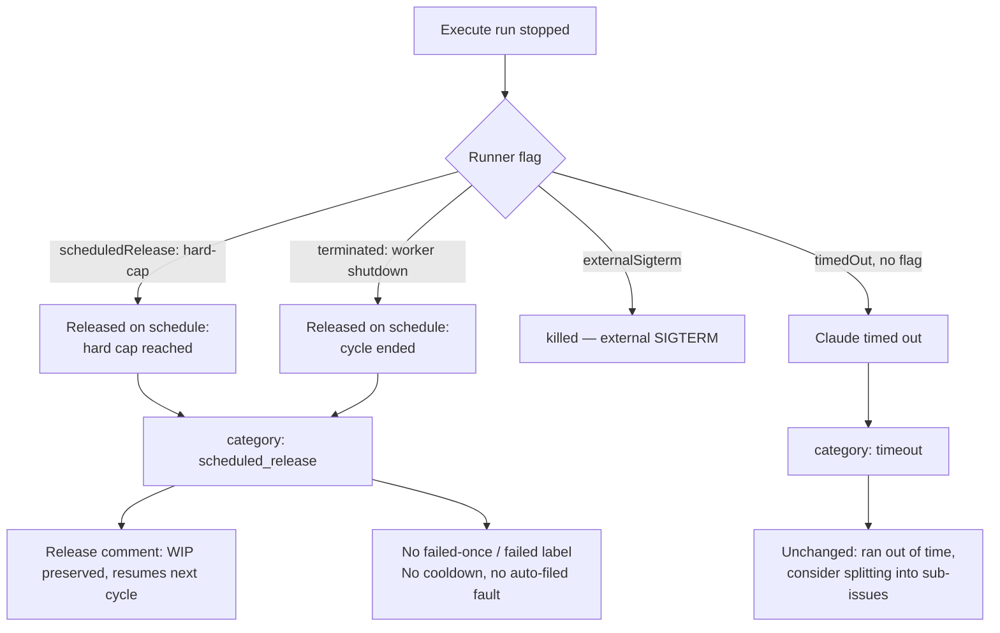

# A cycle-end or hard-cap release is reported as a handover, not a timeout

## Summary

A run stopped because the cycle ended or the supervisor's wall-clock hard cap
was reached used to be reported to the issue as `Claude ran out of time`, with
advice to split the issue into sub-issues — and it entered the
`failed-once` → `failed` ladder. Under the parent change (#397) that is simply
untrue: the run was progressing, its work in progress was committed and pushed,
and the next claim resumes the branch. Nothing about the issue was at fault.

This change teaches the worker to tell the two apart and say so.

- New failure category `scheduled_release` (display `scheduled-release`), keyed
  off the marker `Released on schedule:` that the kill path writes into the
  failure reason. The exit status cannot be used: a scheduled release fires the
  same watchdog and dies on the same SIGTERM as a genuine timeout, so the
  discriminator has to come from the path that knows.
- `decideProgressExtension` now tags its hard-cap refusal `cause: "hard-cap"`;
  `runClaudeWithTimeout` / `runClaudeWithRetry` carry that to the result as
  `scheduledRelease`, and the execute phase builds the scheduled-release reason
  from it instead of the timeout reason.
- The worker's own shutdown at cycle end (`terminated`) gets its own arm in the
  execute phase: preserve the WIP, then fail with the cycle-ended
  scheduled-release reason. Previously it fell through to change detection and
  ran the quality gate and completion over a half-done tree — the same defect
  Issue #46 fixed for the external-SIGTERM path. The external-SIGTERM arm is
  unchanged and still reached, because `terminated` and `externalSigterm` are
  mutually exclusive in the runner.
- `getFailureDiagnosis` / `getFailureDiagnosisOneliner` gain scheduled-release
  wording — *"cycle ended or the run hard cap was reached — WIP preserved,
  resumes next cycle"* — with no "ran out of time" and no "sub-issues" advice.
  The genuine-timeout wording is byte-for-byte unchanged.
- `handleIssueFailure` returns early for a scheduled release: no `failed-once`,
  no `failed`, no unassign, no `gh` call at all. The claim-release comment still
  records the outcome, just not as a fault. It is also **not** classed as
  infrastructure (the bounded in-process retry has no runway to retry into) and
  **not** timeout-class (so it never feeds the escalating timeout cooldown), and
  `classifyRunFailure` marks it `not_code_fixable` so it is never auto-filed as
  a worker defect.
- `buildTimedOutWipCommitMessage` becomes `buildInterruptedWipCommitMessage`
  with an explicit cause, so the `wip:` commit subject names what actually
  stopped the run (`timed-out`, `killed`, `external-sigterm`,
  `scheduled-release`) instead of asserting a timeout three of the four never
  had. The stale `" at the cycle deadline"` phrasing is gone; the completion
  phase's WIP-only gate still matches on the `wip:` prefix, so branches carrying
  the older subjects are recognised unchanged.
- `claude_executor.ts`'s in-progress regex still matches "ran out of time" in
  *agent output* — unrelated, and deliberately left alone.

Closes #424.

## Evidence

Backend/CLI only — no web surface to screenshot. Verified by tests plus the
full quality gate (`./quality.sh`: deno tests, lint, type check, fmt,
markdownlint, mermaid, chokepoint audits — `Result: PASSED`).

How a stopped run is now classified:

## Test Plan

New and modified tests, all passing:

- `worker/deno/tests/execute_phase_scheduled_release_424_test.ts` (new) — drives
  the execute phase with a hard-cap release, a cycle-end shutdown and a genuine
  timeout; asserts each produces its own reason, that the scheduled-release
  reason never contains "ran out of time" or "sub-issues", that it is neither
  infrastructure nor timeout-class, and that the rendered claim-release comment
  says `no PR raised — scheduled-release … WIP preserved … resumes next cycle`.
- `worker/deno/tests/failure_diagnosis_test.ts` — the two cases the issue names
  (`:214`, `:261`) are split into a genuine-timeout case (wording unchanged,
  still suggests splitting) and a scheduled-release case (asserts neither
  phrase appears); plus category detection over a full hard-cap diagnostics
  block that legitimately carries `Watchdog: hard-timeout` and `Timeout: 3600s`.
- `worker/deno/tests/wip_commit_marker_test.ts` — every cause builds a subject
  the completion gate still recognises; the scheduled-release subject contains
  neither "timed out" nor "at the cycle deadline"; the genuine-timeout subject
  is pinned byte for byte.
- `worker/deno/tests/label_manager_test.ts` — a scheduled release makes no `gh`
  call and applies no label.
- `worker/deno/tests/progress_extension_hard_cap_421_test.ts` — the hard-cap
  refusal carries `cause: "hard-cap"`; a stalled run's kill does not.
- `worker/deno/tests/run_outcome_classifier_test.ts` — a scheduled release is
  `not_code_fixable`, class `scheduled-release`.

Docs updated: `docs/CONFIGURATION.md` (how a capped run is reported) and
`docs/TROUBLESHOOTING.md` (how to tell a handover from a real timeout).
