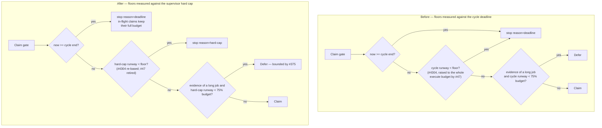

# Re-tune the claim-runway floors for the untruncated regime

## Summary

The claim gate refused a claim when the **cycle** had too little runway left,
not merely when the cycle deadline had passed. Every rule that built that floor
was justified by deadline truncation, which Issue #420 retired: a claim taken at
minute 59 now keeps its full `claude_timeout` budget and may extend past it
while genuinely progressing. Left as they were, the floors deferred claimable
work through most of the back half of every cycle for a reason that no longer
exists, and the Issue #375 starvation counter papered over it.

Both surviving floors are now measured against the boundary that actually kills
a run — the **supervisor hard cap** (`VIBE_RUN_MAX_SECONDS`, resolved by
`run_hard_cap.ts`, Issue #421) — instead of the cycle deadline. The cycle
deadline is untouched: it still stops *new* claims on its own (Issue #397's soft
gate). Closes #425.

### Verdict on each of the three rules

| Rule | Fate | Why |
|------|------|-----|
| `minClaimRunwaySeconds` (#4304) | **Kept, re-based** | Its premise — "a claim that cannot even finish setup is doomed on arrival" — is still true, but the deadline it must be measured against moved from the cycle to the hard cap. |
| `fullExecuteBudgetSeconds` (#47) | **Retired outright** | Its stated purpose was to make a deadline-bound execute "a documented exception rather than the default tail of every cycle". There are no deadline-bound issue executes left for it to make rare. |
| Adaptive floor (#245) + starvation escape (#375) | **Kept, re-based** | An issue with evidence of a long job genuinely still cannot fit when the supervisor will kill the run first, so the justification is live. It survives measured against hard-cap runway, and #375 survives with it — the floor can still be unsatisfiable on a short-cap host. |

### What changed

- **`claim_runway.ts`** — `resolveClaimRunwayFloor` now takes a `ClaimHardCap`
  (`ceilingMs` + `windowSeconds`) instead of `fullExecuteBudgetSeconds` +
  `cycleSeconds`. New `belowClaimRunwayFloor()` / `hardCapRunwaySeconds()`
  helpers are the single place the comparison happens, used by both the serial
  scan loop and the slot pool.
- **`claim_runway_evidence.ts`** — `decideAdaptiveClaim` takes
  `runwayWindowSeconds` (the hard-cap window) where it took `cycleSeconds`, and
  `remainingRunwaySeconds` is now runway to the ceiling. The 0.75 share and the
  short-host fallback are unchanged in shape, only re-based.
- **`run_core.ts`** — the slot pool gained a distinct `hard-cap` stop reason so
  the two refusals are never conflated in the log (the Issue #219 rule):
  `deadline` means the hour is up and in-flight claims keep their budget;
  `hard-cap` means the supervisor would kill the claim before it finished setup.
  An uncapped run has **no** adaptive floor at all — nothing can cut its execute
  short.
- **`run_core_production_deps.ts`** — new `resolveClaimHardCap()` bridges
  `resolveRunHardCap()` into the claim gate. Absent env (a CLI run, a host with
  `VIBE_RUN_MAX_SECONDS=0`) leaves both floors inert, and that is logged once per
  cycle via `ClaimRunwayFloor.inertReason` — never a silent refusal, and never a
  silent non-refusal.
- **Config surface** — `claim_require_full_execute_budget` /
  `CLAIM_REQUIRE_FULL_EXECUTE_BUDGET` removed from `WorkerConfig`, `ConfigFile`,
  `ConfigFileJson`, `OPERATIONAL_DEFAULTS`, `loadConfig`, the boolean-validation
  list and `KNOWN_CONFIG_KEYS` (with a breadcrumb comment so a stale key is
  reported as unknown rather than silently ignored). `min_claim_runway_seconds`
  keeps its name, its `300` default and its env fallback; only what it measures
  changed.
- **`adaptive_floor_deferrals.json`** is **not** orphaned: the floor it belongs
  to survives, so the state stays meaningful. Its 7-day entry TTL
  (`ADAPTIVE_FLOOR_ENTRY_TTL_SECONDS`) already prevents accumulation.
- **`docs/CONFIGURATION.md`** — the retired key is removed from the table, the
  `min_claim_runway_seconds` row and the adaptive-floor section are restated
  against the hard cap, and the flowchart's decision node now reads
  "Hard-cap runway ≥ 75% of min(claude_timeout, cap window)".

No floor rule is left in the code with a comment justifying it by truncation:
`claim_runway.ts`, `claim_runway_evidence.ts` and
`adaptive_floor_starvation.ts` each open with the post-#397 justification and
state explicitly which premise died with #420.

## Evidence

This is a backend claim-gating change with no web interface, so there is no
screenshot to capture. The evidence is the test suite below plus the full
quality gate.

### The gate, before and after

The acceptance case in numbers, on a default host (3600 s cycle, 3600 s execute
budget, 10800 s cap): 20 minutes before the cycle deadline with two hours of cap
runway left, the plain floor needs 300 s and the adaptive floor needs
0.75 × min(3600, 10500) = 2700 s. Both are met, so the issue is claimed. Before
this change the same moment offered 1200 s of *cycle* runway and was refused.

### Quality gate

`./quality.sh` passes: prompt immutability, benchmark audit, hardcoded branch
names, needs-human chokepoint, gh spawn chokepoint, host work-dir guard, git ref
chokepoint, workflow hygiene, source targets, mermaid, markdownlint, docs prompt
versions, deno tests, deno lint, deno type check and deno fmt.

## Test Plan

New cases in `worker/deno/tests/run_core_slot_pool_test.ts`, each of which fails
against the pre-change floors:

- `slot pool #425 - a claim 20 minutes before the cycle deadline proceeds when
  the hard cap has hours left` — the issue's headline acceptance criterion.
- `slot pool #425 - zero hard-cap runway stops the slot with reason=hard-cap,
  and it is logged` — asserts the runway number and the floor are both named in
  the log line (Issue #219).
- `slot pool #397 - past the cycle deadline the slot still stops with
  reason=deadline` — the soft gate is unchanged.
- `slot pool #425 - an issue with long-job evidence is claimed late in the cycle
  when the hard cap can host it` — the adaptive floor no longer defers on cycle
  runway.
- `slot pool #245/#425 - a long job is still deferred when the hard cap cannot
  host an execute` — the surviving justification still bites, and the slot takes
  the next candidate rather than parking.

New cases in `worker/deno/tests/run_core_spend_guards_3648_test.ts`:

- `Issues #4304/#425 - the runway floor stops claiming once the hard cap is
  close` (serial scan loop).
- `Issue #425 - the retired #47 full-budget rule no longer refuses a late claim`.
- `Issue #425 - an uncapped run states the inert floor and keeps claiming` —
  asserts the inert gate is logged, not silent.

New cases in `worker/deno/tests/run_core_adaptive_claim_test.ts`:

- `adaptive claim #425 - a long job 20 minutes before the cycle deadline is
  claimed when the hard cap has hours left`.
- `adaptive claim #425 - an uncapped run has no adaptive floor at all`.

Rewritten (not removed) in
`worker/deno/tests/claim_runway_test.ts`,
`worker/deno/tests/claim_runway_evidence_test.ts` and
`worker/deno/tests/claim_runway_config_test.ts`: the cases that asserted the
`fullExecuteBudgetSeconds` / `cycleSeconds` inputs and the
`claim_require_full_execute_budget` key now assert the hard-cap inputs. All five
`#375` starvation cases and all 28 `#245` adaptive-floor cases are retained and
still pass.

**Documented test change.** Two `#289` config cases lost their
`claim_require_full_execute_budget` assertions and one — `the #207 host settings
refuse a late claim` — was rewritten as `claim runway #425 - a configured floor
refuses a claim inside it of the hard cap`, because the key they exercised no
longer exists. The behaviour they protected (a claim with 904 s of runway is
refused under an 1800 s floor) is still asserted, now against the hard cap.
