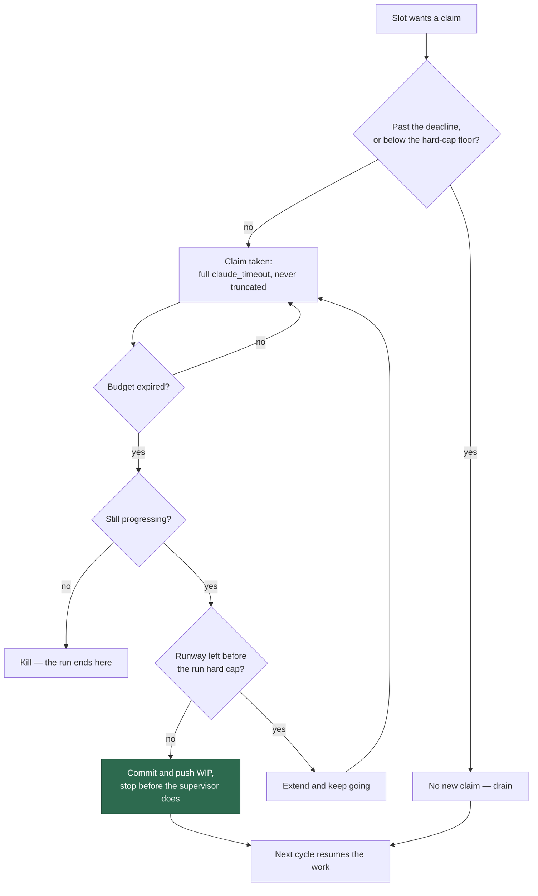

# Document the new cycle-deadline model (Issue #426)

## Summary

The deadline model was paraphrased across five pages, all describing the regime
Issue #397 replaced: the cycle deadline killed in-flight issue work, progress
extensions were opt-in, and the supervisor cap was quoted as 5400 s. This PR
states the model **once** and links the rest to it. Closes #426.

- **`docs/CONFIGURATION.md` — the canonical home.** A new
  "🕰️ The cycle-deadline model" section states the model end to end: the soft
  claim gate (`slotShouldStop` returns `deadline`, and the claim-runway floor
  now measures runway to the supervisor hard cap — `hard-cap`, Issue #425), the
  untruncated execute budget (Issue #420), progress extensions on by default
  (Issue #422) bounded by the run hard cap (Issue #421), the hard-cap kill with
  WIP committed and pushed and the run reported as a scheduled release
  (Issue #424), and the deadline drain that waits.
- **`docs/IDLE-TASK-FRAMEWORK.md`** — the scan's surviving bound is now
  justified on its own terms (a scan holds no work-in-progress and is
  discretionary) instead of by an execute-phase rule that no longer exists.
- **`docs/TROUBLESHOOTING.md`** — the runbook now opens with "nothing is wrong",
  states extensions are on by default, and walks the three greppable log lines
  a hard-cap stop produces, including the *clamped grant* line that was missing.
- **`docs/DEPLOYMENT.md` / `docs/INTERNALS.md`** — the supervisor cap and the
  derived container watchdog, both linking to the canonical section.
- **Issue #399 relationship** stated once, in the canonical section: #397
  removes the deadline-truncation symptom #399 cites and does **not** address
  the slow `./quality.sh` gate that is #399's actual scope.

### The check that keeps it true

`worker/deno/lib/deadline_model_docs_check.ts` fails the gate on the retired
facts rather than relying on a reader noticing:

| Rule | Fails when |
| --- | --- |
| `stale-run-cap` | A page quotes a seconds figure for `VIBE_RUN_MAX_SECONDS` or `VIBE_CONTAINER_WATCHDOG_SECONDS` that the source does not set. The allowed figures are **derived** from `loop.sh`'s cap default and `container_watchdog.ts`'s `WATCHDOG_MARGIN_SECONDS`, so the retired 5400 s fails today and the next raise fails the same way. |
| `extensions-off-by-default` | A page describes progress extensions as off/disabled by default (Issue #422). |
| `execute-deadline-rule` | A page cites `resolveExecuteTimeoutSeconds` as the execute phase's rule (Issue #420). |
| `canonical-model` | The canonical section is missing, or one of the four other pages neither links to it nor was removed. |

`docs/archive/` is exempt — a PR summary is a historical record. The check
SKIPs where there is no `loop.sh` (it is specific to this supervisor repo) and
FAILs loudly if the cap figures stop being derivable, rather than validating
the docs against a default it invented.

## Evidence

Documentation and a Deno check — no web interface to screenshot. The model the
pages now describe:



`./quality.sh` — **PASSED** (19 checks; `config integration`, `pages-liquid`
and `mermaid built output` skipped as usual on this host).

```text
deadline docs - the retired 5400 s cap fails (Issue #426) ... ok
deadline docs - the check follows loop.sh when the cap moves ... ok
deadline docs - this repository's own docs satisfy the model (Issue #426) ... ok
ok | 26 passed | 0 failed
```

## Test Plan

`worker/deno/tests/deadline_model_docs_check_test.ts` — 26 tests, each calling
the real check:

- **Cap drift** — the retired `5400 s` fails; the `10800 s` `loop.sh` actually
  sets passes; raising the parsed cap to `14400` makes the same prose fail, so
  the check follows the source rather than a hardcoded number; the derived
  watchdog (`600`, `11400`) passes and a watchdog that no longer clears the cap
  fails; `VIBE_RUN_MAX_SECONDS=0` and issue references are not seconds values.
- **Off by default** — caught on one line and across a wrapped sentence,
  accepted for "on by default" and for a "Turning it off" heading.
- **Execute rule** — a `resolveExecuteTimeoutSeconds` citation fails; the scan's
  own justification passes.
- **Canonical model** — a missing section fails, a non-linking page fails,
  section-plus-links passes, an absent page is skipped.
- **End to end** — SKIPPED with no `docs/` and in a repo with no `loop.sh`;
  FAILED loudly when the cap is no longer derivable; `docs/archive/` exempt;
  and this repository's own `docs/` tree passes.

### Test changes worth flagging

Two pre-existing tests changed meaning deliberately. They asserted that
quoting **any** seconds figure beside `VIBE_RUN_MAX_SECONDS` fails, which would
have rejected the raised 10800 s cap Issue #423 documents on purpose. They now
assert the figure must agree with the source — a stricter check against drift,
and a looser one against writing the number down.
