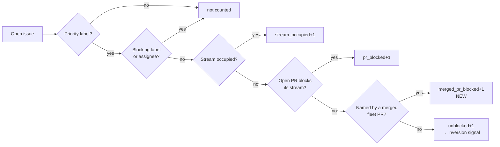

# PR Summary — Issue #429

## Summary

The idle-decision census and the idle-detect audit both model "could the
Priority 2 scan claim this issue right now?" — and both were missing the one
gate that never clears by itself. Since Issue #3151 a **merged** fleet PR whose
title names issue `#N` makes the scan refuse `#N` *permanently*
(`merged-pr-permanent`); only a trusted author re-applying the pickup label with
a date after the merge lifts it. Neither instrument knew that, so a single such
issue held `inversion_signal=true` and `claimable>0` on every cycle, for ever.

The consequence is not just log noise. The census verdict suppresses the
idle-task filer (Issue #2813), and after three consecutive cycles Issue #321
escalates the repo by filing "the claim scan keeps refusing" against it — which
costs a human a `work-on` label and a whole worker run. Two such issues were
filed on 2026-08-26 for the same non-fault: this one and `stSoftwareAU/GRQ#4419`.

The live strand: `stSoftwareAU/GRQ#4326` is open, labelled `work-on` since
2026-08-23T05:18:55Z, unassigned, carrying no blocking label and blocked by no
open PR — so the census counted it claimable — while merged PR #4336
(`… (Issue #4326) (#4336)`, merged 2026-08-23T07:52:58Z) makes the scan refuse
it permanently. The `work-on` label predates the merge, so the re-label escape
hatch does not lift it either. The scan was right; the census was wrong. GRQ was
demonstrably being worked throughout — #4374 closed 08:12Z, 37 minutes before
the 08:49Z escalation, and #4398/#4399/#4400 closed at 12:12Z the same morning.

This is the third instalment of the same fix: Issue #3526 added `pr_blocked`,
Issue #3852 added `stream_occupied`, and this adds `merged_pr_blocked`.

Closes #429.

## What changed

- `idle_decision_census.ts` — new optional `mergedPRs` per-repo input and a
  `mergedPrBlocked` counter. Issues named by a merged fleet PR are excluded from
  `unblocked` (and therefore from `inversionSignal`) and surfaced in the
  `[idle-census]` line as `merged_pr_blocked=<n>`, so the strand stays visible
  rather than silently dropped. Applied *after* stream occupancy and open-PR
  blocking, matching the existing attribution order.
- `idle_detect_diagnostics.ts` — new `merged_pr_blocked` exclusion reason, a
  `mergedPRs` classifier input and a `mergedPRsFn` audit option.
  `pickDominantReason` ranks it above `pr_blocked`: an open PR clears itself when
  it merges, a merged one never does, so it is the more actionable answer to
  "why was nothing picked up".
- `run_core_production_deps.ts` — one shared `fetchMergedPRsForCensus` helper
  wires both instruments to `fetchRecentlyClosedPRsForFleet` through the
  iteration-scoped `prs_closed_*` cache the Priority 2 scan already populates, so
  the gate costs **no** extra API call on a warm iteration.
- `docs/IDLE-TASK-FRAMEWORK.md` — the "unblocked" definition, the flowchart and
  the incident record.

### Two deliberate limits

Both keep the instruments cheap probes rather than a second scan, and both make
them *under*-count — which at worst files an idle-task while work exists, the
bounded-harm direction this module already prefers over starving the filer:

- Only **merged** PRs count. A closed-unmerged PR blocks for a cooldown window
  that clears itself, so counting it would hide work that is about to return.
- The re-label escape hatch (`wasLabelReappliedAfterClosedPR`) is not modelled —
  it needs a per-issue timeline call.

Every fetch is best-effort: a rejection falls back to no merged-PR blocking,
restoring the previous over-count rather than reporting a repo as having nothing
to do. No failure is swallowed into a false "nothing here".

## Evidence

Backend/CLI change — no web interface to screenshot. Verified by unit tests
driving the pure classifiers with the real GRQ#4326/#4336 titles.

`./quality.sh` passes: 19 checks, `Result: PASSED (with skipped checks)`.

## Test Plan

`worker/deno/tests/idle_decision_census_test.ts` (6 new):

- a merged fleet PR permanently blocks the issue it names — the GRQ#4326
  regression, asserting `workOn=0`, `mergedPrBlocked=1`, no inversion
- a merged PR naming a *different* issue does not block
- a closed-unmerged PR does not raise `mergedPrBlocked`
- stream occupancy is attributed ahead of a merged PR
- `idle-task` counts ignore the merged-PR gate
- the formatter emits `merged_pr_blocked=<n>`

`worker/deno/tests/idle_detect_diagnostics_test.ts` (5 new):

- `classifyIssues` excludes an issue named by a merged fleet PR
- a closed-unmerged PR does not exclude
- `pickDominantReason` ranks `merged_pr_blocked` above `pr_blocked`
- `auditClaimableState` raises no `mis_classification` ALERT on a
  merged-PR-stranded backlog, and logs `reason=merged_pr_blocked`
- a failing merged-PR fetch never blocks the audit (fail-safe)

All existing census/audit tests are unchanged and still pass (66 in the two
files), including the #2106 case that genuinely claimable work still alerts.
