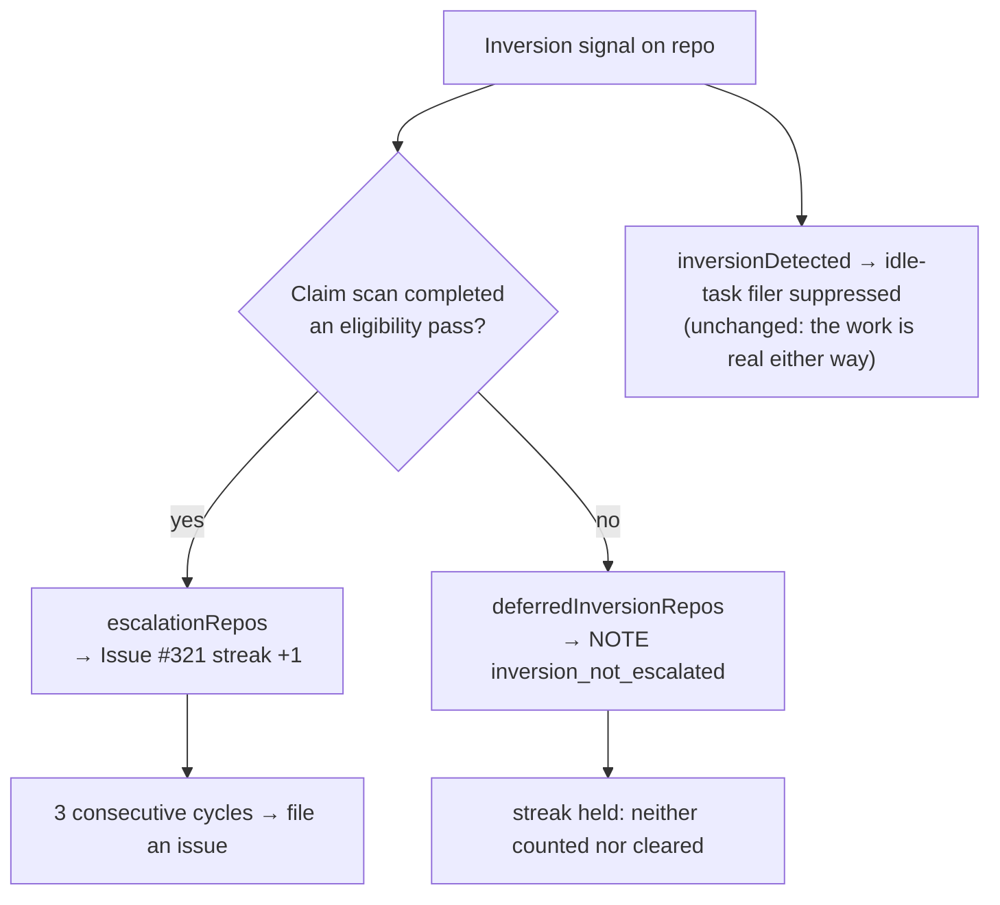

# Escalate an idle inversion only when the claim scan actually refused the work

## Summary

The idle-decision census raises the inversion signal whenever claimable work
exists at the idle-task filing gate, and Issue #321 escalates a three-cycle
streak as _"the claim scan keeps refusing"_ that work. That inference is only
sound when the claim scan **completed an eligibility pass**. It usually had not:
the pool stops before its next claim on the cycle deadline / claim-runway floor,
on shutdown, or while draining — and never evaluates the backlog at all.

This issue is that false alarm. In `~/logs/worker-20260826-*.log`, every
`ALERT inversion` naming `stSoftwareAU/VibeCoder` follows a
`stop reason=deadline` (or `drain`) line by about a minute:

```text
[2026-08-26 22:34:05Z] [s1] stop reason=deadline — reached the cycle deadline / runway floor; stopping before the next claim.
[2026-08-26 22:35:14Z] [idle-census] … repo=stSoftwareAU/VibeCoder … work_on=8 low_priority=1 pr_blocked=0 stream_occupied=0 merged_pr_blocked=0 inversion_signal=true
[2026-08-26 22:35:14Z] [idle-census] … ALERT inversion repos=stSoftwareAU/GRQ,stSoftwareAU/VibeCoder
```

Same shape at 20:59:06 → 21:01:01 and 17:46:24 → 17:47:41. The nine `work-on`
issues were genuinely claimable; the scan had simply run out of cycle. Three
such cycles filed this issue, asking a human to hunt a permanent skip reason
that does not exist — and the previous instance (#429, merged-PR strands) was a
real census bug, so the alert now has a credibility problem it should not have.

The fix teaches the census the difference between _refused_ and _never reached_:

- **`run_core.ts`** — both scan paths (serial loop and concurrent pool) now
  report `eligibilityScanCompleted`, set when `findNextIssue` returns `null`
  after considering the backlog. The loop passes it to the census hook as
  `claimScanCompleted`; a scan skipped for host disk reports `false`.
- **`idle_decision_census.ts`** — a repo the scan did not evaluate is recorded
  as `scanned=false skip_reason=cycle_deadline`. Inverted repos split into
  `escalationRepos` (scanned — evidence of a refusal) and
  `deferredInversionRepos` (logged as `NOTE inversion_not_escalated`, never
  escalated).
- **`run_core_production_deps.ts`** — the Issue #321 streak counts
  `escalationRepos` only, and an unscanned repo's streak is **held**: neither
  counted nor cleared, so a genuine streak survives a busy cycle and a busy
  fleet cannot manufacture one.
- **`idle_inversion_streak.ts`** — the filed issue body now states that only
  completed-scan cycles were counted, so the next reader is not sent looking for
  a deadline artefact.

`inversionDetected` — and therefore idle-task filer suppression (#2813) — is
deliberately **unchanged**: work the scan did not reach is still work, and
filing an idle-task beside it inverts priority just the same.

Closes #437.

## Evidence

Backend/CLI change with no web interface to screenshot. Evidence is the log
analysis above plus the tests below.



`./quality.sh`: **PASSED** (deno tests, lint, type check, fmt, mermaid,
markdownlint).

## Test Plan

New tests in `worker/deno/tests/idle_decision_census_test.ts`:

- `census - an unscanned repo's inversion is deferred, not escalated` — the
  regression test for this issue: eight `work-on` issues on a
  `cycle_deadline` cycle still set `inversionDetected` (filer stays suppressed)
  but produce an empty `escalationRepos`.
- `census - a scanned repo's inversion is escalation-worthy`
- `census - escalation is decided per repo, not per cycle`
- `census - a non-monitored unscanned repo appears in neither list`
- `formatter - reports a deferred inversion instead of dropping it`
- `formatter - no deferral note when every inverted repo was scanned`

New tests in `worker/deno/tests/run_core_idle_census_test.ts`:

- `run_core - an empty scan reports claimScanCompleted=true`
- `run_core - a claim-runway stop reports claimScanCompleted=false` — asserts
  `findNextIssue` was never called, so the loop provably never evaluated the
  backlog.
- `run_core - a concurrent pool's empty scan reports claimScanCompleted=true`

New test in `worker/deno/tests/idle_inversion_streak_test.ts`:

- `#437 - the body states that only completed scans were counted`

No existing test was modified or removed.

## Docs

`docs/IDLE-TASK-FRAMEWORK.md` gains an **Only a refusal escalates** subsection
under the census documentation, with the decision diagram above and the log
excerpt that identified the fault.
