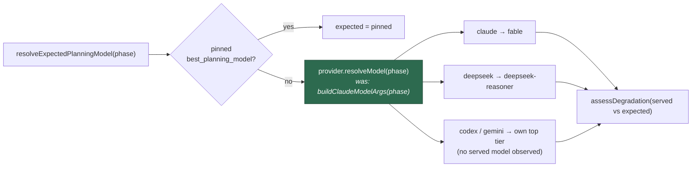

# Degraded-model detection is now provider-aware

## Summary

`resolveExpectedPlanningModel()` derived the expected model from **Claude's**
routing chain unconditionally (`buildClaudeModelArgs(phase)`), with nothing in
`planning_run_stats.ts` consulting the invocation's provider.

That was harmless while only Claude exposed a served model. DeepSeek broke it:
it is carried on the Anthropic CLI with `--output-format stream-json`, so the
served model *is* observable and *is* a DeepSeek id. A `planning` run under
`agent_provider: deepseek` therefore compared served `deepseek-reasoner`
against expected `fable`, found no match, and applied `degraded-model` to the
parent issue and every published sub-issue — for a tier the operator never
requested and a run routed exactly as designed.

The expected model is now derived from **the invocation's own provider
descriptor** (`provider.resolveModel(phase)`), defaulting to the active
provider. The gate is the descriptor, never a `provider.id === "claude"`
equality check — the same shape #398/#417 established for the pre-flight Fable
reroute, one layer up.

Closes #441.

### What changed

- `worker/deno/lib/planning_run_stats.ts`
  - New structural `ExpectedModelProvider` interface (`resolveModel(phase?)`
    only), mirroring `FableRoutingProvider` in `fable_routing.ts`, so this
    module depends on a provider's *routing* rather than on the registry's
    shape.
  - `resolveExpectedPlanningModel(configuredBest?, phase?, provider?)` resolves
    through `(provider ?? activeAgentProvider()).resolveModel(phase)`, falling
    back to the `UNRESOLVED_EXPECTED_MODEL` sentinel when the chain supplies
    nothing.
  - `buildDegradationReport()` accepts and forwards the optional `provider`.
- `docs/MODEL-AND-CACHING.md` — provider-applicability matrix row and the
  section's `Applies to` line move `deepseek` from ⚠️ to ✅; the expected-model
  bullet now names the provider's own chain.

Behaviour held constant:

- A pinned `best_planning_model` still wins before any routing is consulted.
- Claude is byte-for-byte unchanged: `buildClaudeModelArgs(phase)` was already a
  thin argv wrapper over `resolveClaudeModel(phase)`, which is exactly what the
  Claude descriptor's `resolveModel()` delegates to.
- Codex and Gemini still observe no served model, so they still report
  `❓ unknown` and apply no label.

### Out of scope (unchanged)

Which phases prefer Fable, the availability probe, per-provider pricing, and
Quorum's deliberate dropping of per-invocation provider attribution
(`quorum_run_stats.ts` judges a whole round under one verdict).

## Evidence

Backend/CLI change with no web interface to screenshot. The evidence is the
test suite and the full quality gate.



New test run:

```text
running 8 tests from ./tests/planning_run_stats_provider_test.ts
buildDegradationReport - every provider's own planning model is not degraded (Issue #441) ... ok
buildDegradationReport - DeepSeek served deepseek-reasoner is healthy (Issue #441) ... ok
buildDegradationReport - DeepSeek served the wrong DeepSeek tier is degraded (Issue #441) ... ok
resolveExpectedPlanningModel - a pinned best model still wins per provider (Issue #441) ... ok
buildDegradationReport - Codex and Gemini still report indeterminate (Issue #441) ... ok
resolveExpectedPlanningModel - defaults to the active provider, Claude when none is selected (Issue #441) ... ok
resolveExpectedPlanningModel - VIBE_AGENT_PROVIDER selects the chain (Issue #441) ... ok
buildDegradationReport - a provider with no routing for the phase skips served matching (Issue #441) ... ok

ok | 8 passed | 0 failed
```

Full gate (`./quality.sh`): **PASSED** — 19 checks, 0 failures (4 skipped:
config integration, pages-liquid, mermaid built output).

The pre-existing `planning_run_stats`, `phase_run_stats`, `grill_me_run_stats`,
`quorum_run_stats` and `issue_run_stats_comment` suites (124 tests) pass
unmodified — no existing test was commented out, weakened or removed.

## Test Plan

New file `worker/deno/tests/planning_run_stats_provider_test.ts`:

- **Failure Detection (the loop the issue asked for)** —
  `buildDegradationReport - every provider's own planning model is not degraded`
  iterates `agentProviderIds()`, asserts each provider routes `planning` to a
  real model (not the unresolved sentinel), drives `buildDegradationReport()`
  with that model as the served model, and asserts `degraded: false`. A fifth
  provider registered without a routing-aware expected model fails
  `deno test` here rather than mislabelling live issues.
- **Regression for the reported defect** — DeepSeek served `deepseek-reasoner`
  is healthy (fails against the unfixed code, which expected `fable`).
- **The check still bites** — DeepSeek served `deepseek-chat` for `planning` is
  flagged degraded, with both model ids named in the reason.
- **Pinned model wins** — a `best_planning_model` value is returned (trimmed)
  for every registered provider.
- **Codex/Gemini unchanged** — a run with no served model reports
  `degraded: false, indeterminate: true`.
- **Claude unchanged** — with no provider selected, the default resolves
  `planning` → `fable`, `grill_me` → `fable`, and an unrouted phase → the
  `UNRESOLVED_EXPECTED_MODEL` sentinel.
- **Edge cases** — `VIBE_AGENT_PROVIDER=deepseek` selects the DeepSeek chain via
  the default path; a provider whose `resolveModel()` returns `undefined`
  resolves to the sentinel and skips served-model matching rather than flagging.

Every test snapshots, clears and restores the per-provider routing environment
variables so it asserts against the designed defaults and leaks nothing.
