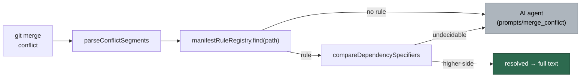

# Deterministic merge-conflict core: hunk parser, version comparator, rule registry

## Summary

Adds `worker/deno/lib/dependency_conflict_rules.ts` — a pure, dependency-free
core for deterministic conflict resolution. Nothing is wired into
`pr_merge_conflict_processor.ts`; this is the foundation later per-ecosystem
sub-issues of #456 plug into. Closes #462.

Three pieces:

- **Hunk parser** — `parseConflictSegments` splits a conflicted file into an
  ordered list of literal segments and conflict hunks, including the
  `||||||| base` section `diff3` conflict style produces. Marker lines are kept
  verbatim, so `renderConflictSegments` on an unmodified parse reproduces the
  input byte-for-byte and a resolved file differs only where a hunk was
  replaced. `applyHunkChoices` renders with each hunk replaced by a chosen side.
- **Version comparator** — `parseDependencySpecifier` /
  `compareDependencySpecifiers` handle the specifier shapes this repo actually
  uses: bare semver (optionally `v`-prefixed), the `^` / `~` / `>=` range
  prefixes (carried through from the winning side, not normalised away), and
  registry specifiers `jsr:@scope/name@^1.2.3` / `npm:pkg@~1.2.3`. Ordering
  reuses the existing `compareSemver` from `software_updates.ts` rather than
  adding a semver dependency, so `2.1.170` correctly beats `2.1.9`.
- **Rule registry** — `ManifestRule` (`matches(path)` / `resolve(segments)`) and
  `createManifestRuleRegistry`, plus the shared `manifestRuleRegistry`
  instance, so `deno.json`, `package.json`, `Cargo.toml` and `go.mod` handlers
  register without editing the core.

`RuleOutcome` is `resolved` (full text) or `unresolved` (reason) only — there is
deliberately no `partial`, because a half-resolved file leaves conflict markers
behind and the processor refuses to push those.

### Deliberately undecidable

The comparator hands these back to the AI/human path rather than guessing:
a pre-release on either side, equal versions, differing range prefixes
(`^1.2.3` vs `~1.2.3` is a policy change, not a bump), different packages, and
anything it cannot parse (`latest`, `workspace:*`, build metadata, a two-segment
version, a sub-path export).

### Fail-loud choices

- A malformed marker sequence (unterminated hunk, nested `<<<<<<<`, `>>>>>>>`
  before its separator) returns an error with the offending line number instead
  of being swallowed as literal text.
- `applyHunkChoices` throws when the choice count does not match the hunk count,
  rather than resolving part of the file.
- A duplicate rule name throws at registration.

`=======` and `>>>>>>>` *outside* a hunk stay literal — a Markdown setext
heading underlines with `=======`.

## Evidence

Backend/CLI only — a pure module with no web interface to screenshot. The
evidence is the unit suite, which fully covers the module (no git, no network,
no file I/O):

```text
$ deno test --allow-read --allow-env tests/dependency_conflict_rules_test.ts
...
ok | 42 passed | 0 failed (5ms)
```

`deno fmt`, `deno lint` and `deno check` are clean, and `./quality.sh` passes.

Where the core sits relative to the existing pass:



The dashed half — wiring the registry into `pr_merge_conflict_processor.ts` —
is a later sub-issue of #456; this PR adds only the boxes left of the fallback.

## Test Plan

Added `worker/deno/tests/dependency_conflict_rules_test.ts` (42 tests), all
calling the real functions with literal inputs:

- **Round-tripping** — zero, one and several hunks; a `diff3` hunk with a base
  section; no trailing newline; CRLF endings; the empty file.
- **Extraction** — ours/theirs/base bodies, surrounding literal text, an empty
  side, and `=======` outside a hunk staying literal.
- **Malformed input** — unterminated hunk (error names line 1), nested start
  marker, end marker before separator.
- **`applyHunkChoices`** — per-hunk side selection, a conflict-free file passing
  through unchanged, and a mismatched choice count throwing.
- **Specifier parsing** — bare, `v`-prefixed, `^` / `~` / `>=`, `jsr:`, `npm:`,
  pre-release flagging, and null for `1.2`, `latest`, `""`, `1.2.3+build`, and a
  sub-path export.
- **Comparison** — `1.2.3` vs `1.10.0` and `2.1.170` vs `2.1.9` (numeric, not
  lexical); `^1.2.3` vs `^1.3.0`; `jsr:@std/fs@^1.0.0` vs `jsr:@std/fs@^1.2.0`;
  `npm:pkg@~1.2.3` vs `npm:pkg@~1.1.9`; whitespace tolerance; and undecidable
  for pre-release, equal, range-prefix-only difference, prefix change with a
  bump, different packages, and unparseable specifiers.
- **Registry** — no rule for `src/main.ts`, lookup by path, post-construction
  registration, first-match-wins, duplicate-name throw, and a resolved outcome
  carrying full marker-free text.

Docs: `docs/workflows/merge-conflicts.md` "Further reading" now points at the
new module and states plainly that nothing is wired in yet.
