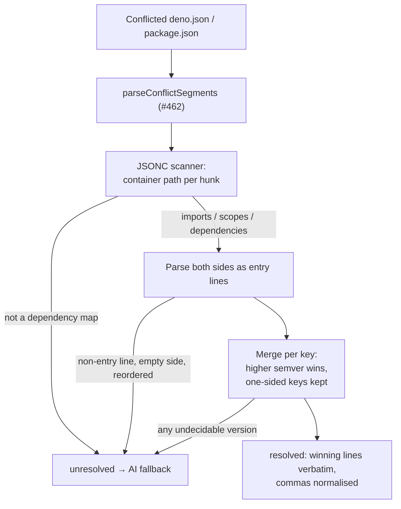

# PR Summary — Issue #463

## Summary

Adds `worker/deno/lib/dependency_conflict_json.ts`, registering the two JSON
manifest rules against the seam from #462 so a version-only conflict in a
dependency map resolves deterministically instead of reaching the AI fallback.
Closes #463.

- **`deno.json` / `deno.jsonc`** — conflicts inside the `imports` map, and
  inside each per-scope map under `scopes`.
- **`package.json`** — conflicts inside `dependencies`, `devDependencies`,
  `peerDependencies` and `optionalDependencies`.

Behaviour, in both rules:

- Resolution is **per dependency key**, not per hunk. For a key both sides carry
  with different specifiers the higher semver wins, whichever branch holds it
  (via `compareDependencySpecifiers` from #462). A key only one side has is kept
  — an ordinary both-sides-survive merge, not a side-pick.
- **All-or-nothing.** A hunk touching anything other than a dependency-map entry
  (`tasks`, `scripts`, a comment, the document root) defers the whole file, as
  does any single undecidable version (pre-release, unparseable specifier,
  equal-but-textually-different, changed range prefix), an emptied side, or
  reordered keys. There is no partial resolution, so a resolved file can never
  carry conflict markers into the pushed tree.
- **Formatting is preserved.** The winning side's original line is emitted with
  its own indentation, quoting and terminator (CRLF included) rather than
  re-serialising the document — a `JSON.parse`/`JSON.stringify` round trip would
  strip `deno.jsonc` comments and turn a two-line resolution into a whole-file
  diff under `deno fmt`. Only a trailing comma is adjusted, and only where the
  merge moved a line off the end of the map.

Which block a hunk sits in is decided by an incremental JSONC scanner that
tracks the enclosing container path (strings, `//` and `/* */` comments are
skipped), so a `tasks` hunk and an `imports` hunk are told apart by position
rather than by guessing at the line's shape.

Nothing is wired into `pr_merge_conflict_processor.ts` yet — that is the
remaining sub-issue of #456 — so today every conflict still follows the existing
agent contract. `docs/workflows/merge-conflicts.md` records the new module
alongside the seam.

## Evidence

Backend-only change: no web interface to screenshot. The evidence is the test
suite, which drives the rules with real conflicted-file text and asserts on the
merged output byte-for-byte.

```
$ deno test --allow-read --allow-env tests/dependency_conflict_json_test.ts
running 27 tests from ./tests/dependency_conflict_json_test.ts
...
ok | 27 passed | 0 failed (5ms)

$ ./quality.sh
  deno tests                     PASSED
  deno lint                      PASSED
  deno type check                PASSED
  deno fmt                       PASSED
Result: PASSED (with skipped checks)
```

How a conflicted manifest flows through the rule:



## Test Plan

Added `worker/deno/tests/dependency_conflict_json_test.ts` (27 tests), covering
every acceptance criterion:

- `^1.0.0` vs `^1.2.0` in `imports` resolves to `^1.2.0` with the higher version
  on *either* side.
- Each side bumping a different dependency in one hunk keeps both bumps; a
  dependency added on one side only is kept.
- A `scopes` conflict resolves; multiple hunks in one file all resolve.
- A `tasks` conflict is `unresolved`; so is a hunk that starts in `tasks` and
  runs into `imports` (no partial resolution), a `package.json` `scripts` hunk,
  and a root-level `version` hunk.
- Undecidable versions defer the whole file: pre-release, sub-path specifier
  (`jsr:@std/yaml@^1.0.12/parse`), equal-but-textually-different (`1.2.0` vs
  `v1.2.0`), changed range prefix.
- A non-entry line inside a hunk, an emptied side, reordered keys, and a hunk
  inside a `/* */` comment all defer.
- `package.json` resolves `dependencies`/`devDependencies` and
  `peerDependencies`/`optionalDependencies`; a trailing comma is added when the
  merge moves a winning line off the end of the map.
- A `deno.jsonc` with `//` and `/* */` comments keeps them and only the resolved
  line changes; CRLF endings survive; a conflict-free file is returned
  unchanged; every resolved output is asserted free of conflict markers.
- Path matching (`deno.json`, `deno.jsonc`, not `deno.lock`/`package-lock.json`)
  and registration into the shared `manifestRuleRegistry` on import.

### Security self-check

- Input validation: both rule entry points parse untrusted file text with
  anchored regexes and a character-level scanner; anything unrecognised returns
  `unresolved` rather than being resolved on a guess.
- No secrets, no new dependencies, no shell/SQL/HTTP surface — the module is
  pure, with no git, network or file I/O.
- Fails loud: an undecidable case returns `unresolved` with a reason naming the
  hunk and the key, which the caller hands to the AI/human path; nothing is
  silently dropped.
