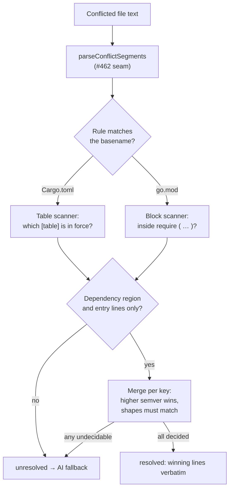

# Deterministic rules for `Cargo.toml` and `go.mod` dependency conflicts

## Summary

Adds `worker/deno/lib/dependency_conflict_native.ts`, registering the two
non-JSON manifest rules against the `ManifestRule` seam from #462 and completing
the ecosystem coverage #456 asks for. Closes #464.

- **`Cargo.toml`** — resolves version conflicts in `[dependencies]`,
  `[dev-dependencies]`, `[build-dependencies]` and their
  `[target.*.dependencies]` variants. Both entry shapes are handled: the short
  form (`serde = "1.0.195"`) and the inline-table form
  (`serde = { version = "1.0.195", features = [...] }`). Only the `version`
  field is compared — a conflict that also changes `features`,
  `default-features`, `path` or `git`, or switches between the two forms, is a
  policy change and returns `unresolved`.
- **`go.mod`** — resolves version conflicts on `require` lines, in both the
  single-line and parenthesised-block forms. Versions must be a plain Go semver
  with the mandatory leading `v` (`v1.2.3`); `+incompatible` and pseudo-versions
  (`v0.0.0-20230101120000-abcdef123456`) are undecidable, because
  timestamp-ordered pseudo-versions are not comparable by the semver rule.

The same contracts as the JSON rules hold: per **dependency key** the higher
semver wins whichever branch carries it, a key only one side has is kept, and
resolution is all-or-nothing — any hunk touching a non-dependency line (a
`[features]` block, a `go` directive, a `replace` block, a table header, a
`[dependencies.serde]` sub-table) defers the whole file. The winning side's
original line is emitted verbatim, so a resolved file differs from the input
only on the lines that were resolved.

Neither rule is wired into `pr_merge_conflict_processor.ts` yet — like #462 and
#463 this is the pure, fully unit-tested seam implementation.

### Ordering guard

Go module versions are compared numerically, not lexically, so `v1.10.0` beats
`v1.2.3` (a lexical comparison would pick the wrong side). This reuses
`compareDependencySpecifiers` from the #462 seam rather than a second
comparator.

## Evidence

Backend-only change: pure functions with no web interface to screenshot. The
evidence is the test suite, which drives the real rules over real conflicted
manifest text and asserts on the merged output.

```
$ deno test tests/dependency_conflict_native_test.ts
ok | 37 passed | 0 failed (5ms)
```

Every acceptance criterion in the issue has a named test:

| Acceptance criterion                                  | Test                                                                       |
| ----------------------------------------------------- | -------------------------------------------------------------------------- |
| `Cargo.toml` short form `"1.0.195"` vs `"1.0.200"`    | `cargoTomlRule - short-form conflict resolves to the higher version`         |
| Table form, version only → resolves                   | `cargoTomlRule - table-form conflict differing only in version resolves`     |
| Table form, `features` also differs → `unresolved`    | `cargoTomlRule - table-form conflict changing features defers`               |
| `go.mod` `v1.2.3` vs `v1.10.0`, numeric ordering      | `goModRule - require-block conflict resolves numerically, not lexically`     |
| Pseudo-version / `+incompatible` → `unresolved`       | `goModRule - a pseudo-version on either side defers`, `… +incompatible …`    |
| `[features]` block / `replace` directive              | `cargoTomlRule - a conflict in a features block defers`, `goModRule - … replace block defers` |
| No conflict markers, only resolved lines differ       | `resolvedText` helper asserts marker-free output; every equality assertion compares the whole file |

Where a conflicted file flows through the new module:



## Test Plan

Added `worker/deno/tests/dependency_conflict_native_test.ts` — 37 tests, all
calling `rule.resolve()` on parsed conflicted manifests and asserting on the
merged text or the defer reason:

- **`Cargo.toml` resolves** — short form (higher on either side), numeric vs
  lexical ordering (`1.9.0` vs `1.10.0`), caret prefix carried through, both
  sides' independent bumps kept, a dependency added on one side kept, and
  `[dev-dependencies]`, `[build-dependencies]` and
  `[target.'cfg(unix)'.dependencies]` each resolved.
- **`Cargo.toml` defers** — changed range prefix, changed `features`, changed
  `default-features`, short↔table form switch, a version-less `git`/`path`
  entry, `[features]`, `[package]`, a hunk running into a table header, a
  `[dependencies.serde]` sub-table, and a file containing a `"""` multi-line
  string (which the line-based table scanner does not follow, so it defers
  rather than guessing).
- **`go.mod` resolves** — block form numeric ordering, higher on either side,
  `// indirect` preserved with the winning line, single-line `require`, both
  sides' bumps kept, a module added on one side kept.
- **`go.mod` defers** — pseudo-version on either side, `+incompatible`, a
  missing `v` prefix, a changed `// indirect` marker, a `replace` block, a `go`
  directive, and a hunk that closes the `require` block.
- **Shared contract** — a conflict-free file round-trips byte for byte, CRLF
  terminators are preserved, one undecidable hunk defers the whole file, defer
  reasons name the rule and hunk, basename matching works on both path
  separators, and both rules are present in the shared registry.

Also updated `docs/workflows/merge-conflicts.md` "Further reading" so the new
module is documented alongside the #462 seam and the #463 JSON rules.

`deno task test`, `deno task lint` and `deno task check` all pass; `./quality.sh`
was run in full before raising the PR.
