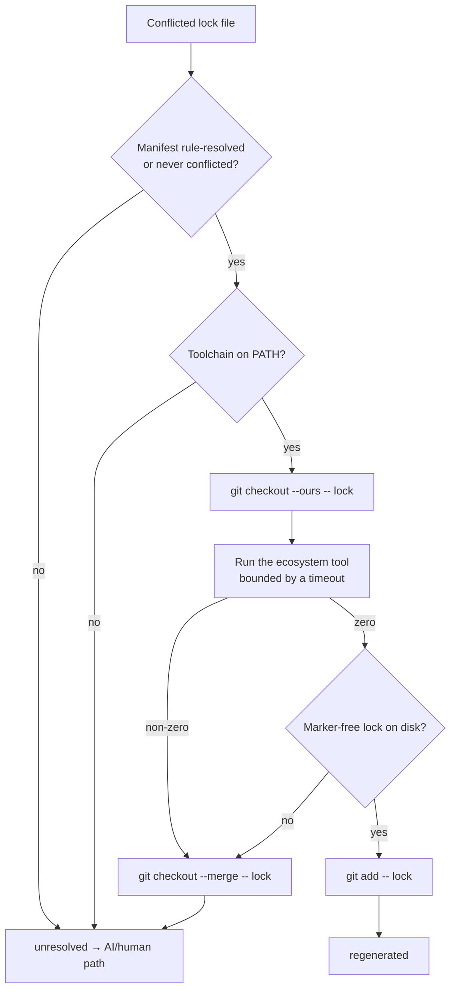

# PR Summary — Regenerate lock files instead of text-merging them (Issue #465)

## Summary

Adds `worker/deno/lib/dependency_lock_regen.ts`: a conflicted lock file is
**never** text-merged. `deno.lock`, `package-lock.json`, `Cargo.lock` and
`go.sum` carry integrity hashes over a resolved dependency graph, so picking
hunks yields a file that looks clean while describing a graph that never
existed. The module instead checks the lock out to a known state and lets the
ecosystem's own tool rewrite it from the already-merged manifest.

The behaviour, per lock file:

- **Pair the lock with its manifest.** Regeneration runs only when the paired
  manifest was rule-resolved in this attempt, or was never conflicted at all. An
  `unresolved` manifest defers the lock with no command run — a lock regenerated
  against an unmerged manifest would describe the wrong dependency set.
- **Probe the toolchain first.** The binary must be on `PATH` before anything
  runs. `container/tools.json` registers `deno`, `node`/`npm` and `rust`/`cargo`
  but has **no Go entry**, so `go.sum` falls through the probe today; that is the
  probe working, and the rule starts working the day the image ships Go.
- **Regenerate with the ecosystem tool** — `deno install`,
  `npm install --package-lock-only`, `cargo update --workspace --offline`
  (falling back to a network-permitted refresh), `go mod tidy`.
- **Fail loud, stage nothing on failure.** An absent toolchain, a non-zero exit,
  a spawn error, an unreadable lock, or a zero exit that leaves markers behind
  all return `unresolved` with a reason, restore the conflicted state with
  `git checkout --merge`, and stage nothing. `unresolved` routes the file to the
  existing AI-fallback and `needs-human` path in
  `pr_merge_conflict_processor.ts`, so a failed regeneration is visible on the
  PR rather than silent.
- **Bounded and redacted.** Every command carries a timeout
  (`DEFAULT_LOCK_REGEN_TIMEOUT_MS`, 5 minutes). Captured output is redacted
  before truncation, then bounded to a 20-line / 2 KiB tail, so a secret
  straddling the cut cannot survive in the kept tail.

"Never text-merge" is expressed in the type, not just the code path: the
`regenerated` outcome carries **no text field**, so no caller can be handed
hunk-derived content to write. The only writer of lock content is the ecosystem
tool.

`ManifestStatus` is derived from the rule core's `RuleOutcome["kind"]`
(`dependency_conflict_rules.ts`, Issue #462), so the "manifest was resolved"
seam cannot drift.

The command runner, toolchain probe and lock-file reader are all injected, so
no test shells out or touches the filesystem.

Like the manifest-rule modules from #462 and #463, this module is not yet wired
into the resolution pass — the wiring lands with the rest of milestone #456.
`docs/workflows/merge-conflicts.md` records it alongside them.

Closes #465.

## Evidence

Backend module only — no web interface to screenshot. The evidence is the test
suite and the quality gate.

Resolution flow for one lock file:



Targeted run:

```text
$ deno test --allow-all tests/dependency_lock_regen_test.ts
running 22 tests from ./tests/dependency_lock_regen_test.ts
...
ok | 22 passed | 0 failed (5ms)
```

Full gate:

```text
$ ./quality.sh < /dev/null
  deno tests                     PASSED
  deno lint                      PASSED
  deno type check                PASSED
  deno fmt                       PASSED
Result: PASSED (with skipped checks)
```

The full suite is `ok | 16488 passed | 0 failed | 34 ignored`. Note for the
reviewer: the first gate run reported `deno tests FAILED` under load; the same
command re-run standalone twice and the gate re-run both pass with zero
failures, so it was container resource contention, not a test defect.

## Test Plan

`worker/deno/tests/dependency_lock_regen_test.ts` — 22 tests, command runner,
tool probe and lock reader all faked:

- **Spec lookup** — each supported lock file maps to its ecosystem and
  manifests; a non-lock path (including `docs/deno.lock.md`) maps to nothing.
- **Happy path** — a conflicted `worker/deno/deno.lock` whose `deno.json` was
  rule-resolved runs **exactly one** regeneration command, in the lock's own
  directory, and leaves a marker-free file staged with `git add`.
- **Never text-merged** — the outcome carries no `text` field, and the only lock
  content written is what the tool wrote; the losing hunk's version is absent
  because the file was rewritten, not because a hunk was picked.
- **Absent toolchain** — `go.sum` with no `go` on `PATH` returns `unresolved`
  and runs **no** command.
- **Non-zero exit** — returns `unresolved`, stages nothing, and restores the
  conflicted state with `git checkout --merge`.
- **Zero exit, markers survive** — returns `unresolved`, stages nothing.
- **Unreadable lock after a zero exit** — returns `unresolved`.
- **Unresolved manifest** — both `deno.json` and `deno.jsonc` cases return
  `unresolved` with no command run.
- **Unsafe paths** — `../other/deno.lock` and `/etc/deno.lock` are refused
  before any command runs.
- **Failed checkout** — no regeneration is attempted.
- **Cargo fallback** — offline first; the network refresh runs only after the
  offline attempt fails, and the reported command is the one that succeeded.
- **Bounding and redaction** — every call carries the default (and an
  overridden) timeout; a `ghp_…` token in captured output is replaced by the
  redaction placeholder in both the returned reason and the log line, and the
  output is truncated to a bounded tail.
- **Batch** — each lock file is independent and in order (regenerated /
  unresolved / regenerated); an empty list runs nothing.
