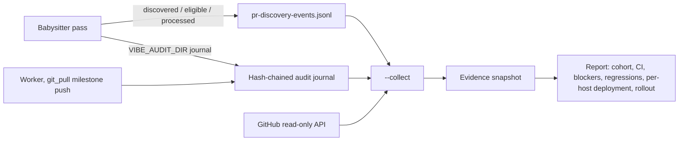

## Summary

Continues the PR completion report and collector that #4709 landed
(`deno task pr-completion-report`); nothing is rebuilt. This change adds trusted
provenance for babysitter and milestone actions, complete all-head CI and
blocker accounting, a post-merge CI view, per-host policy and heartbeat
reporting, and a demonstrable rediscovery record. An `--auto` merge arm is now
recorded as `merge-arm` and can never verify a later merge. The 24-hour
unattended target is still reported as an operational figure only, never a gate,
and no baseline or achieved result is claimed. Parts of the issue remain open
(see Acceptance Criteria), so this is Part of #4658.

Version bump: `VERSION` is not touched by this change.

### Deno regression avoided

Deno command and tasks only; no Node tooling, `package.json` or `deno.lock`
change.

```mermaid
flowchart LR
    B[Babysitter pass] -->|discovered / eligible / processed| E[pr-discovery-events.jsonl]
    B -->|VIBE_AUDIT_DIR journal| J[Hash-chained audit journal]
    W[Worker, git_pull milestone push] --> J
    G[GitHub read-only API] --> C[--collect]
    J --> C
    E --> C
    C --> S[Evidence snapshot] --> R[Report: cohort, CI, blockers, regressions, per-host deployment, rollout]
```

## Spec

### Intent and Rationale

- `merged_by` and logins cannot show unattended completion. A PR counts as
  verified unattended only when every GitHub-observed mutating event matches a
  chain-verified fleet record; anything unmatched stays `unknown`, never `human`.
- The #4709 reconciliation listed what was still missing: babysitter, reviewer
  and milestone provenance, CI and blocker accounting, post-merge visibility,
  per-host policy and rediscovery. This change continues the same collector.

### Essential Design Decisions

- Arming auto-merge (`gh pr merge --auto`) is `merge-arm`. A direct merge pinned
  with `--match-head-commit` is the only merge that can verify completion; every
  auto-merge path therefore stays `unknown` until a trusted replacement exists.
  Accepted trade-off: fewer PRs verify than before.
- A `git_pull.ts` push is `milestone` only when it targets `milestone/<slug>`;
  its other pushes (a base merge into a PR branch) are `branch-update`, which is
  neither implementation evidence nor a fix round.
- Post-merge CI is read from runs on the PR's `merge_commit_sha`, never the PR
  head. `cancelled` is not a failure. A merged PR with no merge commit gets a
  coverage note. Later default-branch commits are not observed.
- The lifecycle ledger `host` stays the machine hostname so the subscription
  allocation reader still matches. Reviewer, babysitter and discovery rows use
  `reportHostId(escalationHostId())`, which maps any `VIBE_HOST_ID` to the
  report's host-id pattern so one odd value cannot abort a babysitter pass.

### Undiscoverable Facts

- No `<fleet_data_source>` block was supplied; no cohort was measured and live
  GitHub was never called. The REST shapes in the test fakes are the documented
  `pulls`, `actions/runs`, `actions/runs/{id}/attempts/{n}`, `.../jobs` and
  `commits/{sha}/check-runs?filter=all` responses.
- `./quality.sh` was not completed locally: the gate ran past the 580 s
  bound inside the deno test stage (see Test Plan).

## Evidence

Backend and CLI only; no UI file is touched.

Tool behaviour the code depends on, observed by running the real classifiers:
`classifyGitMutation(["push","origin","milestone/foo"])` returns
`{verb:"git-push", target:"milestone/foo", scope:"cwd"}`, and
`buildPushArgs("origin","feature-branch")` yields
`["push","--end-of-options","origin","feature-branch"]` with target
`feature-branch`. `gh pr merge --auto` classifies as `merge-arm`.

Issues read: #3404, "Per-tier PR outcomes and cost per merged PR in fleet
telemetry"; #4595, "Orchestrated issue runs record only one provider call's run
stats, so the cost/model comment and fleet telemetry leave out the plan and
executor calls"; #4613, "Branch updates: on a strict base with no merge queue,
update only the PR that is ready to merge, not every PR that is behind". The
report does not consume `fleet_telemetry.ts` and claims none of their
deliverables.

Docs read and updated: `docs/INTERNALS.md` ("PR completion evidence report":
match rule, merge window, blockers, regression evidence, CI scope, host
identity), `docs/AGENT-ACCOUNTABILITY.md` (per-entry fields, storage). Siblings
grepped for the new audit kinds: `repair`, `implementation`, `merge`.

## Acceptance Criteria

- **missing** — "Record trusted automation provenance for
  implementation/repair/review/dismissal/merge actions" for the review skill —
  reason: the review-fleet-prs skill posts through its own `gh` and does not
  journal, so its reviews come from `log.jsonl`, which is unchained and no longer
  verifies a PR; the babysitter, worker and milestone pushes are journalled.
- **missing** — "distinguish recorded human intervention" — reason: nothing
  records a human action, so `--collect` yields only verified or unknown history;
  `humanAssistedMerged` is non-zero only from an `--input` snapshot.
- **missing** — "genuinely owner-gated outcomes" verified from the collector —
  reason: `--collect` sets `ownerGateVerified` false because no recorded hold
  marker exists; those PRs stay in the denominator and are counted in
  `unverifiedOwnerGateLabels`.
- **missing** — "waiting time by concrete blocker" for hold, recovery (#4656) and
  refresh (#4613) waits — reason: only `needs-human`, `changes-requested` and
  CI-failure intervals are produced.
- **missing** — the post-merge view of later default-branch commits — reason:
  only runs on the PR's own merge commit are observed, plus reverts inside the
  cohort.
- **missing** — a live two-week measurement — reason: an operational evaluation
  after rollout; the report evaluates it automatically and says `pending` or
  `unavailable` until deployment and discovery evidence are complete.

## Standards Review

<!-- vibe-standards-review inputs="diff+CODING-STANDARDS.md" -->

- **violation** — a GitHub review with a `commit_id` could only match an action
  carrying the same head, which a journalled review never has —
  evidence: `worker/deno/lib/pr_completion_snapshot.ts:738` — reason: fixed in
  this diff (review-specific head rule removed; test added)
- **violation** — every `git_pull.ts` push classified `milestone` —
  evidence: `worker/deno/lib/audit_hook.ts:249` — reason: fixed in this diff
  (milestone only for `milestone/` targets; others `branch-update`)
- **violation** — ledger `host` changed to a different identity than its
  sibling writer and the allocation reader —
  evidence: `worker/deno/lib/issue_assignment.ts:450` — reason: fixed in this
  diff (restored `getHostname()`)
- **violation** — old-shape merge entry (no `headSha`) and old snapshot
  (`rediscovered`) were untested —
  evidence: `worker/deno/tests/pr_completion_snapshot_test.ts:100` — reason:
  fixed in this diff (both read as unknown, tested)
- **violation** — stale docs on the match rule, merge window and audit kinds —
  evidence: `docs/INTERNALS.md:1169` — reason: fixed in this diff, with
  `docs/AGENT-ACCOUNTABILITY.md:227`
- **violation** — babysitter discovery calls, `VIBE_AUDIT_DIR` refusals,
  `--expected-inventory`, and the `discoveryComplete`/deployment operands had no
  test — evidence: `worker/deno/commands/fleet_pr_babysitter.ts:2954` — reason:
  fixed in this diff (tests added)
- **violation** — a merge-arm test hard-coded the kind —
  evidence: `worker/deno/tests/pr_completion_snapshot_test.ts:619` — reason:
  fixed in this diff (a hook-driven test added; its red comes from the hook's own
  kind assertion, the collector assertion alone does not go red)
- **clean** — Australian English; no hidden or secret file staged; new regexes
  anchored with bounded quantifiers; legacy shapes read as unknown; named tests
  exist; no members only tests read (`reportHostId`, `isAuditJournalSwitchedOff`
  have production callers).

## Test Plan

- Added or extended: `worker/deno/tests/pr_completion_snapshot_test.ts`,
  `worker/deno/tests/pr_completion_report_test.ts`,
  `worker/deno/tests/pr_completion_report_command_test.ts`,
  `worker/deno/tests/pr_discovery_events_test.ts`,
  `worker/deno/tests/fleet_pr_babysitter_test.ts`,
  `worker/deno/tests/fleet_pr_babysitter_audit_test.ts`,
  `worker/deno/tests/audit_hook_test.ts`,
  `worker/deno/tests/audit_journal_test.ts`,
  `worker/deno/tests/issue_assignment_test.ts`,
  `worker/deno/tests/review_round_command_4658_test.ts`,
  `worker/deno/tests/review_round_test.ts`.
- Targeted run on the head of the touched suites: `ok | 285 passed | 0 failed`
  (parallel pass); the babysitter files `ok | 125 passed | 0 failed`. `deno fmt
  --check`, `deno lint` and `deno check` on the changed files are clean;
  markdownlint on the docs: 0 issues.
- Red checks (each guard broken alone, test went red, restored): review head rule
  re-added; merge window doubled; same-head merge check removed; `--auto` =>
  `merge` (hook assertion); `cancelled` counted; PR-head runs used for post-merge;
  never resolved; recovery restricted to the same head; blocker cap removed;
  roster recovery on collect; missing-host note off and forced on; `git_pull`
  always `milestone`; always `branch-update`; relative and `..` `VIBE_AUDIT_DIR`
  checks removed; `deployment.status` and `discoveryComplete` operands deleted;
  `--expected-inventory` pass-through removed; reader trusting `rediscovered`;
  discovery calls removed one at a time; `reportHostId` bypassed (babysitter,
  heartbeat and reviewer).
- The `windowClosed &&` operand of `ready` in
  `worker/deno/lib/pr_completion_report.ts` was a dead operand (`status` already
  returns `pending` first when the window is open), so it was removed rather than
  tested. The `issue_assignment` host test is green under the gate whichever value
  is written, because the gate strips `VIBE_HOST_ID`; it is red in a direct run
  with `VIBE_HOST_ID` set.
- Callers checked: `productionIssueAssignmentSeams` (host reader
  `subscription_allocation_runtime.ts:248` again matches); `actionKindFor`
  callers all go through `record`.
- Existing assertions changed (all removed relative to `origin/main`):
  - Removed from `worker/deno/tests/audit_hook_test.ts`:
    `assertEquals(entry?.headSha, undefined);`
    - Required by: "Record trusted automation provenance for
      implementation/repair/review/dismissal/merge actions"
    - Replaced by: `assertEquals(entry?.headSha, "a".repeat(40));`
  - Removed from `worker/deno/tests/audit_hook_test.ts`:
    `assertEquals(pushKind(callerIn("lib", "git_pull.ts")), "unknown");`
    - Required by: "trusted provenance for babysitter/reviewer and milestone
      actions"
    - Replaced by: `assertEquals(pushKindFor(["push", "origin", "milestone/foo"], caller), "milestone");`
  - Removed from `worker/deno/tests/pr_completion_report_test.ts`:
    `assertEquals(report.cohort.prCount, 7);` (also `openPrs` 2, `eligiblePrs` 6)
    - Obsolete: the fixture gained an eighth PR (open, owner-gate label) to cover
      `unverifiedOwnerGateLabels`; the counts rise by one.
      Still covered by:
      `worker/deno/tests/pr_completion_report_test.ts::PR completion report deduplicates repeated observations and separates trusted outcomes`
  - Removed from `worker/deno/tests/pr_completion_snapshot_test.ts`:
    `assertEquals(report.rollout.rediscoveredPrs, 1);` (and `processedPrs`,
    `notRediscoveredPrs`)
    - Required by: "Report mixed/stale deployment or missing heartbeat as
      unknown/degraded" and the rediscovery reconciliation: without discovery
      evidence the count is unknown.
      Replaced by: `assertEquals(report.rollout.unknownDiscoveryPrs, 2);`
  - Removed from `worker/deno/tests/pr_completion_snapshot_test.ts`: the
    `unattendedMerged` 1, `logged?.actor` `"fleet"`, `logged?.verified` `true`
    assertions of the review-log tests
    - Required by: "Do not label a historical PR zero-touch solely from login
      identity" — an unchained `log.jsonl` is not trusted provenance.
      Replaced by: `assertEquals(logged?.verified, false);` and
      `assertEquals(report.completion.unknownMerged, 1);`
  - Removed from `worker/deno/tests/pr_completion_snapshot_test.ts`: the
    before-creation and 15-minutes-after merge `assert(ids.includes(...))`
    checks
    - Obsolete: merge matching is now a ten-minute window either side of
      `mergedAt` on the same head, and an auto arm no longer matches.
      Still covered by:
      `worker/deno/tests/pr_completion_snapshot_test.ts::a verified merge matches GitHub's merge only on the same head and within ten minutes either side`
- Twinned rules: the `actionKind` classification in `audit_hook.ts` and the
  matcher in `pr_completion_snapshot.ts` agree on kinds; the hook-driven collect
  test covers both. `CODING-STANDARDS.md` and the guidelines template are not
  changed.
- Full gate: `./quality.sh < /dev/null` was started on the pre-fix head and
  exceeded the 580 s bound in the deno test stage; every stage that printed a
  result passed (completeness, markdownlint, semgrep, release-tag ruleset,
  mermaid); checkov and config integration were skipped by the gate. It was not
  re-run on the final head. CI runs the full suite on this PR.
- Not done: live GitHub never called; no cross-host data; reviewer provenance
  from the review skill; human attribution; owner-gate verification.

🤖 Generated with [Claude Code](https://claude.com/claude-code)
