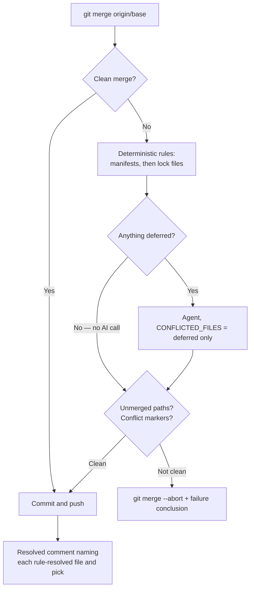

# Try deterministic dependency rules before the AI agent

## Summary

The merge-conflict pass handed every conflict straight to the AI agent, whose
contract forbids it from deciding "the same value set to two different values" —
so a `deno.json`/`deno.lock` version bump on both branches always escalated. This
wires the deterministic rules (#462–#465) into `resolveConflict`, **before** the
agent: each conflicted path is offered to the registered manifest rules, the lock
files whose manifest resolved are regenerated from it, and everything the rules
resolve is staged. The agent is then run only over the paths the rules deferred —
and not at all when they resolved every path. Closes #466.

Two new modules keep the processor small:

- `worker/deno/lib/dependency_conflict_apply.ts` — the pass itself: apply rules,
  regenerate locks, stage, report. A deferral stages nothing and leaves the
  conflicted file exactly as git wrote it; a failed write or `git add` restores
  the conflict with `git checkout --merge` and defers with the git output in the
  reason, so a file can never be reported as resolved when it is not.
- `worker/deno/lib/dependency_conflict_decisions.ts` — derives the per-dependency
  decisions from the rule's **own** output (by anchoring on the literal segments
  it re-emitted verbatim), so the PR comment can never describe a pick the rules
  did not make. Text it cannot attribute reports "could not be attributed"
  instead of guessing.

Every existing bound is untouched: the 2-attempt budget, the pre-merge attempt
marker, the unmerged-path and conflict-marker guards, the `merge-base
--is-ancestor` verification, the no-force push and the `needs-human` escalation.
The guards run over the whole tree, so they cover the rule-resolved files too;
the only wording change is that a tree left unmerged says "the deterministic
rules" when the agent never ran.

`buildResolvedComment` now names each rule-resolved file and each version
decision, in the form `@std/fs: ^1.0.0 → ^1.2.0 (taken from main)` — the
documented carve-out from the never-side-pick contract states
what it did, so a reviewer can audit an automated version pick without reading
the diff. When the rules resolve nothing the comment is byte-for-byte what it was
before.

## Evidence

Backend/CLI change — there is no web interface to screenshot. The behaviour is
covered by tests that drive the real processor and the real rules.



Quality gate on this branch:

```text
ok | 16608 passed | 0 failed | 34 ignored (7m14s)
Result: PASSED (with skipped checks)
```

## Test Plan

`worker/deno/tests/pr_merge_conflict_processor_test.ts` (6 new cases, plus the
existing 15 unchanged and passing):

- a `deno.json` + `deno.lock` conflict is resolved and pushed with **no**
  `runResolutionAgent` call, and the comment names both files;
- the **real** rules resolve a version bump end to end: the path is staged, no
  agent runs, and the comment names `@std/fs` with both specifiers;
- a conflict spanning `deno.json` and a source file invokes the agent with a
  prompt listing only the source file;
- a conflict with no rule-eligible file reaches the agent exactly as before, and
  the comment carries no rule section;
- leftover conflict markers and an unmerged path each still fail the attempt on a
  rule-resolved tree, aborting the merge and pushing nothing;
- `buildResolvedComment` with no rule resolutions is identical to the old
  three-argument call, and `describeDependencyDecision` renders each shape.

`worker/deno/tests/dependency_conflict_apply_test.ts` (10 cases): resolving and
staging a bump, deferring a file with no rule, an undecidable version, a
malformed conflict, an unreadable file and a path escaping the working directory;
a failed stage restoring the conflict; lock regeneration gated on its manifest;
an empty conflict set.

`worker/deno/tests/dependency_conflict_decisions_test.ts` (13 cases): entry-line
parsing for JSON, Cargo short and inline-table, and `go.mod` shapes; decisions
driven through real `deno.json` and `Cargo.toml` rule resolutions, including
multi-hunk files, base-added keys and unattributable text.
