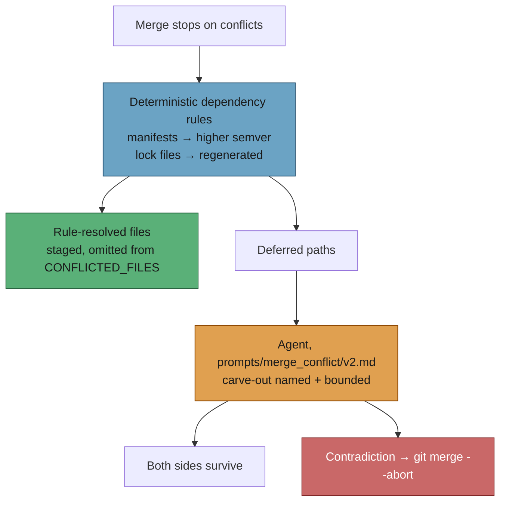

# PR Summary — Document the dependency-rule carve-out in the merge-conflict prompt

## Summary

The merge-conflict pass now settles dependency-version conflicts deterministically
before the agent runs (#466), but the agent prompt still told the agent that "the
same value set to two different values" is always a human's decision — contradicting
what the worker had already done. This adds `prompts/merge_conflict/v2.md`, which
states the deterministic rules as an explicit, **bounded** carve-out from the
never-side-pick contract. Closes #467.

What v2 adds over v1 (v1 is unchanged and stays as the historical record; the prompt
manager selects the highest version on disk, so adding the file activates it):

- A **"The Dependency-Version Carve-Out — Settled Before You Ran"** subsection inside
  the contract: manifests (`deno.json`/`deno.jsonc`, `package.json`, `Cargo.toml`,
  `go.mod`) are resolved per dependency key by taking the higher published semver;
  lock files (`deno.lock`, `package-lock.json`, `Cargo.lock`, `go.sum`) are
  regenerated, never text-merged.
- The agent is told that rule-resolved files are **not listed** in the conflicted-file
  list, so it does not go looking for them — and that anything the rules could not
  settle *is* listed, with the never-side-pick contract applying to it in full.
- The rationale in one line, so the carve-out is not generalised: dependency versions
  have a total order, so "the later version wins" is a rule rather than a judgement —
  which a source-code value conflict lacks.
- The bound stated plainly, plus a new worked example: a deferred `deno.json` whose
  hunk also touched `tasks` is an ordinary conflict, because being a manifest does not
  re-open the carve-out. The 30s→60s vs 30s→10s timeout example is unchanged and still
  instructs `git merge --abort` and escalate.

`docs/workflows/merge-conflicts.md` gains one bullet in **📏 The contract** naming the
carve-out and pointing at the prompt version that carries it.

## Evidence

Prompt/docs change — no web interface to screenshot. Verified by the new test file and
the existing structural gates:

- `deno test tests/merge_conflict_prompt_v2_test.ts` — **14 passed, 0 failed**. Before
  `v2.md` existed, 12 of those 14 failed (the two that passed were the build test,
  which then ran against v1, and the v1 negative control).
- `deno test tests/docs_prompt_version_freshness_test.ts` — 17 passed, including
  "actual repo tree has no stale references": no live doc cites
  `prompts/merge_conflict/v1`.
- `deno test tests/pr_merge_conflict_processor_test.ts tests/prompt_builder_test.ts
  tests/prompt_manager_test.ts` — 142 passed, 0 failed.
- `./quality.sh` — run in the foreground before raising the PR.

## Test Plan

Added `worker/deno/tests/merge_conflict_prompt_v2_test.ts` (14 tests):

- **Loading contract** — v2 loads via `loadPrompt`, is the latest version on disk,
  passes `validatePromptTemplate`, and carries all four required placeholders
  (`PR_NUMBER`, `QUALITY_INSTRUCTIONS`, `BASE_BRANCH`, `CONFLICTED_FILES`) plus the
  optional `VERBOSITY_INSTRUCTIONS`.
- **Builder round-trip** — `buildMergeConflictPrompt()` produces a prompt with no
  unsubstituted placeholder and with the PR number, base branch, conflicted path and
  quality instructions all present.
- **Contract survives** — the never-side-pick wording, the forbidden-command list and
  the duplicate exception are all still there, and the timeout worked example still
  says `git merge --abort` and names the human decision.
- **Carve-out is bounded** — it is named inside the contract section, scoped to
  dependency-version hunks in the four known manifests, states the rules run *before*
  the prompt and take the higher semver, says lock files are regenerated, tells the
  agent rule-resolved files are not listed (and asserts `{{CONFLICTED_FILES}}` is still
  injected exactly once), and carries the total-order rationale.
- **Negative control** — v1 mentions neither "carve-out" nor "dependency-version", so
  the assertions above are testing v2's new content rather than shared boilerplate.
