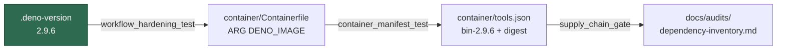

# Update the pinned Deno toolchain to 2.9.6

## Summary

Bumps the pinned Deno toolchain from **2.9.5** to **2.9.6**
([release notes](https://github.com/denoland/deno/releases/tag/v2.9.6)).
Closes #469.

Deno is pinned in three places that the quality gate ties together, plus the
generated inventory that records them:

| File | Change |
| --- | --- |
| `.deno-version` | `2.9.5` → `2.9.6` — the single source of truth every workflow's `setup-deno` reads via `deno-version-file` |
| `container/tools.json` | image `tag` `bin-2.9.5` → `bin-2.9.6`, `digest` re-pinned |
| `container/Containerfile` | `ARG DENO_IMAGE` restated to match the manifest |
| `docs/audits/dependency-inventory.md` | regenerated with `supply-chain-gate --write-inventory`, not hand-edited |

New digest: `sha256:4cf0029b9aeeeed5efcbb71828737f0d7c8c8a20072df960e51a5679ef0d21ba`.

It was read from the Docker registry manifest for `denoland/deno:bin-2.9.6`.
The same lookup against `bin-2.9.5` reproduces the digest already committed on
`main` byte for byte, which is what establishes the method rather than a
trusted-by-assertion value.



### Reviewer note — release age

v2.9.6 was published `2026-08-27T17:29:30Z`; this branch was cut roughly 11
hours later. The repo's own external-dependency quarantine is 24 hours
(`renovate.json` `minimumReleaseAge`, `DEFAULT_TOOL_QUARANTINE_HOURS`), which
is why Renovate had not raised this bump itself. This PR exists because a human
asked for the bump in #469 — that is the human decision the quarantine defers
to, not a bypass of it. Merging after `2026-08-28T17:29:30Z` clears the window
outright if you would rather it did.

## Evidence

Backend/toolchain change with no web interface, so there is nothing to
screenshot. The evidence is the gates that enforce these pins.

Full gate, run in the foreground:

```text
./quality.sh < /dev/null
Result: PASSED (with skipped checks)
  deno tests PASSED   deno lint PASSED   deno type check PASSED   deno fmt PASSED
```

Targeted run of the three suites that own these files:

```text
deno test tests/workflow_hardening_test.ts tests/container_manifest_test.ts \
          tests/supply_chain_gate_test.ts
ok | 124 passed | 0 failed (181ms)
```

Inventory regenerated by the gate itself, and re-checked in the same command:

```text
deno run ... mod.ts supply-chain-gate --repo ../.. --write-inventory
✅ supply-chain-gate: no findings. Scanned 10 workflow file(s) / 46 uses: reference(s),
   29 script file(s) / 57 deno invocation(s), 1 container file(s) / 2 base image(s),
   renovate.json present.
Inventory written to docs/audits/dependency-inventory.md
```

## Test Plan

No new tests. Every file this PR touches is already covered by a gate that
fails on drift, and each of those gates asserts the *invariant* rather than a
literal version — so they keep working at 2.9.7 without being edited:

- `worker/deno/tests/workflow_hardening_test.ts` — `.deno-version` must equal
  the Containerfile's `ARG DENO_IMAGE` tag, and every workflow must install
  Deno from `deno-version-file: .deno-version` rather than a floating `v2.x`.
- `worker/deno/tests/container_manifest_test.ts` — *"the committed definition
  matches its pinned manifest"* fails when `container/Containerfile` and
  `container/tools.json` disagree on a tag or digest.
- `worker/deno/tests/supply_chain_gate_test.ts` — *"the real repository tree
  passes with no findings"* fails when the committed inventory no longer
  matches the tree, which is what forced the regeneration above.

Adding a test that asserts the string `2.9.6` would have to be edited on every
future bump and would verify nothing the three gates above do not already
verify, so it was deliberately not added.

The 2.9.6 binary itself is exercised end to end by `container-build.yml`, which
builds the image from the new digest on this PR.
