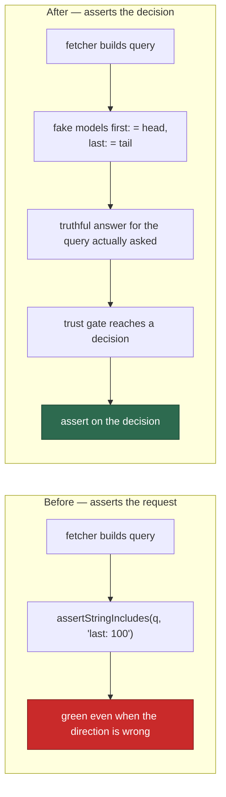

# Audit every test: delete the ones that assert how the code is written

## Summary

Audited all 1179 test files in `worker/deno/tests/` and deleted the ones whose
assertions were that a prompt template or a documentation page contains a
hand-typed phrase, or that a generated GraphQL query is spelled a particular
way. **144 files and 202 individual tests** are gone; a modelling fake and eight
new behaviour tests replace the coverage that mattered. Closes #471.

The standard applied — and the line drawn on every judgement call:

- **Delete** when the expected value is a phrase, heading, number or omission
  the author typed into both the artefact and the test. Such a test is written
  from the same mental model that produced the artefact, so it cannot disagree
  with its author.
- **Keep** when the expected value is *computed* in a way that can disagree with
  the author: a real function called with fixture data, a registry set-compared
  against a parsed document, a link graph resolved, a Mermaid block parsed.
  Reading a file is not the disqualifier — reading a file to compare it against
  a hand-typed string is.

Issue #470 is the worked example this issue was raised from: `buildBatchQuery`
asked GitHub for the ahead/behind comparison in the wrong direction, and the
test that "covered" it asserted the query *text*, so it stayed green for the
whole life of the defect.

## Evidence

Backend/CLI change with no web interface, so there is no screenshot to capture.
The evidence is the suite itself.

### The replacement fails when the behaviour is reverted — demonstrated

`tests/support/github_graphql_fake.ts` is a fake GitHub GraphQL endpoint that
models the API's own rules rather than the query's spelling: it resolves the
repository, resolves each alias, honours `first:` (head of the connection)
versus `last:` (tail), and returns `null` for anything it cannot resolve.



Flipping `last: 100` to `first: 100` in `lib/timeline_batch.ts` — the same class
of defect as #470 — turns the replacement red:

```
timeline_batch - the most-recent untrusted add survives batching and is
rejected (Issue #3089) => ./tests/timeline_batch_test.ts:53:6

FAILED | 16 passed | 1 failed
```

Restored, the file is green (17 passed). The deleted text assertion would
simply have been "corrected" to match the new spelling.

### Suite timing, before and after

| | Tests | Runner wall-clock |
| --- | --- | --- |
| Before | 16475 passed, 0 failed, 34 ignored | 7m33s (`time` reported 7m41.7s) |
| After | 14984 passed, 0 failed, 34 ignored | 7m20s (`time` reported 7m26.9s) |

1491 tests fewer and about 13s faster. The saving is small because the suite's
wall-clock is dominated by a handful of subprocess-spawning integration tests,
not by the count of in-process assertions — the win here is that the remaining
tests can fail when the code is wrong.

### Quality gate

`./quality.sh` PASSED — prompt immutability, benchmark audit, chokepoint
guards, workflow hygiene, mermaid, markdownlint, docs prompt versions, deno
tests, lint, type check and fmt.

## Deletions

Rule 3 of the TDD standard forbids removing tests silently, so every deletion is
accounted for below.

### 1. Prompt-template keyword checks — 131 files deleted

Each loaded a versioned prompt with `loadPrompt()` and asserted the body
contains a phrase ("carries tagged worked examples", "names the actor in the
first sentence", "keeps the load-bearing worker contracts"). None ever ran the
prompt; they asserted an instruction is *present*, never that following it
produces anything. The placeholder-contract half of each file is redundant with
`prompt_manager_test.ts` → "validates all prompt templates pass", which
validates **every** shipped template in one behaviour test.

`bash_script_refs_prompt_v3`, `bash_syntax_audit_prompt_v4`,
`best_practices_prompt_v10`, `best_practices_v3/v5/v7`, `ci_fix_prompt_v3/v10`,
`coding_guidelines_v10/v12/v13/v14/v15/v16/v23/v24/v26/v30/v31/v36/v37`,
`cross_repo_release_gate_prompt`, `dead_code_prompt_v5`,
`deprecated_api_prompt_v4`, `doc_coverage_prompt_v3/v6`,
`docs_owed_by_code_change`, `documentation_audit_prompt_v2/v4/v7`,
`duplicated_knowledge_prompt_v3`, `escape_hatch_prompts`,
`follow_up_dedup_prompt`, `format_drift_prompt_v5`,
`github_actions_audit_prompt_v1`–`v13`, `v16`, `v17`,
`grill_me_prompt_v1`–`v5`, `v8`, `v9`, `v11`, `v12`, `internal_dep_fix_prompt`,
`issue_prompt_v12/v14/v15/v16/v17/v23/v25/v30`, `needs_human_prompt`,
`no_worker_label_add`, `opus5_prompt_retune`, `orphan_deps_prompt_v1/v2/v5`,
`performance_workflow_prompt`, `planning_critique_v3/v4`,
`planning_v12/v13/v16/v19`, `pr_feedback_prompt_v5/v7/v11/v12/v13`,
`private_repo_reference_audit_prompt_v3`, `prompt_opus47_efficiency`,
`reserved_label_warning_v2040`, `retired_labels_dropped_from_prompts`,
`security_scan_prompt` and `security_scan_prompt_v2/v5`–`v10`, `v12`–`v19`,
`v21`–`v24`, `v26`–`v28`, `v30`, `spelling_fix_prompt_v4/v5`,
`supply_chain_detection_prompt_v1/v2/v4`,
`supply_chain_readiness_prompt_v1/v3/v4/v7`, `suppression_governance_prompts`,
`test_audit_prompt_v1/v3/v4/v5/v7/v10`, `workflow_annotation_scan_prompt_v3`,
`workflow_setup_prompt_v4` (all `_test.ts`).

Behaviour that survives elsewhere:

- Wrapper-body fingerprints (`X_BODY_FINGERPRINT`) — the coupling that matters
  is `matchesIdleTaskBody()`, exercised against a built body in each
  `*_template_test.ts`.
- `buildSecurityScanPrompt` substitution — `security_scanner_test.ts`.
- The CWE SARIF tag `security_scan_prompt_v28_test.ts` produced —
  `security_sarif_test.ts` → "buildSecuritySarif - CWE rides rule.properties.tags".

### 2. Documentation keyword checks — 13 files deleted

`agent_docs_consolidation`, `best_practices_general_declares_success`,
`best_practices_react_dangerously_set_inner_html`,
`best_practices_rust_bug_classes`, `best_practices_rust_build_profiles`,
`best_practices_supply_chain`, `coding_guidelines_spin_wait`,
`design_principles_idle_task_count`, `opus5_prompt_tuning_docs`, `quorum_docs`,
`root_docs_prompt_version`, `secret_redaction_doc_standard`,
`security_sarif_docs` (all `_test.ts`).

Every assertion was `doc.includes(<phrase the author typed>)` over a `.md` file
— a bucket guide, `QUORUM.md`, `SECURITY.md`, `CODING-STANDARDS.md`,
`DESIGN-PRINCIPLES.md` or an archived summary. `design_principles_idle_task_count`
is additionally subsumed by `idle_task_count_docs_test.ts`, which applies the
same invariants to every live doc with the count derived from the registry.
`quorum_docs_test.ts` also carried a dead assertion —
`assertMentions(QUORUM_DOC, "docs/QUORUM.md", "")` passed unconditionally.

### 3. Individual tests removed from files that keep real coverage — 202 tests

Prompt files reduced to their behaviour tests (the builder calls survive; the
prose assertions do not): `ci_fix_prompt_v4` (3), `coding_guidelines_v42` (11,
keeping the `findModelGenerationNames` scan), `planning_critique_v5` (18),
`planning_v20` (16), `question_prompt_v8` (19), `quorum_prompt_v1` (14),
`quorum_judge_prompt_v1` (15), `screenshot_prompt_precision` (6),
`workflow_setup_prompt` (16), `workflow_setup_prompt_v5` (11),
`prompt_builder` (5 — version floors, a "type is exported" tautology and one
prompt-prose grep), `project_conventions_stanza` (1),
`orphan_deps_metadata` (1).

Doc files reduced to their computed checks: `agent_provider_readme_docs` (2),
`agents_md_pointer_anchors` (1), `bucket_docs` (1),
`coding_standards_model_agnostic` (1), `config_docs_consistency` (1),
`container_tools_example_docs` (5), `containment_docs` (9 named plus 3
loop-generated families = 22 test instances), `deno_path_docs` (1),
`design_principles_template_count` (3), `docs_provider_matrix` (5),
`human_pr_policy_docs` (5), `markdown_anchors` (2), `model_routing_docs` (1),
`negative_result_lesson_docs` (4 plus an 8-case loop),
`priority_ladder_docs` (1), `progress_extension_default_422` (1),
`quality_gate_docs_consistency` (4), `readme_docs_reachability` (3 plus a
4-case loop), `threat_model_docs` (3), `timeout_docs_consistency` (5).

In every case the surviving tests in the same file compute their expectation
from code — a registry set-compared against a parsed table, a launch plan
compared against a mount table, `anchorSet()` resolving a fragment, a real
scanner run over a fixture tree.

Two vacuous assertions were found and removed with their tests:
`human_pr_policy_docs_test.ts:256` read `//.test(policy),` — `//` starts a
comment, so `assert()` received only the message and that half of the test had
always passed.

### 4. GraphQL query-shape assertions — 6 tests replaced by 8 behaviour tests

Deleted: `timeline_batch - buildBatchQuery aliases each issue`,
`timeline_batch - buildBatchQuery reads the most-recent labelled events`,
`timeline_batch - most-recent untrusted add survives batching and is rejected`
(hard-coded its own response, so it could not detect a direction change),
`comment_batch - buildCommentBatchQuery aliases each issue`,
`comment_batch - buildCommentBatchQuery honours commentsPerIssue override`,
`check_runs_batch - buildCheckRunsBatchQuery aliases each PR`.

Replaced by fake-driven behaviour tests (below). One finding: the
`commentsPerIssue` override has **no caller** — `fetchCommentBatch` does not
expose it — so the deleted test was covering a knob nothing turns. It is left
uncovered rather than given a fake behaviour test it does not have.

## Judged boundary — what was deliberately kept

The issue's failure-detection list includes "no remaining test asserts on … a
`gh` argument array". Applied literally that would delete several hundred
legitimate tests, so the line drawn is narrower and is stated here so a reviewer
can disagree with it explicitly:

- **Removed** — a generated request string asserted as a *proxy* for an outcome
  the test could observe directly (the GraphQL query text above).
- **Kept** — an argv that *is* the function's return value
  (`buildContainerLaunchPlan().buildArgs`, `buildInvocation()`,
  `gh_guard`'s `result.ghArgs`) or the only observable side effect at the
  process boundary (`setup_scheduled_task`'s recorded `schtasks` invocation).
  These assert an output, not a spelling, and go red when the behaviour changes.

Also kept, as computed rather than copied: `idle_task_cross_repo_body_refs_test.ts`
(scans every cross-repo prompt body for bare `#NNN` references and internal
paths, and cross-checks the prompt list against the templates directory),
`markdown_anchors`/`threat_model_docs` link-and-anchor resolution,
`idle_task_count_docs`, and the registry-derived halves of the provider and
timeout doc tests.

A build guard that fails on new grep-shaped tests remains the follow-up the
issue described; it is not part of this change.

## Test Plan

Added — `worker/deno/tests/support/github_graphql_fake.ts` plus:

- `timeline_batch - each issue receives its own timeline (Issue #471)` —
  two issues with distinct labelled events; a mis-aliased query cannot map them
  back.
- `timeline_batch - the most-recent untrusted add survives batching and is
  rejected (Issue #3089)` — 150 labelled events, the newest by an untrusted
  actor; **fails when `last:` is flipped to `first:`** (demonstrated above).
- `timeline_batch - the trust gate refuses a batched timeline whose last add is
  untrusted (Issue #3089)` — end-to-end through
  `wrapGhWithBatchedTimeline` into `wasLabelAddedByAllowedAuthor`.
- `timeline_batch - a repository the API cannot resolve is an error, not an
  empty timeline` — fail-loud, not a silent empty result.
- `comment_batch - each issue receives its own comments (Issue #471)`.
- `comment_batch - the newest comments are the ones fetched (Issue #471)` —
  twice the budget exists; the tail is what comes back.
- `comment_batch - a repository the API cannot resolve fails the batch
  (Issue #471)` — the issue lands in `failedNumbers`, not in an empty map.
- `check_runs_batch - each PR receives its own rollup (Issue #471)`.
- `check_runs_batch - a PR the API cannot resolve carries no state, not a green
  one (Issue #471)` — an unresolvable PR must not read as passing.

Modified — 34 test files reduced to their behaviour tests (§3 above).
Deleted — 144 test files (§1 and §2 above).

Docs — `CODING-STANDARDS.md` gains "Fake the external service, do not assert the
request" under the TDD section, pointing at the new fake as the worked example.
