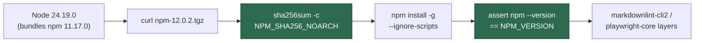

# PR Summary — Issue #475

## Summary

Pinned npm 12.0.2 as a container toolchain in its own right, instead of
inheriting whatever npm the Node tarball bundles. Node 24.19.0 ships npm
11.17.0, which is why every image build logged
`npm notice New major version of npm available! 11.17.0 -> 12.0.2`.

- `container/tools.json` gains an `npm` toolchain (version `12.0.2`,
  `NPM_VERSION`, noarch SHA-256). The `node` entry no longer lists `npm` among
  its commands, so exactly one pin owns that command and neither silently
  overwrites the other.
- `container/Containerfile` downloads `npm-${NPM_VERSION}.tgz`, verifies it
  against `NPM_SHA256_NOARCH`, installs it with `--ignore-scripts` from the
  local file (the rule the markdownlint-cli2 and playwright-core steps already
  follow), and then asserts `npm --version` reports the pin — a build that
  installed nothing fails loudly rather than quietly staying on npm 11.
- `docs/CONTAINER-IMAGE.md` records the Node/npm coupling: npm 12 declares
  `engines.node: ^22.22.2 || ^24.15.0 || >=26.0.0`, which the pinned Node
  24.19.0 satisfies, so a `NODE_VERSION` bump must keep npm's `engines` happy.
- `docs/audits/dependency-inventory.md` regenerated with
  `supply-chain-gate --write-inventory`.

npm 12.0.2 was published 2026-07-29, well clear of the 24h external-dependency
quarantine.

Closes #475

## Evidence

This is a container-build change with no web interface, so no screenshot
applies.

Build step, after the Node layer:



The install path was exercised against the pinned tarball before committing,
using the same flags the Containerfile uses:

```text
$ curl -fsSL -o /tmp/npm-12.0.2.tgz https://registry.npmjs.org/npm/-/npm-12.0.2.tgz
$ sha256sum /tmp/npm-12.0.2.tgz
5dbb86c71d07a1957f2e90734092dd6a58bdcd9ebc2d8d41ca1c6e6a21d364e1  /tmp/npm-12.0.2.tgz
$ npm install -g --ignore-scripts --prefix /tmp/npmtest /tmp/npm-12.0.2.tgz
added 1 package in 2s
$ /tmp/npmtest/bin/npm --version
12.0.2
```

That digest is the one committed to `container/tools.json` and restated as
`ARG NPM_SHA256_NOARCH`. The published package declares no `install`/
`postinstall` lifecycle script, so `--ignore-scripts` costs nothing.

`./quality.sh` passes (`Result: PASSED (with skipped checks)`); the container
image itself is built and version-checked by
`.github/workflows/container-build.yml`, whose "Verify the
monitored-repository toolchains" step runs `npm --version` against the built
image and fails when it does not report the pinned `12.0.2`.

## Test Plan

Added to `worker/deno/tests/container_manifest_test.ts`:

- `container/ - npm is pinned at 12.x and owned by exactly one toolchain
  (Issue #475)` — parses the committed `container/tools.json` and asserts a
  single toolchain installs the `npm` command, that it is on the 12.x line with
  a 64-hex noarch digest, and that `findMissingRuntimeTools` reports neither
  `node` nor `npm` missing. Fails against the unfixed manifest, where `node`
  owned `npm` and no 12.x pin existed.
- `container/Containerfile - installs the pinned npm from a checksum-verified
  tarball (Issue #475)` — asserts the build steps (comments and `ARG` lines
  excluded) fetch `npm-${NPM_VERSION}.tgz` and verify `${NPM_SHA256_NOARCH}`,
  so a pin declared in the manifest but never applied by the build is caught.

Existing coverage that now exercises the new pin:

- `findContainerfileViolations` over the committed Containerfile requires
  `ARG NPM_VERSION` and `ARG NPM_SHA256_NOARCH` to restate the manifest
  verbatim, and rejects any download without a checksum.
- `Containerfile - the copy the image is built from stays under Apple
  container's cap (Issue #4393)` — the stripped file is 12,592 bytes against
  the 15,000-byte limit.
